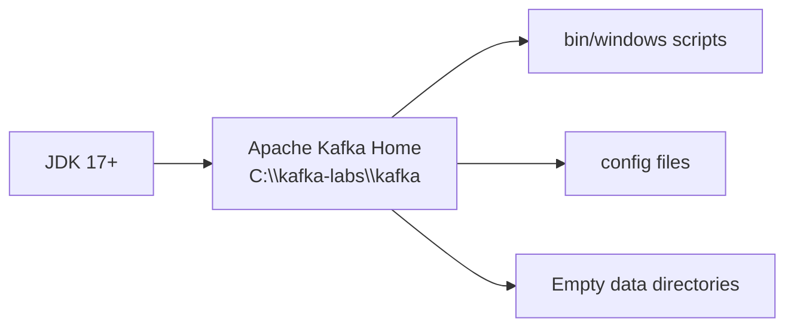

# Lab 01 – Workstation and Kafka Installation

**Lab Number:** 01  
**Day:** 1  
**Duration:** 30 minutes  
**Difficulty:** Beginner  
**Environment:** Windows 10 / Windows 11  
**Mode:** Individual

---

## Description

This lab prepares the Windows workstation used for the rest of the Kafka course. You will verify Java, create the standard lab folders, download Apache Kafka, extract it, and confirm that the Kafka command-line tools are present.

You do **not** start ZooKeeper or a broker in this lab. The goal is a clean, known environment so later labs do not fail because of missing software or mixed install paths.

---

## Prerequisites

- A Windows 10 or Windows 11 machine with local administrator rights
- Internet access to download JDK and Apache Kafka
- At least 8 GB RAM and 10 GB free disk space
- PowerShell 5.1 or later
- Ability to set user environment variables

Software you will install or verify:

- JDK 17 or later
- Apache Kafka 3.8.x or 3.9.x (ZooKeeper mode)

---

## Business Use Case

QuickCart is an e-commerce company. Several applications need to exchange events: orders, payments, inventory updates, and website clicks.

Today the platform team starts building a shared event backbone. Before any topic or microservice is created, every engineer must have the same Kafka lab layout:

```text
C:\kafka-labs\
    kafka\          Apache Kafka binaries and configs
    data\           ZooKeeper and broker log directories
```

If workstations are inconsistent, later cluster labs fail in different ways for different people. This lab standardizes the environment.

---

## Architecture

This lab builds the workstation, not the cluster.

```text
                    QUICKCART ENGINEER WORKSTATION

 +------------------------------------------------------------------+
 |  Windows 10/11                                                   |
 |                                                                  |
 |  JDK 17+                    PowerShell                           |
 |    JAVA_HOME                                                     |
 |                                                                  |
 |  C:\kafka-labs\                                                  |
 |      +-- kafka\              Kafka home                          |
 |      |     +-- bin\windows\  Start / CLI scripts                 |
 |      |     +-- config\       ZooKeeper and broker properties     |
 |      |     +-- libs\         Kafka libraries                     |
 |      |                                                           |
 |      +-- data\               Created now, used from Lab 02       |
 |            +-- zookeeper\                                        |
 |            +-- kafka-0\                                          |
 |            +-- kafka-1\                                          |
 |            +-- kafka-2\                                          |
 |            +-- kafka-3\                                          |
 +------------------------------------------------------------------+

 Nothing is listening on 2181 or 9092 yet.
```



---

## Detailed Steps

### Step 0 – Initial Setup

Open **Windows PowerShell**. You do not need to run it as Administrator unless a later command is denied.

Confirm you are not inside a restricted or space-heavy working folder. The Kafka lab must live on `C:\kafka-labs`.

```powershell
whoami
Get-Location
```

Create the root folder if it does not exist:

```powershell
New-Item -ItemType Directory -Force -Path C:\kafka-labs
Set-Location C:\kafka-labs
Get-ChildItem
```

**Checkpoint**

- `C:\kafka-labs` exists
- Your prompt can change into that folder

---

### Step 1 – Verify or Install Java

Check whether Java is already available:

```powershell
java -version
```

Expected: a Java 17 or later version, for example:

```text
openjdk version "17.0.12" 2024-07-16
OpenJDK Runtime Environment ...
OpenJDK 64-Bit Server VM ...
```

If `java` is not recognized, or the version is older than 17:

1. Install a JDK 17+ build (Eclipse Temurin, Microsoft Build of OpenJDK, or Oracle JDK).
2. Close and reopen PowerShell after installation.
3. Run `java -version` again.

Record your result:

| Check | Your value |
| --- | --- |
| Java vendor | |
| Java version | |
| 64-bit VM? | Yes / No |

**Do not continue if Java is missing or older than 17.**

---

### Step 2 – Set `JAVA_HOME`

Kafka's Windows scripts need `JAVA_HOME`.

Find the JDK folder. Common paths:

```text
C:\Program Files\Eclipse Adoptium\jdk-17...
C:\Program Files\Microsoft\jdk-17...
C:\Program Files\Java\jdk-17...
```

List installed Java folders:

```powershell
Get-ChildItem "C:\Program Files\Java" -ErrorAction SilentlyContinue
Get-ChildItem "C:\Program Files\Eclipse Adoptium" -ErrorAction SilentlyContinue
Get-ChildItem "C:\Program Files\Microsoft" -ErrorAction SilentlyContinue
```

Set `JAVA_HOME` for the current user. Replace the path with **your** JDK folder:

```powershell
[System.Environment]::SetEnvironmentVariable(
    "JAVA_HOME",
    "C:\Program Files\Eclipse Adoptium\jdk-17.0.12+7",
    "User"
)
```

Add the JDK `bin` folder to your user `PATH` if `java` was not already on the path:

```powershell
$jdkBin = "$([System.Environment]::GetEnvironmentVariable('JAVA_HOME','User'))\bin"
$userPath = [System.Environment]::GetEnvironmentVariable("Path", "User")
if ($userPath -notlike "*$jdkBin*") {
    [System.Environment]::SetEnvironmentVariable("Path", "$userPath;$jdkBin", "User")
}
```

Close PowerShell and open a **new** PowerShell window, then verify:

```powershell
echo $env:JAVA_HOME
java -version
```

**Checkpoint**

- `$env:JAVA_HOME` prints the JDK folder
- `java -version` still works in the new window

---

### Step 3 – Download Apache Kafka

This course uses **Apache Kafka with ZooKeeper**, not Kafka 4.x KRaft-only packages.

In the new PowerShell window:

```powershell
Set-Location C:\kafka-labs
```

Download Kafka 3.8.1 (Scala 2.13). If your trainer provides a different 3.8.x or 3.9.x package, use that file instead.

```powershell
$kafkaUrl = "https://downloads.apache.org/kafka/3.8.1/kafka_2.13-3.8.1.tgz"
$kafkaZip = "C:\kafka-labs\kafka_2.13-3.8.1.tgz"

Invoke-WebRequest -Uri $kafkaUrl -OutFile $kafkaZip
Get-Item $kafkaZip
```

If the Apache download site is blocked, use the archive URL provided by the trainer and save the `.tgz` file as `C:\kafka-labs\kafka_2.13-3.8.1.tgz`.

**Checkpoint**

- The `.tgz` file exists under `C:\kafka-labs`
- File size is greater than 100 MB

---

### Step 4 – Extract Kafka to the Standard Home Folder

Windows 10 and Windows 11 include `tar`.

```powershell
Set-Location C:\kafka-labs
tar -xzf kafka_2.13-3.8.1.tgz
Get-ChildItem
```

You should see a folder similar to `kafka_2.13-3.8.1`.

Rename it to the course standard name:

```powershell
Rename-Item -Path C:\kafka-labs\kafka_2.13-3.8.1 -NewName kafka
Get-ChildItem C:\kafka-labs\kafka
```

If `C:\kafka-labs\kafka` already exists from an older attempt, stop and ask the trainer before overwriting it.

**Checkpoint**

`C:\kafka-labs\kafka` contains at least these folders:

```text
bin
config
libs
licenses
```

---

### Step 5 – Confirm Windows CLI Scripts

```powershell
Get-ChildItem C:\kafka-labs\kafka\bin\windows
```

Confirm these files exist:

| Script | Purpose |
| --- | --- |
| `zookeeper-server-start.bat` | Start ZooKeeper |
| `kafka-server-start.bat` | Start a broker |
| `kafka-topics.bat` | Create and inspect topics |
| `kafka-console-producer.bat` | Send records |
| `kafka-console-consumer.bat` | Read records |
| `kafka-consumer-groups.bat` | Inspect consumer groups |
| `zookeeper-shell.bat` | Inspect ZooKeeper |

Open the default config folder:

```powershell
Get-ChildItem C:\kafka-labs\kafka\config
```

Confirm these files exist:

| File | Purpose |
| --- | --- |
| `zookeeper.properties` | ZooKeeper settings |
| `server.properties` | Default single-broker settings |

---

### Step 6 – Create Data Directories

Kafka and ZooKeeper should not write data into the install folder. Create dedicated data directories now.

```powershell
New-Item -ItemType Directory -Force -Path C:\kafka-labs\data\zookeeper
New-Item -ItemType Directory -Force -Path C:\kafka-labs\data\kafka-0
New-Item -ItemType Directory -Force -Path C:\kafka-labs\data\kafka-1
New-Item -ItemType Directory -Force -Path C:\kafka-labs\data\kafka-2
New-Item -ItemType Directory -Force -Path C:\kafka-labs\data\kafka-3
Get-ChildItem C:\kafka-labs\data
```

Expected:

```text
zookeeper
kafka-0
kafka-1
kafka-2
kafka-3
```

These folders stay empty until Lab 02 and Lab 07 start services.

---

### Step 7 – Record Your Environment

Complete this table. You will reuse it all week.

| Item | Your value |
| --- | --- |
| Machine name | |
| Windows version | |
| Java version | |
| `JAVA_HOME` | |
| Kafka home | `C:\kafka-labs\kafka` |
| Kafka package version | |
| Data root | `C:\kafka-labs\data` |

---

## Conclusion

Your workstation is now standardized for the QuickCart Kafka labs.

You installed or verified JDK 17+, set `JAVA_HOME`, extracted Apache Kafka to `C:\kafka-labs\kafka`, confirmed the Windows CLI scripts, and created empty data directories.

No cluster is running yet. That is intentional. Lab 02 starts ZooKeeper and the first broker using this layout.

**You are ready for Lab 02 when:**

- `java -version` shows 17 or later
- `$env:JAVA_HOME` is set
- `C:\kafka-labs\kafka\bin\windows\kafka-topics.bat` exists
- `C:\kafka-labs\data` contains the five folders listed above

Next lab: [02-single-broker.md](02-single-broker.md)

---

## Knowledge Check

1. Why does this course pin Kafka to `C:\kafka-labs\kafka` instead of a personal `Downloads` folder?
2. Why do we use Kafka 3.8.x or 3.9.x instead of Kafka 4.x for Day 1?
3. What is `JAVA_HOME` used for?
4. Which folder will ZooKeeper use for its data files?

**Expected answers**

1. Every command in the manuals uses the same path, so scripts and configs stay copy-pasteable.
2. This curriculum includes ZooKeeper-mode cluster labs. Kafka 4.x is KRaft-only.
3. Kafka Windows start scripts locate the Java runtime through `JAVA_HOME`.
4. `C:\kafka-labs\data\zookeeper`

---

## Common Issues

| Symptom | Likely cause | What to do |
| --- | --- | --- |
| `java` is not recognized | JDK not installed or not on `PATH` | Install JDK 17+, set `JAVA_HOME`, open a new PowerShell |
| `JAVA_HOME` is empty after setting it | Variable set only in the old window | Close PowerShell and open a new window |
| `tar` cannot extract the file | Download is incomplete | Re-download the `.tgz` and check the file size |
| `Rename-Item` fails | `C:\kafka-labs\kafka` already exists | Inspect the old folder with the trainer before deleting it |
| Download is blocked | Corporate proxy or firewall | Use the trainer-provided Kafka package |
