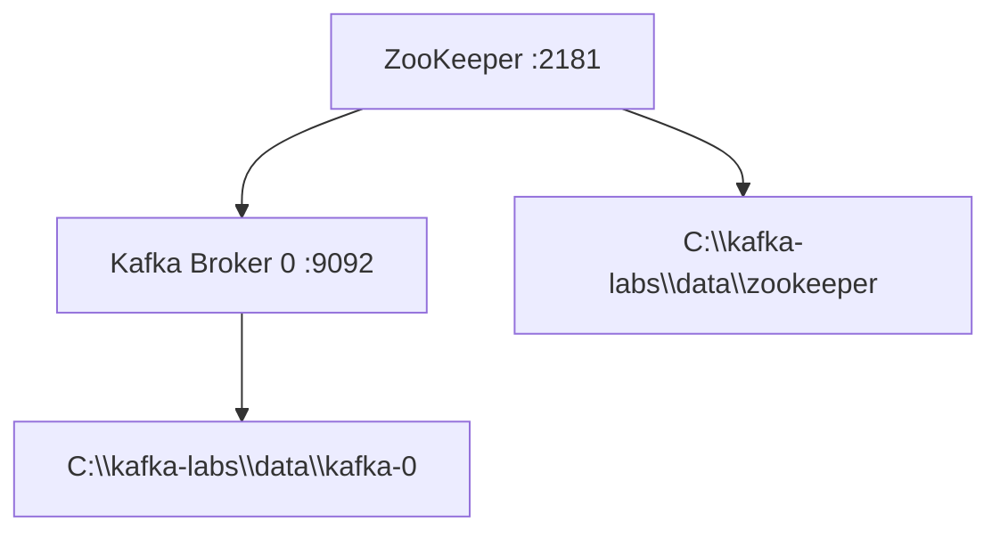

# Lab 02 – Single Node, Single Broker Configuration

**Lab Number:** 02  
**Day:** 1  
**Duration:** 40 minutes  
**Difficulty:** Beginner  
**Environment:** Windows 10 / Windows 11  
**Mode:** Individual

---

## Description

This is the first running Kafka cluster of the course: one ZooKeeper process and one Kafka broker on the same Windows machine.

You will review the default configuration files, point data directories to `C:\kafka-labs\data`, start ZooKeeper, start one broker, and prove that the broker has registered itself.

At the end of this lab, Kafka is running but no business topic exists yet. Producing and consuming starts in Lab 03.

---

## Prerequisites

- Lab 01 is complete
- `java -version` shows JDK 17 or later
- `C:\kafka-labs\kafka` exists
- Data folders from Lab 01 exist
- Ports `2181` and `9092` are free
- Two PowerShell terminals available

Verify the install before changing any config:

```powershell
# Set the root folder used for all Kafka labs
$location = "C:\kafka-labs"

Write-Host "Kafka Lab Location: $location"
```

```powershell
Test-Path "$location\kafka\bin\windows\kafka-server-start.bat"
Test-Path "$location\data\zookeeper"
Test-Path "$location\data\kafka-0"
```

Both `Test-Path` results for the data folders must be `True`.

---

## Business Use Case

QuickCart wants a small development Kafka environment on each engineer's laptop. Production will later use three brokers. For the first day, one broker is enough to:

- accept order events
- persist those events
- let one downstream service read them

The platform rule is: **every developer cluster uses the same ports and folders**. That makes trainer support possible.

```text
QuickCart developer laptop
        |
        v
  ZooKeeper :2181
        |
        v
   Broker 0 :9092
```

---

## Architecture

```text
                 LAB 02 CLUSTER

                 +-------------+
                 |  ZooKeeper  |
                 |    :2181    |
                 | data:       |
                 | kafka-labs\ |
                 | data\       |
                 | zookeeper   |
                 +------+------+
                        |
                        | metadata, broker registration
                        v
                 +-------------+
                 |  Kafka      |
                 |  Broker 0   |
                 |    :9092    |
                 | log.dirs:   |
                 | kafka-0     |
                 +-------------+

 One machine. One broker. No replication yet.
```



---

## Detailed Steps

### Step 0 – Initial Setup

Open **Terminal 1** and confirm nothing is already bound to the lab ports:

```powershell
netstat -ano | findstr ":2181"
netstat -ano | findstr ":9092"
```

If either command prints a `LISTENING` row, another process owns that port. Stop that process or ask the trainer before continuing.

Confirm Kafka home:

```powershell
Set-Location "$location\kafka"
Get-ChildItem .\config\zookeeper.properties
Get-ChildItem .\config\server.properties
```

---

### Step 1 – Review `zookeeper.properties`

Open `C:\kafka-labs\kafka\config\zookeeper.properties` in a text editor.

Find `dataDir` and `clientPort`.

Change `dataDir` to the course folder. Use forward slashes.

```properties
dataDir=C:/kafka-labs/data/zookeeper
clientPort=2181
```

Leave the other ZooKeeper defaults unless the trainer gives a different value.

Save the file.

**Why this change?**  
The default `dataDir` points inside the Kafka install tree. The course keeps runtime data under `C:\kafka-labs\data` so you can reset a lab without reinstalling Kafka.

---

### Step 2 – Review `server.properties`

Open `C:\kafka-labs\kafka\config\server.properties`.

Confirm or set these properties:

```properties
broker.id=0
listeners=PLAINTEXT://localhost:9092
log.dirs=C:/kafka-labs/data/kafka-0
zookeeper.connect=localhost:2181
num.partitions=1
offsets.topic.replication.factor=1
transaction.state.log.replication.factor=1
transaction.state.log.min.isr=1
```

Notes for this single-broker lab:

- `broker.id=0` identifies this broker in the cluster.
- `listeners` is how clients and tools reach the broker.
- `offsets.topic.replication.factor` must be `1` because only one broker exists. A value of `3` will prevent the broker from creating internal topics.

Save the file.

Record the values you used:

| Property | Value in your file |
| --- | --- |
| `broker.id` | |
| `listeners` | |
| `log.dirs` | |
| `zookeeper.connect` | |

---

### Step 3 – Start ZooKeeper

In **Terminal 1**:

```powershell
$location = "C:\kafka-labs"

Set-Location "$location\kafka"

.\bin\windows\zookeeper-server-start.bat `
    .\config\zookeeper.properties
```

Leave this terminal open. ZooKeeper is a long-running process.

Wait until the log shows that ZooKeeper is bound to port 2181. Typical phrases include `binding to port` and `2181`.

**Checkpoint**

In a new PowerShell window:

```powershell
netstat -ano | findstr ":2181"
```

You should see a `LISTENING` entry for port 2181.

Do not start the broker if ZooKeeper is not listening.

---

### Step 4 – Start the Single Kafka Broker

Open **Terminal 2**:

```powershell
$location = "C:\kafka-labs"

Set-Location "$location\kafka"

.\bin\windows\kafka-server-start.bat `
    .\config\server.properties
```

Leave this terminal open.

Wait until the broker log reports that it has started. Look for the broker id and the listener on `9092`.

Expected identity:

```text
Broker ID: 0
Port:      9092
```

**Checkpoint**

```powershell
netstat -ano | findstr ":9092"
```

You should see a `LISTENING` entry for port 9092.

---

### Step 5 – Confirm the Broker from the CLI

Open **Terminal 5** as an admin/CLI terminal. Do not use Terminal 1 or 2.

```powershell
$location = "C:\kafka-labs"

Set-Location "$location\kafka"

.\bin\windows\kafka-topics.bat `
    --list `
    --bootstrap-server localhost:9092
```

A successful command returns without a connection error. The topic list may be empty or may show only internal topics. That is acceptable.

If the command hangs or reports `Connection to node -1` / `Broker may not be available`, the broker is not ready. Wait 10 seconds and retry.

---

### Step 6 – Confirm Data Files Were Created

```powershell
Get-ChildItem "$location\data\zookeeper"
Get-ChildItem "$location\data\kafka-0"
```

ZooKeeper should now have files such as `myid` is **not** required for a standalone ZooKeeper. You should see ZooKeeper snapshot/log files appear after it has been running.

The broker log directory should contain Kafka log folders after the broker has fully started. Internal topics such as `__consumer_offsets` may appear shortly after the first client request.

**Checkpoint**

| Check | Expected | Observed |
| --- | --- | --- |
| ZooKeeper on 2181 | Listening | |
| Broker on 9092 | Listening | |
| `kafka-topics --list` | Connects to localhost:9092 | |
| `C:\kafka-labs\data\kafka-0` | No longer empty after broker start | |

---

### Step 7 – Keep the Cluster Running

Do **not** stop ZooKeeper or the broker.

You will use this exact cluster in Lab 03 and Lab 04.

If you must reboot, restart in this order:

1. ZooKeeper
2. Broker using `server.properties`

---

## Conclusion

You now have a working single-node, single-broker Kafka environment for QuickCart development.

ZooKeeper is coordinating metadata on port 2181. One Kafka broker is serving clients on port 9092 and writing logs to `C:\kafka-labs\data\kafka-0`.

This cluster can store events, but it has no redundancy. If Broker 0 stops, the cluster is unavailable. Labs 07 and 08 add more brokers and replication.

**You are ready for Lab 03 when:**

- ZooKeeper is still running in Terminal 1
- The broker is still running in Terminal 2
- `kafka-topics --list --bootstrap-server localhost:9092` works

Next lab: [03-produce-consume.md](03-produce-consume.md)

---

## Knowledge Check

1. Why must ZooKeeper start before the broker in this course setup?
2. Why is `offsets.topic.replication.factor=1` required on a one-broker cluster?
3. What happens to this lab cluster if Terminal 2 is closed?
4. Which component stores the actual topic records: ZooKeeper or the broker?

**Expected answers**

1. This Kafka package runs in ZooKeeper mode. The broker registers with ZooKeeper and reads cluster metadata from it.
2. Internal topics cannot be replicated three ways when only one broker exists.
3. The broker process stops and clients can no longer produce or consume.
4. The broker stores records in `log.dirs`. ZooKeeper stores cluster metadata, not the business events.

---

## Common Issues

| Symptom | Likely cause | What to do |
| --- | --- | --- |
| Broker exits immediately | ZooKeeper is not running | Start ZooKeeper first and retry |
| `java.lang.OutOfMemoryError` | Low heap / constrained VM | Close extra applications; ask trainer for heap guidance |
| Port 9092 already in use | Leftover Kafka process | Find and stop the old `java` Kafka process |
| Broker cannot create `__consumer_offsets` | Replication factor still 3 | Set the internal-topic replication properties to `1` |
| Path error in `log.dirs` | Backslashes or a missing folder | Use `C:/kafka-labs/data/kafka-0` and confirm the folder exists |
