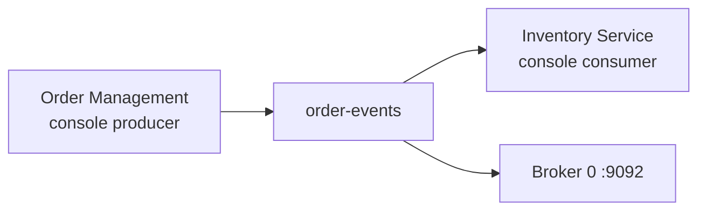

# Lab 03 – Create a Topic, Produce Events, and Consume Events

**Lab Number:** 03  
**Day:** 1  
**Duration:** 35 minutes  
**Difficulty:** Beginner  
**Environment:** Windows 10 / Windows 11  
**Mode:** Individual

---

## Description

This lab moves the first QuickCart business events through Kafka.

You will create the `order-events` topic, send order records with the console producer, read them with the console consumer, stop and restart the consumer, and confirm that Kafka can replay events from the beginning.

These are CLI tools, not Java applications. Day 2 introduces the producer and consumer APIs.

---

## Prerequisites

- Lab 01 and Lab 02 are complete
- ZooKeeper is running on `localhost:2181`
- The single broker is running on `localhost:9092`
- You have a free PowerShell terminal for CLI work
- You can open two extra terminals for producer and consumer

Verify the cluster:

```powershell
cd C:\kafka-labs\kafka

.\bin\windows\kafka-topics.bat `
  --list `
  --bootstrap-server localhost:9092
```

If this command cannot connect, return to Lab 02 and start ZooKeeper, then the broker.

---

## Business Use Case

QuickCart's Order Management application needs to publish every new order so other systems can react:

- Inventory can reserve stock
- Notification can email the customer
- Analytics can count daily orders

Those systems should not call the Order database directly. They should read from a Kafka topic named `order-events`.

In this lab you simulate the Order application with the console producer and simulate one downstream reader with the console consumer.

---

## Architecture

```text
                 QUICKCART  -  FIRST EVENT FLOW

     Order Management
     (console producer)
             |
             |  ORD1001,CUSTOMER101,1500,PLACED
             v
     +-------------------+
     |   order-events    |
     |   1 partition     |
     |   RF = 1          |
     +---------+---------+
               |
               v
     Inventory Service
     (console consumer)


              Kafka Broker 0 :9092
                       |
                       v
                  ZooKeeper :2181
```



---

## Detailed Steps

### Step 0 – Initial Setup

Confirm services are up.

**Terminal 1** should still show ZooKeeper logs.  
**Terminal 2** should still show broker logs.

If you restarted the machine, start them again:

Terminal 1:

```powershell
cd C:\kafka-labs\kafka
.\bin\windows\zookeeper-server-start.bat .\config\zookeeper.properties
```

Terminal 2:

```powershell
cd C:\kafka-labs\kafka
.\bin\windows\kafka-server-start.bat .\config\server.properties
```

Open **Terminal 5** for topic commands:

```powershell
cd C:\kafka-labs\kafka
```

---

### Step 1 – Create the `order-events` Topic

```powershell
.\bin\windows\kafka-topics.bat `
  --create `
  --topic order-events `
  --bootstrap-server localhost:9092 `
  --partitions 1 `
  --replication-factor 1
```

Expected:

```text
Created topic order-events.
```

If the topic already exists from a previous attempt, do not create it again. List topics instead.

**Why one partition and RF 1?**  
This cluster has only one broker. Replication factor 3 would fail. Multiple partitions are introduced in Lab 05.

---

### Step 2 – List Topics

```powershell
.\bin\windows\kafka-topics.bat `
  --list `
  --bootstrap-server localhost:9092
```

Confirm `order-events` appears. Internal topics such as `__consumer_offsets` may also appear. That is normal.

---

### Step 3 – Describe the Topic

```powershell
.\bin\windows\kafka-topics.bat `
  --describe `
  --topic order-events `
  --bootstrap-server localhost:9092
```

Record the result:

| Field | Expected | Your value |
| --- | --- | --- |
| Topic | `order-events` | |
| PartitionCount | 1 | |
| ReplicationFactor | 1 | |
| Partition 0 Leader | 0 | |
| Replicas | 0 | |
| ISR | 0 | |

On a one-broker cluster the leader, replica set, and ISR should all be broker `0`.

---

### Step 4 – Start the Console Producer

Open **Terminal 6**:

```powershell
cd C:\kafka-labs\kafka

.\bin\windows\kafka-console-producer.bat `
  --bootstrap-server localhost:9092 `
  --topic order-events
```

The prompt waits for input. That means the producer is connected.

Type these exact records. Press Enter after each line:

```text
ORD1001,CUSTOMER101,1500,PLACED
ORD1002,CUSTOMER102,2200,PLACED
ORD1003,CUSTOMER103,700,CANCELLED
ORD1004,CUSTOMER104,9000,PLACED
ORD1005,CUSTOMER105,3500,PLACED
```

Do not press Ctrl+C. Leave the producer running.

Business meaning of one record:

```text
ORD1001,CUSTOMER101,1500,PLACED
   |         |        |      |
order id  customer  amount  status
```

---

### Step 5 – Start a Temporary Consumer from the Beginning

Open **Terminal 7**:

```powershell
cd C:\kafka-labs\kafka

.\bin\windows\kafka-console-consumer.bat `
  --bootstrap-server localhost:9092 `
  --topic order-events `
  --from-beginning
```

You should see the five order records.

`--from-beginning` tells this consumer to read existing records, not only records produced after it started.

**Checkpoint**

Students should now answer:

- Who produced the data? → Order Management / console producer
- Where is it stored? → topic `order-events`
- How many partitions? → 1
- How many replicas? → 1

---

### Step 6 – Produce More Orders While the Consumer Is Running

Return to **Terminal 6** (producer) and enter:

```text
ORD1006,CUSTOMER106,12500,PLACED
ORD1007,CUSTOMER107,4000,CANCELLED
ORD1008,CUSTOMER108,2800,PLACED
```

Watch **Terminal 7**. The new records should appear without restarting the consumer.

This is the live stream: produce now, consume now.

---

### Step 7 – Stop the Consumer and Prove Replay

In **Terminal 7**:

```text
Ctrl+C
```

The consumer stops. The records remain in Kafka.

Start the consumer again with `--from-beginning`:

```powershell
.\bin\windows\kafka-console-consumer.bat `
  --bootstrap-server localhost:9092 `
  --topic order-events `
  --from-beginning
```

You should see **all eight** records again.

This is a core Kafka property: events are persisted and can be replayed. A new QuickCart service can read history instead of asking the Order database for a one-time extract.

Stop this consumer with `Ctrl+C` when you have confirmed replay.

---

### Step 8 – Observe What Happens Without `--from-beginning`

Start a consumer **without** `--from-beginning`:

```powershell
.\bin\windows\kafka-console-consumer.bat `
  --bootstrap-server localhost:9092 `
  --topic order-events
```

This consumer waits. It does not print the old eight records.

Return to the producer and send:

```text
ORD1009,CUSTOMER109,6500,PLACED
```

Only `ORD1009` appears in this consumer.

**Trainer point**

A consumer that starts at the latest offset sees new records only. Kafka still has the earlier orders. The consumer simply chose not to read them.

Stop this consumer with `Ctrl+C`.

Leave the producer and the cluster running if you are continuing immediately to Lab 04.

---

## Conclusion

You created QuickCart's first business topic and moved order events through Kafka.

`order-events` now holds durable records on Broker 0. A consumer can read from the beginning, follow the live stream, or start at the tip and see only new events.

You have demonstrated the three roles from this morning's theory: **producer**, **topic**, and **consumer**.

**You are ready for Lab 04 when:**

- `order-events` exists
- You have produced at least `ORD1001` through `ORD1009`
- You have seen replay with `--from-beginning`

Next lab: [04-kafka-cli.md](04-kafka-cli.md)

---

## Knowledge Check

1. What does `--from-beginning` change?
2. If the consumer is stopped, are the messages lost?
3. Why did we use `--replication-factor 1`?
4. Can Inventory and Analytics both read `order-events` later?

**Expected answers**

1. The consumer reads existing records from offset 0, not only new records.
2. No. Kafka retains them according to topic retention settings.
3. The Lab 02 cluster has only one broker.
4. Yes. That is publish/subscribe. Lab 09 makes it concrete with two consumer groups.

---

## Common Issues

| Symptom | Likely cause | What to do |
| --- | --- | --- |
| `Topic already exists` | Topic created earlier | Use `--list` / `--describe`; do not recreate it |
| `Replication factor: 1 larger than available brokers` | Broker is down or RF is too high | Confirm the Lab 02 broker is running |
| Producer shows no prompt / connection errors | Broker not ready | Recheck Terminal 2 and port 9092 |
| Consumer prints nothing | Started without `--from-beginning` and no new records | Produce another record or add `--from-beginning` |
| Records look concatenated | You typed two orders on one line | Produce one record per line |
