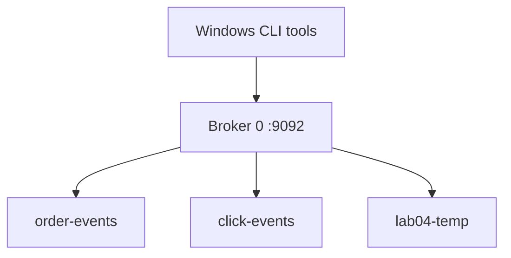

# Lab 04 – Explore Kafka CLI Commands

**Lab Number:** 04  
**Day:** 1  
**Duration:** 35 minutes  
**Difficulty:** Beginner  
**Environment:** Windows 10 / Windows 11  
**Mode:** Individual

---

## Description

This lab is a guided tour of the Kafka command-line tools used by administrators and developers.

You will create a second topic, list and describe topics, produce records with keys, consume records with metadata printed, inspect topic configuration, and delete a disposable topic.

Treat this as an operations workbook. After Day 1 you should be able to inspect a cluster without opening an IDE.

---

## Prerequisites

- Labs 01–03 are complete
- ZooKeeper is running on `2181`
- The single broker is running on `9092`
- Topic `order-events` exists
- You are working from `C:\kafka-labs\kafka`

Verify:

```powershell
cd C:\kafka-labs\kafka

.\bin\windows\kafka-topics.bat `
  --list `
  --bootstrap-server localhost:9092
```

`order-events` must appear. If the cluster is down, restart ZooKeeper and the broker using the Lab 02 commands.

---

## Business Use Case

QuickCart's platform team needs a standard way to answer operational questions:

- Which topics exist?
- How many partitions does a topic have?
- Who is the leader?
- What is the retention?
- Can we create a temporary topic for a campaign and delete it afterwards?

The website team also wants a `click-events` topic for page-view tracking. You will create it with the CLI, inspect it, and keep it for later labs.

---

## Architecture

```text
                    CLI WORKSTATION
                           |
                           | bootstrap-server localhost:9092
                           v
                 +---------------------+
                 |     Broker 0        |
                 |                     |
                 |  order-events       |
                 |  click-events       |
                 |  lab04-temp         |
                 +---------------------+

 kafka-topics.bat
 kafka-console-producer.bat
 kafka-console-consumer.bat
 kafka-configs.bat
 kafka-consumer-groups.bat
```



---

## Detailed Steps

### Step 0 – Initial Setup

Open **Terminal 5** and set the working directory:

```powershell
cd C:\kafka-labs\kafka
```

Confirm the broker answers:

```powershell
.\bin\windows\kafka-topics.bat `
  --list `
  --bootstrap-server localhost:9092
```

If this fails, start ZooKeeper (Terminal 1) and the broker (Terminal 2) before continuing.

---

### Step 1 – Create `click-events`

```powershell
.\bin\windows\kafka-topics.bat `
  --create `
  --topic click-events `
  --bootstrap-server localhost:9092 `
  --partitions 1 `
  --replication-factor 1
```

Expected:

```text
Created topic click-events.
```

---

### Step 2 – List All Topics

```powershell
.\bin\windows\kafka-topics.bat `
  --list `
  --bootstrap-server localhost:9092
```

You should see at least:

```text
click-events
order-events
```

Internal topics may also appear. Do not delete `__consumer_offsets`.

---

### Step 3 – Describe One Topic and All Topics

Describe `click-events`:

```powershell
.\bin\windows\kafka-topics.bat `
  --describe `
  --topic click-events `
  --bootstrap-server localhost:9092
```

Describe every topic:

```powershell
.\bin\windows\kafka-topics.bat `
  --describe `
  --bootstrap-server localhost:9092
```

Complete:

| Topic | Partitions | RF | P0 Leader | P0 Replicas | P0 ISR |
| --- | ---: | ---: | ---: | --- | --- |
| `order-events` | | | | | |
| `click-events` | | | | | |

---

### Step 4 – Produce Click Events with Keys

Kafka records can have a **key** and a **value**. Keys matter when a topic has more than one partition. Practice the syntax now.

Open **Terminal 6** if the previous producer is still attached to `order-events`. Stop it with `Ctrl+C` if you need the terminal, or open a new terminal.

```powershell
cd C:\kafka-labs\kafka

.\bin\windows\kafka-console-producer.bat `
  --bootstrap-server localhost:9092 `
  --topic click-events `
  --property parse.key=true `
  --property key.separator=:
```

The character before each colon is the key. The text after the colon is the value. Enter:

```text
USER101:HOME,banner,2026-09-19
USER102:SEARCH,shoes,2026-09-19
USER101:CART,sku-441,2026-09-19
USER103:CHECKOUT,started,2026-09-19
USER102:HOME,promo,2026-09-19
```

Leave the producer running or stop it after the five records. Either is fine.

---

### Step 5 – Consume and Print Key, Partition, and Offset

Open **Terminal 7**:

```powershell
cd C:\kafka-labs\kafka

.\bin\windows\kafka-console-consumer.bat `
  --bootstrap-server localhost:9092 `
  --topic click-events `
  --from-beginning `
  --property print.key=true `
  --property print.partition=true `
  --property print.offset=true `
  --property key.separator=:
```

You should see output similar to:

```text
Partition:0    Offset:0    USER101:HOME,banner,2026-09-19
Partition:0    Offset:1    USER102:SEARCH,shoes,2026-09-19
```

Exact formatting can vary by Kafka version. What matters is that you can identify:

- the key
- the value
- the partition
- the offset

Complete:

| Offset | Key | Value |
| ---: | --- | --- |
| 0 | | |
| 1 | | |
| 2 | | |
| 3 | | |
| 4 | | |

All records should be in partition `0` because the topic has one partition.

Stop this consumer with `Ctrl+C`.

---

### Step 6 – Inspect Topic Configuration

```powershell
.\bin\windows\kafka-configs.bat `
  --bootstrap-server localhost:9092 `
  --entity-type topics `
  --entity-name click-events `
  --describe
```

If the topic still uses only defaults, the output may say that there are no dynamic configs. That is still a successful command.

Next, look at broker defaults from `server.properties` that affect topics. Open `C:\kafka-labs\kafka\config\server.properties` and find:

| Property | Meaning |
| --- | --- |
| `log.retention.hours` | Time-based retention |
| `log.retention.bytes` | Size-based retention |
| `log.segment.bytes` | Segment size |
| `num.partitions` | Default partition count for new topics |

Record the values in your file:

| Property | Value in your `server.properties` |
| --- | --- |
| `log.retention.hours` | |
| `num.partitions` | |

You will change retention and compaction on Day 2. Today you only need to know where those settings live.

---

### Step 7 – Create and Delete a Disposable Topic

Create a temporary topic:

```powershell
.\bin\windows\kafka-topics.bat `
  --create `
  --topic lab04-temp `
  --bootstrap-server localhost:9092 `
  --partitions 1 `
  --replication-factor 1
```

Confirm it exists:

```powershell
.\bin\windows\kafka-topics.bat `
  --list `
  --bootstrap-server localhost:9092
```

Delete it:

```powershell
.\bin\windows\kafka-topics.bat `
  --delete `
  --topic lab04-temp `
  --bootstrap-server localhost:9092
```

List topics again and confirm `lab04-temp` is gone or marked for deletion.

**Do not delete** `order-events` or `click-events`. Later labs reuse them.

If delete is disabled, `server.properties` may contain `delete.topic.enable=false`. Set it to `true`, restart the broker, and retry. Many Kafka 3.x packages already allow delete.

---

### Step 8 – First Look at Consumer Groups

This is only an introduction. Lab 09 is the full consumer-group exercise.

Start a consumer with a group name:

```powershell
.\bin\windows\kafka-console-consumer.bat `
  --bootstrap-server localhost:9092 `
  --topic order-events `
  --group lab04-inventory `
  --from-beginning
```

Leave it running long enough to receive records, then stop it with `Ctrl+C`.

Inspect the group:

```powershell
.\bin\windows\kafka-consumer-groups.bat `
  --bootstrap-server localhost:9092 `
  --describe `
  --group lab04-inventory
```

You should see columns similar to:

```text
GROUP
TOPIC
PARTITION
CURRENT-OFFSET
LOG-END-OFFSET
LAG
```

Write the values for `order-events` partition 0:

| Field | Your value |
| --- | --- |
| CURRENT-OFFSET | |
| LOG-END-OFFSET | |
| LAG | |

If the consumer is stopped, `LAG` may be 0 and `CONSUMER-ID` may be empty. That means the group committed offsets and currently has no active member.

---

## Conclusion

You now have a working CLI toolkit for the QuickCart Kafka cluster.

You can create, list, describe, and delete topics; produce keyed records; consume records with partition and offset metadata; inspect topic configuration; and describe a consumer group.

These commands are the same tools you will use in the multi-broker labs and in the Day 1 capstone. Java clients come later. The operational questions stay the same.

**You are ready for Lab 05 when:**

- `click-events` exists
- You produced keyed click records
- You captured at least one offset value
- `lab04-temp` has been deleted

Next lab: [05-partitions-offsets.md](05-partitions-offsets.md)

---

## Knowledge Check

1. Which command shows leader, replicas, and ISR?
2. What is an offset?
3. Why did we print the key while consuming `click-events`?
4. Why must you avoid deleting `__consumer_offsets`?

**Expected answers**

1. `kafka-topics --describe`
2. The position of a record inside a partition.
3. To confirm that Kafka stored the key separately from the value.
4. It is an internal topic used to store consumer-group offsets.

---

## Common Issues

| Symptom | Likely cause | What to do |
| --- | --- | --- |
| Producer treats the whole line as the value | Missing `parse.key=true` | Restart the producer with the key properties |
| Consumer does not print keys | Missing `print.key=true` | Restart the consumer with the print properties |
| Topic delete is rejected | Delete disabled or broker down | Check `delete.topic.enable` and broker logs |
| Consumer group describe is empty | Wrong group name | Use `--group lab04-inventory` exactly |
