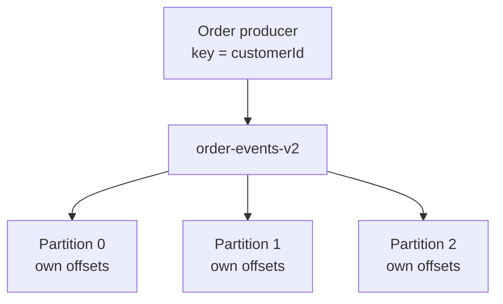

# Lab 05 – Partitions, Keys, and Offsets

**Lab Number:** 05  
**Day:** 1  
**Duration:** 40 minutes  
**Difficulty:** Beginner  
**Environment:** Windows 10 / Windows 11  
**Mode:** Individual

---

## Description

This lab shows why Kafka topics are split into partitions.

You will create a three-partition topic, produce orders **with** keys and **without** keys, consume records while printing partition and offset, and prove that:

- records with the same key go to the same partition
- order is guaranteed only inside a partition
- each partition has its own offset sequence

This is the foundation for consumer scaling in Lab 09 and the capstone.

---

## Prerequisites

- Labs 01–04 are complete
- Single-broker cluster from Lab 02 is running
- You understand `order-events` from Lab 03
- CLI tools from Lab 04 work against `localhost:9092`

Verify:

```powershell
cd C:\kafka-labs\kafka

.\bin\windows\kafka-topics.bat `
  --list `
  --bootstrap-server localhost:9092
```

---

## Business Use Case

QuickCart's order volume is growing. One partition is no longer enough because:

- one consumer can read only one partition at a time inside a group
- the team wants customer orders to stay in sequence per customer

The platform team creates `order-events-v2` with three partitions.

Rule from the business:

> All orders for the same customer must stay in order so Inventory does not process a cancellation before the original purchase.

That rule is implemented with the **customer id as the record key**.

---

## Architecture

```text
                 order-events-v2

            +-----------+-----------+
            |    P0     |    P1     |    P2
            | offset 0  | offset 0  | offset 0
            | offset 1  | offset 1  | offset 1
            | offset 2  |           |
            +-----------+-----------+-----------+

 Key = CUSTOMER101  -->  always the same partition
 Key = CUSTOMER102  -->  always the same partition
 No key             -->  default partitioner spreads records


                 Broker 0 :9092
                 (all three partitions live here)
```



---

## Detailed Steps

### Step 0 – Initial Setup

Confirm the Lab 02 cluster is running.

```powershell
cd C:\kafka-labs\kafka

.\bin\windows\kafka-topics.bat `
  --list `
  --bootstrap-server localhost:9092
```

If the command fails, start ZooKeeper and the single broker before continuing.

Do not create this topic on the three-broker cluster. Lab 05 still uses the one-broker lab so you can focus on partitions, not replication.

---

### Step 1 – Create a Three-Partition Topic

```powershell
.\bin\windows\kafka-topics.bat `
  --create `
  --topic order-events-v2 `
  --bootstrap-server localhost:9092 `
  --partitions 3 `
  --replication-factor 1
```

Expected:

```text
Created topic order-events-v2.
```

Describe it:

```powershell
.\bin\windows\kafka-topics.bat `
  --describe `
  --topic order-events-v2 `
  --bootstrap-server localhost:9092
```

Complete:

| Partition | Leader | Replicas | ISR |
| ---: | ---: | --- | --- |
| 0 | | | |
| 1 | | | |
| 2 | | | |

On the single-broker cluster every partition is led by broker `0`.

---

### Step 2 – Produce Records with Customer Keys

Open a producer that parses keys. The key is the customer id.

```powershell
.\bin\windows\kafka-console-producer.bat `
  --bootstrap-server localhost:9092 `
  --topic order-events-v2 `
  --property parse.key=true `
  --property key.separator=:
```

Enter these records exactly:

```text
CUSTOMER101:ORD2001,1500,PLACED
CUSTOMER102:ORD2002,2200,PLACED
CUSTOMER101:ORD2003,300,CANCELLED
CUSTOMER103:ORD2004,9000,PLACED
CUSTOMER102:ORD2005,500,PLACED
CUSTOMER101:ORD2006,750,PLACED
```

Notice `CUSTOMER101` appears three times. Those three orders must land in one partition.

Leave the producer running.

---

### Step 3 – Consume and Map Keys to Partitions

Open a new terminal:

```powershell
cd C:\kafka-labs\kafka

.\bin\windows\kafka-console-consumer.bat `
  --bootstrap-server localhost:9092 `
  --topic order-events-v2 `
  --from-beginning `
  --property print.key=true `
  --property print.partition=true `
  --property print.offset=true `
  --property key.separator=:
```

Complete this table from **your** output. Do not copy a neighbor's assignment. Kafka's default partitioner hashes the key, so partition numbers can differ between machines, but the same key must stay together.

| Record | Key | Partition | Offset |
| --- | --- | ---: | ---: |
| ORD2001 | CUSTOMER101 | | |
| ORD2002 | CUSTOMER102 | | |
| ORD2003 | CUSTOMER101 | | |
| ORD2004 | CUSTOMER103 | | |
| ORD2005 | CUSTOMER102 | | |
| ORD2006 | CUSTOMER101 | | |

**Checkpoint**

- Every `CUSTOMER101` row has the same partition number
- Every `CUSTOMER102` row has the same partition number
- Offsets restart at 0 in each partition

Stop this consumer with `Ctrl+C` after you fill the table.

---

### Step 4 – Prove Per-Partition Ordering

Look only at `CUSTOMER101` rows.

Those records should appear in this business order inside their partition:

```text
ORD2001 PLACED
ORD2003 CANCELLED
ORD2006 PLACED
```

That is why Inventory can safely process one customer's stream. Kafka does **not** promise that `CUSTOMER102` events are processed before or after `CUSTOMER101` events.

Write the idea in your own words:

```text
Ordering guarantee I observed:
________________________________________________________
```

---

### Step 5 – Produce Records without Keys

In the producer terminal, press `Ctrl+C` to stop the keyed producer.

Start a producer **without** key parsing:

```powershell
.\bin\windows\kafka-console-producer.bat `
  --bootstrap-server localhost:9092 `
  --topic order-events-v2
```

Enter:

```text
NOKEY-A,CUSTOMER201,100,PLACED
NOKEY-B,CUSTOMER202,200,PLACED
NOKEY-C,CUSTOMER203,300,PLACED
NOKEY-D,CUSTOMER204,400,PLACED
NOKEY-E,CUSTOMER205,500,PLACED
NOKEY-F,CUSTOMER206,600,PLACED
```

Consume again with metadata:

```powershell
.\bin\windows\kafka-console-consumer.bat `
  --bootstrap-server localhost:9092 `
  --topic order-events-v2 `
  --from-beginning `
  --property print.partition=true `
  --property print.offset=true
```

Find the six `NOKEY-*` records and record their partitions:

| Record | Partition |
| --- | ---: |
| NOKEY-A | |
| NOKEY-B | |
| NOKEY-C | |
| NOKEY-D | |
| NOKEY-E | |
| NOKEY-F | |

They will usually spread across partitions. That is useful for throughput and useless for per-customer ordering.

Stop the consumer with `Ctrl+C`.

---

### Step 6 – Read Offsets for One Partition

Kafka stores a separate log per partition. Inspect partition 0:

```powershell
.\bin\windows\kafka-run-class.bat kafka.tools.GetOffsetShell `
  --bootstrap-server localhost:9092 `
  --topic order-events-v2 `
  --partitions 0
```

If `GetOffsetShell` flags differ in your Kafka version, use:

```powershell
.\bin\windows\kafka-run-class.bat kafka.tools.GetOffsetShell `
  --broker-list localhost:9092 `
  --topic order-events-v2
```

You can also see log-end offsets from a consumer group after a consume, or from `--describe` plus the consumer-groups tool.

Create a short-lived group to read offsets:

```powershell
.\bin\windows\kafka-console-consumer.bat `
  --bootstrap-server localhost:9092 `
  --topic order-events-v2 `
  --group lab05-offset-check `
  --from-beginning `
  --timeout-ms 5000
```

The consumer exits after idle timeout on some versions. If it does not, stop it with `Ctrl+C` after records print.

```powershell
.\bin\windows\kafka-consumer-groups.bat `
  --bootstrap-server localhost:9092 `
  --describe `
  --group lab05-offset-check
```

Complete:

| Partition | CURRENT-OFFSET | LOG-END-OFFSET | LAG |
| ---: | ---: | ---: | ---: |
| 0 | | | |
| 1 | | | |
| 2 | | | |

Each partition has its own offset counter. There is no single “topic offset.”

---

### Step 7 – Trainer Questions

Answer before moving on:

**Why three partitions?**  
Partitions let Kafka spread records and later allow up to three active consumers in one group.

**Why use the customer id as the key?**  
The default partitioner hashes the key, so one customer's events stay in one partition and keep their order.

**What is an offset?**  
The record's position inside **that partition's** log.

---

## Conclusion

You split QuickCart order traffic across three partitions and saw how keys control placement.

Same key → same partition → ordered history for that customer.  
No key → records are distributed → higher parallelism, no per-customer order.

Offsets are per partition, not per topic. That is why consumer lag is also reported per partition.

**You are ready for Lab 06 when:**

- `order-events-v2` has three partitions
- You recorded that `CUSTOMER101` stayed on one partition
- You recorded offsets for partitions 0, 1, and 2

Next lab: [06-zookeeper.md](06-zookeeper.md)

---

## Knowledge Check

1. Does Kafka guarantee global order across an entire topic?
2. If Inventory runs three consumers in one group against this topic, what is the maximum useful parallelism?
3. What happens if you later add a fourth consumer to that group?
4. Why can partition numbers for `CUSTOMER101` differ between two students?

**Expected answers**

1. No. Order is guaranteed only within a partition.
2. Three, because there are three partitions.
3. The fourth consumer gets no partition.
4. The hash of the key is mapped onto the available partitions. The important proof is consistency of the same key, not the partition number itself.

---

## Common Issues

| Symptom | Likely cause | What to do |
| --- | --- | --- |
| All keyed records show an empty key | Producer was not started with `parse.key=true` | Restart the producer with the key properties |
| `CUSTOMER101` appears in two partitions | A line was typed without the key or with the wrong separator | Re-create the topic only if the trainer agrees; otherwise produce a fresh marked batch |
| `GetOffsetShell` class not found | Script/version difference | Use `kafka-consumer-groups --describe` instead |
| Replication-factor error | You accidentally pointed at a stopped cluster | Restart the Lab 02 broker |
