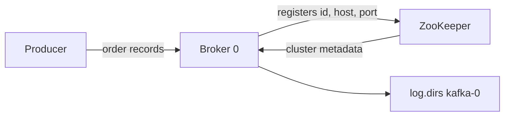

# Lab 06 – Explore ZooKeeper

**Lab Number:** 06  
**Day:** 1  
**Duration:** 30 minutes  
**Difficulty:** Beginner  
**Environment:** Windows 10 / Windows 11  
**Mode:** Individual

---

## Description

This lab inspects the ZooKeeper process that coordinates the Day 1 Kafka cluster.

You will connect with `zookeeper-shell`, list Kafka metadata paths, identify the registered broker, inspect topic metadata, and state clearly what ZooKeeper stores and what it does **not** store.

This course uses ZooKeeper-mode Kafka. You need this lab even if newer production clusters use KRaft.

---

## Prerequisites

- Labs 01–05 are complete
- ZooKeeper is running on `localhost:2181`
- The single Kafka broker is running on `localhost:9092`
- Topics `order-events` and `order-events-v2` exist

Verify ZooKeeper is listening:

```powershell
netstat -ano | findstr ":2181"
```

You must see a `LISTENING` row.

---

## Business Use Case

QuickCart operations asked a simple question after the first broker came up:

> “If ZooKeeper is part of the cluster, is that where our orders are stored?”

The answer is no. ZooKeeper stores **cluster metadata**. Brokers store **event logs**.

This lab proves that distinction so nobody pages ZooKeeper when an order is missing.

---

## Architecture

```text
                 WHAT EACH STORE HOLDS

 +----------------------+     +--------------------------+
 | ZooKeeper :2181      |     | Kafka Broker 0 :9092     |
 |                      |     |                          |
 | /brokers/ids         |     | order-events log         |
 | /brokers/topics      |     | order-events-v2 logs     |
 | controller info      |     | click-events log         |
 | cluster membership   |     | consumer offsets         |
 |                      |     |                          |
 | NOT order payloads   |     | Business records live    |
 +----------------------+     +--------------------------+
             ^                            |
             |     broker registration    |
             +----------------------------+
```



---

## Detailed Steps

### Step 0 – Initial Setup

Confirm both processes are running.

Terminal 1: ZooKeeper logs still scrolling or idle after startup.  
Terminal 2: Broker logs still available.

If ZooKeeper was restarted recently, wait 10 seconds for the broker to re-register before using the shell.

Open **Terminal 5**:

```powershell
cd C:\kafka-labs\kafka
```

---

### Step 1 – Open the ZooKeeper Shell

```powershell
.\bin\windows\zookeeper-shell.bat localhost:2181
```

A successful start shows a prompt similar to:

```text
Connecting to localhost:2181
Welcome to ZooKeeper!
```

You are now talking to ZooKeeper, not to Kafka.

If the shell cannot connect, ZooKeeper is not running. Return to Lab 02 Step 3.

---

### Step 2 – List the Kafka Root Paths

At the ZooKeeper prompt type:

```text
ls /
```

You should see Kafka-related znodes. Typical names include:

```text
[cluster, controller, brokers, zookeeper, admin, isr_change_notification, consumers, latest_producer_id_block, log_dir_event_notification, config]
```

Exact names vary by Kafka version. You must see `brokers`.

Write the names you received:

```text
ls /  result:
________________________________________________
```

---

### Step 3 – Inspect Registered Brokers

```text
ls /brokers
```

Expected children include `ids` and `topics`.

```text
ls /brokers/ids
```

On the Lab 02 cluster you should see:

```text
[0]
```

That is `broker.id=0` from `server.properties`.

Read the broker registration:

```text
get /brokers/ids/0
```

The payload is JSON-like text. Find:

| Field | What it means | Your value |
| --- | --- | --- |
| host / endpoint | Where clients connect | |
| port | Listener port | |
| version / timestamp | Registration metadata | |

You should be able to recognize `9092`.

---

### Step 4 – Inspect Topic Metadata

```text
ls /brokers/topics
```

You should see topic names such as:

```text
order-events
click-events
order-events-v2
```

Internal topics may also appear.

Inspect one business topic:

```text
get /brokers/topics/order-events-v2
```

Look for partition-to-broker mapping information. This is metadata about **where partitions live**, not the order payloads themselves.

Complete:

| Topic visible in ZooKeeper? | Yes / No |
| --- | --- |
| `order-events` | |
| `click-events` | |
| `order-events-v2` | |

---

### Step 5 – Look at Controller Information

```text
get /controller
```

The controller is the broker currently performing administrative duties such as partition-leader management.

On a one-broker cluster the controller is broker `0`.

Record:

| Field | Your value |
| --- | --- |
| Controller broker id | |
| Why that id makes sense | |

---

### Step 6 – Prove ZooKeeper Does Not Store Order Payloads

Stay in the ZooKeeper shell.

Try to find `ORD2001` or `CUSTOMER101` by browsing the topic znode you already fetched.

You will see partition assignments and configuration-related metadata. You will **not** see:

```text
CUSTOMER101:ORD2001,1500,PLACED
```

Leave the ZooKeeper shell:

```text
quit
```

Now look at the broker log directory:

```powershell
Get-ChildItem C:\kafka-labs\data\kafka-0
```

Find a folder whose name contains `order-events-v2`. Then list it:

```powershell
Get-ChildItem C:\kafka-labs\data\kafka-0 -Directory |
  Where-Object { $_.Name -like "*order-events-v2*" }
```

Each partition has its own directory, typically:

```text
order-events-v2-0
order-events-v2-1
order-events-v2-2
```

Those directories contain `.log` / index files. That is where the business records live.

**Checkpoint**

| Question | Answer |
| --- | --- |
| Where is broker `0` registered? | ZooKeeper `/brokers/ids/0` |
| Where are `ORD2001` bytes stored? | Broker `log.dirs` |
| If ZooKeeper is down, can a running broker still serve already-started produce/consume in every case? | Discuss with trainer; new metadata operations depend on ZooKeeper in this mode |

---

### Step 7 – Optional: Watch What Happens If You Start the Shell Against the Wrong Port

Do **not** stop ZooKeeper.

This command should fail because `9092` is Kafka, not ZooKeeper:

```powershell
.\bin\windows\zookeeper-shell.bat localhost:9092
```

You should get a connection or protocol error. That is useful: the two ports are different services.

---

## Conclusion

ZooKeeper is the coordinator for this training cluster. It knows which brokers are alive, which topics exist, and which broker is controller.

It does not store QuickCart order payloads. Those records are in the broker log directories under `C:\kafka-labs\data\kafka-0`.

When you add more brokers in Lab 07, `/brokers/ids` will show `1`, `2`, and `3` instead of only `0`.

**You are ready for Lab 07 when:**

- You listed `/brokers/ids` and saw broker `0`
- You listed `/brokers/topics` and saw your business topics
- You can explain the metadata-versus-log split in one sentence

Next lab: [07-multi-broker.md](07-multi-broker.md)

---

## Knowledge Check

1. What lives under `/brokers/ids`?
2. Why is ZooKeeper required in this course’s Kafka package?
3. A product owner asks you to “open ZooKeeper and get yesterday’s cancelled orders.” What do you tell them?
4. What is the controller?

**Expected answers**

1. The ids of brokers currently registered in the cluster.
2. Brokers use it for membership, controller election, and topic/partition metadata.
3. Orders are in Kafka logs, not ZooKeeper. Use a consumer or the topic log.
4. The broker currently performing cluster administrative duties.

---

## Common Issues

| Symptom | Likely cause | What to do |
| --- | --- | --- |
| Shell cannot connect to 2181 | ZooKeeper is not running | Start `zookeeper-server-start.bat` |
| `ls /brokers/ids` is empty | Broker has not registered yet | Start the broker and retry after 10 seconds |
| `get` prints little or no JSON | You used `ls` on a data node or a version-specific path | Use `get /brokers/ids/0` |
| You are stuck in the shell | Forgot `quit` | Type `quit` and press Enter |
