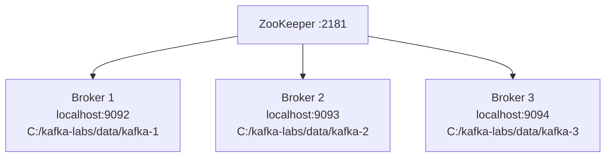

# Lab 07 – Single Node, Multiple Brokers

**Lab Number:** 07  
**Day:** 1  
**Duration:** 45 minutes  
**Difficulty:** Intermediate  
**Environment:** Windows 10 / Windows 11  
**Mode:** Individual

---

## Description

This lab turns the one-broker developer cluster into a three-broker cluster running on the same Windows machine.

You will stop the Lab 02 broker, create `server-1.properties`, `server-2.properties`, and `server-3.properties`, start three brokers, confirm they all register in ZooKeeper, and create a replicated topic.

From this lab onward, Day 1 uses the three-broker layout. Do not start `server.properties` (broker 0) again unless a later step says to revert.

---

## Prerequisites

- Labs 01–06 are complete
- ZooKeeper is running on `localhost:2181`
- You understand `broker.id`, `listeners`, and `log.dirs`
- Ports `9092`, `9093`, and `9094` will be used
- Four PowerShell terminals are available: ZooKeeper + 3 brokers
- One extra terminal for CLI commands

**Important:** Broker 0 from Lab 02 currently owns port `9092`. You must stop it before Broker 1 can use `9092`.

---

## Business Use Case

QuickCart’s platform team rejected a one-broker production design.

If the single developer broker dies, order and payment events are unavailable. The business requirement is:

- three Kafka brokers
- topics can be replicated
- one Windows lab machine is acceptable for training
- each broker must have its own id, port, and log directory

This lab builds that cluster. Lab 08 proves that replication actually protects data.

---

## Architecture

```text
                    ZooKeeper
                       2181
                         |
          +--------------+--------------+
          |              |              |
          v              v              v
      Broker 1       Broker 2       Broker 3
       :9092          :9093          :9094
      kafka-1        kafka-2        kafka-3

 One Windows machine. Three broker processes.
```



---

## Detailed Steps

### Step 0 – Initial Setup

Stop the Lab 02 single broker.

Go to **Terminal 2** (the broker using `server.properties`) and press:

```text
Ctrl+C
```

Wait until the process exits and the prompt returns.

Confirm port 9092 is free:

```powershell
netstat -ano | findstr ":9092"
```

No `LISTENING` row should remain for 9092.

Leave **ZooKeeper running** in Terminal 1. You do not restart ZooKeeper.

Confirm data folders exist:

```powershell
Test-Path C:\kafka-labs\data\kafka-1
Test-Path C:\kafka-labs\data\kafka-2
Test-Path C:\kafka-labs\data\kafka-3
```

All three must be `True`. If not, create them:

```powershell
New-Item -ItemType Directory -Force -Path C:\kafka-labs\data\kafka-1
New-Item -ItemType Directory -Force -Path C:\kafka-labs\data\kafka-2
New-Item -ItemType Directory -Force -Path C:\kafka-labs\data\kafka-3
```

---

### Step 1 – Create `server-1.properties`

Copy the original broker config:

```powershell
cd C:\kafka-labs\kafka

Copy-Item .\config\server.properties .\config\server-1.properties
```

Open `C:\kafka-labs\kafka\config\server-1.properties` and set these properties. Search for each name and change it. Do not duplicate the same property twice in the file.

```properties
broker.id=1
listeners=PLAINTEXT://localhost:9092
advertised.listeners=PLAINTEXT://localhost:9092
log.dirs=C:/kafka-labs/data/kafka-1
zookeeper.connect=localhost:2181
num.network.threads=3
num.io.threads=8
offsets.topic.replication.factor=3
transaction.state.log.replication.factor=3
transaction.state.log.min.isr=2
```

Save the file.

`offsets.topic.replication.factor` is now 3 because three brokers will exist.

---

### Step 2 – Create `server-2.properties`

```powershell
Copy-Item .\config\server.properties .\config\server-2.properties
```

Edit `server-2.properties`:

```properties
broker.id=2
listeners=PLAINTEXT://localhost:9093
advertised.listeners=PLAINTEXT://localhost:9093
log.dirs=C:/kafka-labs/data/kafka-2
zookeeper.connect=localhost:2181
offsets.topic.replication.factor=3
transaction.state.log.replication.factor=3
transaction.state.log.min.isr=2
```

Save the file.

---

### Step 3 – Create `server-3.properties`

```powershell
Copy-Item .\config\server.properties .\config\server-3.properties
```

Edit `server-3.properties`:

```properties
broker.id=3
listeners=PLAINTEXT://localhost:9094
advertised.listeners=PLAINTEXT://localhost:9094
log.dirs=C:/kafka-labs/data/kafka-3
zookeeper.connect=localhost:2181
offsets.topic.replication.factor=3
transaction.state.log.replication.factor=3
transaction.state.log.min.isr=2
```

Save the file.

Complete this checklist before starting any broker:

| File | broker.id | Port | log.dirs |
| --- | ---: | ---: | --- |
| `server-1.properties` | 1 | 9092 | `C:/kafka-labs/data/kafka-1` |
| `server-2.properties` | 2 | 9093 | `C:/kafka-labs/data/kafka-2` |
| `server-3.properties` | 3 | 9094 | `C:/kafka-labs/data/kafka-3` |

If two files share the same `broker.id` or `log.dirs`, the cluster will fail. Fix that before Step 4.

---

### Step 4 – Start Broker 1

Open **Terminal 2**:

```powershell
cd C:\kafka-labs\kafka

.\bin\windows\kafka-server-start.bat `
  .\config\server-1.properties
```

Expected identity:

```text
Broker ID: 1
Port: 9092
```

Keep the terminal running.

---

### Step 5 – Start Broker 2

Open **Terminal 3**:

```powershell
cd C:\kafka-labs\kafka

.\bin\windows\kafka-server-start.bat `
  .\config\server-2.properties
```

Expected identity:

```text
Broker ID: 2
Port: 9093
```

---

### Step 6 – Start Broker 3

Open **Terminal 4**:

```powershell
cd C:\kafka-labs\kafka

.\bin\windows\kafka-server-start.bat `
  .\config\server-3.properties
```

Expected identity:

```text
Broker ID: 3
Port: 9094
```

**Checkpoint**

```powershell
netstat -ano | findstr ":9092"
netstat -ano | findstr ":9093"
netstat -ano | findstr ":9094"
```

All three ports should be `LISTENING`.

---

### Step 7 – Confirm All Three Brokers in ZooKeeper

Open a CLI terminal:

```powershell
cd C:\kafka-labs\kafka

.\bin\windows\zookeeper-shell.bat localhost:2181
```

At the ZooKeeper prompt:

```text
ls /brokers/ids
```

Expected:

```text
[1, 2, 3]
```

The order inside the brackets can vary. Broker `0` should no longer appear.

```text
quit
```

---

### Step 8 – Create a Replicated Inventory Topic

```powershell
.\bin\windows\kafka-topics.bat `
  --create `
  --topic inventory-events `
  --bootstrap-server localhost:9092 `
  --partitions 3 `
  --replication-factor 3
```

Expected:

```text
Created topic inventory-events.
```

If you see an error that the replication factor is larger than the number of brokers, one broker is not up. Check Terminals 2–4.

Describe the topic:

```powershell
.\bin\windows\kafka-topics.bat `
  --describe `
  --topic inventory-events `
  --bootstrap-server localhost:9092
```

Sample shape (your leader numbers will differ):

```text
Topic: inventory-events
PartitionCount: 3
ReplicationFactor: 3

Partition: 0  Leader: 1  Replicas: 1,2,3  Isr: 1,2,3
Partition: 1  Leader: 2  Replicas: 2,3,1  Isr: 2,3,1
Partition: 2  Leader: 3  Replicas: 3,1,2  Isr: 3,1,2
```

Complete **your** result:

| Partition | Leader | Replicas | ISR |
| ---: | ---: | --- | --- |
| 0 | | | |
| 1 | | | |
| 2 | | | |

**Do not expect the sample assignments.** Kafka places replicas automatically.

---

### Step 9 – Produce and Consume Across the Cluster

Produce a few inventory events. You can bootstrap using any one broker, but listing all three is a better habit.

```powershell
.\bin\windows\kafka-console-producer.bat `
  --bootstrap-server localhost:9092,localhost:9093,localhost:9094 `
  --topic inventory-events
```

Enter:

```text
SKU441,ORD2001,RESERVED
SKU442,ORD2002,RESERVED
SKU441,ORD2003,RELEASED
SKU550,ORD2004,RESERVED
```

Stop the producer with `Ctrl+C` after the four lines, or leave it running.

Consume:

```powershell
.\bin\windows\kafka-console-consumer.bat `
  --bootstrap-server localhost:9092,localhost:9093,localhost:9094 `
  --topic inventory-events `
  --from-beginning
```

You should see the four records. Stop the consumer with `Ctrl+C`.

---

### Step 10 – What Happened to Old Topics?

Topics created on the **one-broker** cluster (`order-events`, `click-events`, `order-events-v2`) still have metadata, but they were created with replication factor 1 on broker 0.

Broker 0 is no longer running. Those old topics may be unavailable or unhealthy.

For the rest of Day 1:

- use `inventory-events` and the new topics you create on the three-broker cluster
- do not spend time repairing Lab 03 topics unless the trainer asks

This is an important operational lesson: topic placement is bound to the brokers that existed when the topic was created.

---

## Conclusion

You now have a three-broker QuickCart lab cluster on one Windows machine.

Each broker has a unique id, port, and log directory. `inventory-events` has three partitions and three replicas. ZooKeeper lists brokers `1`, `2`, and `3`.

The cluster can store replicated events. Lab 08 shows what happens when one of those brokers fails.

**You are ready for Lab 08 when:**

- ZooKeeper plus three brokers are running
- `/brokers/ids` shows `1`, `2`, and `3`
- `inventory-events` has RF 3 and a full ISR for each partition

Next lab: [08-replication-isr.md](08-replication-isr.md)

---

## Knowledge Check

1. Why must each broker have a different `log.dirs` on one machine?
2. Why did we stop broker 0 before starting broker 1?
3. Why can a client use `localhost:9093` even if you created the topic through `localhost:9092`?
4. Why are Lab 03 topics not reliable on this new cluster?

**Expected answers**

1. Two brokers cannot safely share one log directory. Each process must own its files.
2. Both would try to bind `9092`, and leftover broker-0 data/metadata would confuse the new cluster.
3. Any broker can bootstrap a client. The client then discovers the partition leaders.
4. They were created on broker 0 with RF 1. That broker is gone.

---

## Common Issues

| Symptom | Likely cause | What to do |
| --- | --- | --- |
| Broker 1 fails to bind 9092 | Lab 02 broker still running | Stop `server.properties` and retry |
| Duplicate `broker.id` error | Two files have the same id | Fix the properties and restart the conflicting broker |
| `Number of available brokers` too low | A broker is still starting | Wait and re-describe `/brokers/ids` |
| Kafka keeps using `C:\tmp\kafka-logs` | `log.dirs` not saved or duplicated later in the file | Search the file; the last value wins |
| Machine feels slow | Three Java brokers on 8 GB RAM | Close extra applications; do not start unused consumers |
