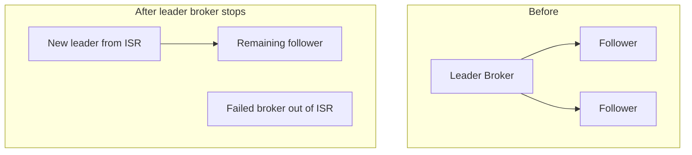

# Lab 08 – Replication, Leader, Follower, and ISR

**Lab Number:** 08  
**Day:** 1  
**Duration:** 40 minutes  
**Difficulty:** Intermediate  
**Environment:** Windows 10 / Windows 11  
**Mode:** Individual

---

## Description

This lab proves that QuickCart’s three-broker cluster can survive the loss of one broker.

You will record leaders and ISR for `inventory-events`, stop one broker that currently leads a partition, watch leader election, compare ISR before and after the failure, produce and consume while that broker is down, then restart the broker and watch it rejoin the ISR.

The Day 1 capstone repeats this pattern on the payment topic. Learn the terms here so the capstone is an investigation, not a first exposure.

---

## Prerequisites

- Lab 07 is complete
- ZooKeeper is running
- Brokers 1, 2, and 3 are running on `9092`, `9093`, and `9094`
- Topic `inventory-events` exists with 3 partitions and RF 3
- You have the partition table you filled in Lab 07

Verify:

```powershell
cd C:\kafka-labs\kafka

.\bin\windows\kafka-topics.bat `
  --describe `
  --topic inventory-events `
  --bootstrap-server localhost:9092
```

Every partition should list three replicas and a full ISR.

---

## Business Use Case

QuickCart cannot pause checkout because one Kafka VM is patched.

The durability rule is:

- every inventory event has three copies
- producers and consumers talk to the **leader** replica
- followers stay in the **in-sync replica** set (ISR)
- if a leader broker dies, another ISR member becomes leader
- after the failed broker returns, it catches up and rejoins ISR

This lab is that failure drill.

---

## Architecture

```text
Before failure - example for Partition 0

            Broker 1
             LEADER
            /      \
           /        \
      Broker 2    Broker 3
      FOLLOWER    FOLLOWER

      ISR = 1,2,3


Broker 1 FAILS


After election - example

             X
          Broker 1

      Broker 2
       LEADER
          |
      Broker 3
      FOLLOWER

      ISR = 2,3
```



Your actual leader ids will come from `--describe`. Do not assume Partition 0 is always on Broker 1.

---

## Detailed Steps

### Step 0 – Initial Setup

Confirm all three brokers are running:

```powershell
netstat -ano | findstr ":9092"
netstat -ano | findstr ":9093"
netstat -ano | findstr ":9094"
```

All three should be `LISTENING`.

If a broker is down, start it with the matching properties file from Lab 07 before you record the “before failure” table.

---

### Step 1 – Record Leaders, Replicas, and ISR

```powershell
cd C:\kafka-labs\kafka

.\bin\windows\kafka-topics.bat `
  --describe `
  --topic inventory-events `
  --bootstrap-server localhost:9092
```

Complete **Table A – Before failure**:

| Partition | Leader | Replicas | ISR |
| ---: | ---: | --- | --- |
| 0 | | | |
| 1 | | | |
| 2 | | | |

Definitions you will use for the rest of the day:

| Term | Meaning |
| --- | --- |
| Leader | Replica that handles reads and writes for that partition |
| Follower | Replica that copies the leader’s log |
| Replicas | All assigned copies, including stale ones |
| ISR | Replicas that are currently in sync with the leader |

---

### Step 2 – Choose One Broker to Stop

Look at Table A and pick a broker id that is **leader for at least one partition**.

Write your choice:

```text
Broker I will stop: ________
Port of that broker: ________
Partitions it currently leads: ________
```

Examples:

- If Broker 1 leads any partition, you will stop Terminal 2 (`server-1.properties`, port 9092)
- If you instead stop Broker 2, use Terminal 3 (port 9093)
- If you stop Broker 3, use Terminal 4 (port 9094)

---

### Step 3 – Stop the Chosen Broker

Go to that broker’s terminal and press:

```text
Ctrl+C
```

Wait until the process exits.

Architecture now looks like this if Broker 1 was stopped:

```text
      Broker 1       Broker 2       Broker 3

         X             RUNNING        RUNNING
      FAILED
```

Do not stop a second broker. With RF 3 and two remaining brokers the cluster can still elect leaders. Stopping two brokers can make partitions unavailable.

---

### Step 4 – Describe the Topic Using a Living Broker

If you stopped Broker 1, do **not** bootstrap against `localhost:9092`.

Use a broker that is still running. Example after stopping Broker 1:

```powershell
.\bin\windows\kafka-topics.bat `
  --describe `
  --topic inventory-events `
  --bootstrap-server localhost:9093
```

If you stopped Broker 2, `localhost:9092` or `localhost:9094` is fine.

Complete **Table B – After failure**:

| Partition | Leader after | ISR after |
| ---: | ---: | --- |
| 0 | | |
| 1 | | |
| 2 | | |

Compare Table A and Table B.

Expected observations:

- Partitions whose leader was the failed broker have a **new leader**
- The new leader was already in the old ISR
- ISR for those partitions no longer contains the failed broker

---

### Step 5 – Produce While a Broker Is Down

```powershell
.\bin\windows\kafka-console-producer.bat `
  --bootstrap-server localhost:9092,localhost:9093,localhost:9094 `
  --topic inventory-events
```

If the first bootstrap host is the dead broker, the client should still discover a living broker from the remaining addresses. If the producer cannot connect, remove the dead host from the list and retry.

Enter:

```text
SKU900,ORD2090,RESERVED
SKU901,ORD2091,RESERVED
SKU902,ORD2092,RELEASED
```

The produce should succeed.

This is the business proof: inventory updates continue during a single-broker outage.

---

### Step 6 – Consume While a Broker Is Down

```powershell
.\bin\windows\kafka-console-consumer.bat `
  --bootstrap-server localhost:9093,localhost:9094,localhost:9092 `
  --topic inventory-events `
  --from-beginning
```

You should see earlier Lab 07 records plus the three new ones.

Stop the consumer with `Ctrl+C`.

---

### Step 7 – Restart the Failed Broker

Start the broker you stopped. Example for Broker 1:

```powershell
cd C:\kafka-labs\kafka

.\bin\windows\kafka-server-start.bat `
  .\config\server-1.properties
```

Use `server-2.properties` or `server-3.properties` if you stopped those brokers.

Wait 15–30 seconds for the replica to fetch missing records.

---

### Step 8 – Confirm the Broker Rejoins ISR

```powershell
.\bin\windows\kafka-topics.bat `
  --describe `
  --topic inventory-events `
  --bootstrap-server localhost:9092
```

Complete **Table C – After recovery**:

| Partition | Leader | ISR |
| ---: | ---: | --- |
| 0 | | |
| 1 | | |
| 2 | | |

Expected:

```text
Broker restarts
      ↓
Replica reconnects
      ↓
Replica catches up
      ↓
Returns to ISR
```

The restarted broker should reappear in ISR. It may or may not become leader again. Kafka does not have to move leadership back.

Write what you observed:

```text
Did the original leaders return?  Yes / No
Did the restarted broker return to every ISR?  Yes / No
```

---

### Step 9 – Explain the Result in Business Language

Fill in this sentence:

```text
If the Kafka VM that led Partition ____ failed, QuickCart inventory
events stayed available because Broker ____ became leader from the
in-sync replicas ____.
```

---

## Conclusion

Replication is not a diagram. You watched a leader disappear, another in-sync replica take over, producers and consumers continue, and the recovered broker catch up.

Key terms for the rest of the course:

- **Leader** – the replica currently serving a partition
- **Follower** – a replica copying the leader
- **ISR** – followers that are caught up enough to be eligible for leadership

Lab 11 repeats this drill on `payment-events` without step-by-step coaching.

**You are ready for Lab 09 when:**

- Tables A, B, and C are filled with your cluster’s values
- You produced records during the outage
- All three brokers are running again

Next lab: [09-consumer-groups.md](09-consumer-groups.md)

---

## Knowledge Check

1. What is the difference between Replicas and ISR?
2. Why must you describe the topic through a broker that is still running?
3. Why did we refuse to stop two brokers in this lab?
4. After recovery, must the original leader become leader again?

**Expected answers**

1. Replicas are the assigned copies. ISR is the subset currently in sync.
2. The failed broker cannot answer metadata requests.
3. Losing two of three replicas can leave no eligible leader, depending on `min.insync.replicas` and remaining ISR.
4. No. Remaining on a healthy leader is acceptable.

---

## Common Issues

| Symptom | Likely cause | What to do |
| --- | --- | --- |
| Describe hangs on 9092 | You stopped Broker 1 and still bootstrap 9092 only | Use 9093 or 9094 |
| ISR does not change | You did not wait, or you stopped a broker that led nothing and metadata is cached | Wait 10 seconds and describe again |
| Producer fails after the outage | Bootstrap list contains only the dead broker | Include at least one living broker |
| Restarted broker never reappears in ISR | Broker cannot reach ZooKeeper or is using the wrong `log.dirs` | Check the restart terminal for errors |
| Accidental two-broker outage | Closed the wrong terminal | Start the extra broker immediately |
