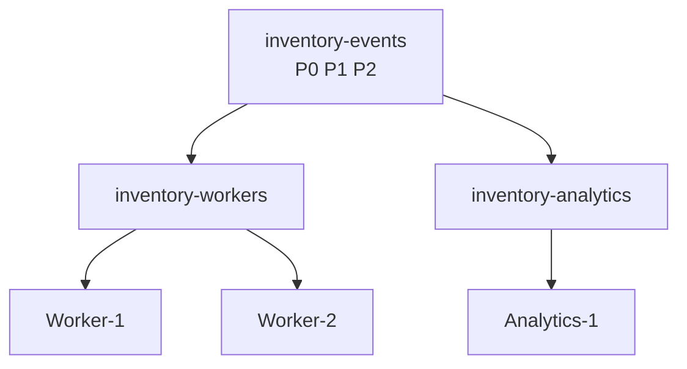

# Lab 09 – Consumer Groups, Lag, and Rebalancing

**Lab Number:** 09  
**Day:** 1  
**Duration:** 40 minutes  
**Difficulty:** Intermediate  
**Environment:** Windows 10 / Windows 11  
**Mode:** Individual

---

## Description

This lab turns the morning publish/subscribe discussion into a running system.

You will start two consumers in the same group, start a second group against the same topic, inspect assignments and lag, stop one consumer to force a rebalance, and see what happens when there are more consumers than partitions.

Use `inventory-events` on the three-broker cluster. Do not use Java consumers today.

---

## Prerequisites

- Labs 07 and 08 are complete
- ZooKeeper and brokers 1–3 are running
- `inventory-events` exists with 3 partitions and RF 3
- You can open at least four extra terminals: producer + 3 consumers
- You know how to describe a topic and a consumer group

Verify:

```powershell
cd C:\kafka-labs\kafka

.\bin\windows\kafka-topics.bat `
  --describe `
  --topic inventory-events `
  --bootstrap-server localhost:9092
```

---

## Business Use Case

Two QuickCart systems need the same inventory events:

- **Inventory Workers** share the load. Each reserved SKU should be processed once.
- **Analytics** needs the same events independently so warehouse dashboards stay correct.

That is two consumer groups on one topic:

```text
Same events. Different groups. Independent offsets.
```

If one inventory worker stops, the remaining worker must take its partitions. That is rebalancing.

---

## Architecture

```text
                 inventory-events

              P0      P1      P2
               \      |      /
                \     |     /
                 v    v    v

         inventory-workers
         Consumer Group
           Worker-1   Worker-2


                 same topic
                     |
                     v
         inventory-analytics
         Consumer Group
           Analytics-1
```



---

## Detailed Steps

### Step 0 – Initial Setup

Confirm the three-broker cluster is healthy.

```powershell
cd C:\kafka-labs\kafka

.\bin\windows\kafka-topics.bat `
  --list `
  --bootstrap-server localhost:9092,localhost:9093,localhost:9094
```

`inventory-events` must be listed.

If you have leftover console consumers from Lab 08, stop them with `Ctrl+C` so they do not join the new groups by accident.

---

### Step 1 – Start Inventory Worker 1

Open a new terminal:

```powershell
cd C:\kafka-labs\kafka

.\bin\windows\kafka-console-consumer.bat `
  --bootstrap-server localhost:9092,localhost:9093,localhost:9094 `
  --topic inventory-events `
  --group inventory-workers
```

Leave it running.

This consumer starts at the latest offset unless you add `--from-beginning`. That is intended. Worker 1 will process **new** inventory events.

---

### Step 2 – Start Inventory Worker 2

Open another terminal and run the **same** command:

```powershell
cd C:\kafka-labs\kafka

.\bin\windows\kafka-console-consumer.bat `
  --bootstrap-server localhost:9092,localhost:9093,localhost:9094 `
  --topic inventory-events `
  --group inventory-workers
```

You now have:

```text
Consumer Group: inventory-workers
  Worker-1
  Worker-2
```

Kafka will share the three partitions between these two members.

---

### Step 3 – Produce a Fresh Inventory Batch

Open a producer terminal:

```powershell
cd C:\kafka-labs\kafka

.\bin\windows\kafka-console-producer.bat `
  --bootstrap-server localhost:9092,localhost:9093,localhost:9094 `
  --topic inventory-events
```

Enter:

```text
SKU701,ORD2101,RESERVED
SKU702,ORD2102,RESERVED
SKU703,ORD2103,RELEASED
SKU704,ORD2104,RESERVED
SKU705,ORD2105,RESERVED
SKU706,ORD2106,RELEASED
SKU707,ORD2107,RESERVED
SKU708,ORD2108,RESERVED
```

Watch **both** worker terminals.

Neither worker necessarily receives every record. Together they should receive the batch.

Write what you saw:

| Worker | Records you saw |
| --- | --- |
| Worker-1 | |
| Worker-2 | |
| Combined unique records | |

---

### Step 4 – Inspect Group Assignment and Lag

In a CLI terminal:

```powershell
.\bin\windows\kafka-consumer-groups.bat `
  --bootstrap-server localhost:9092 `
  --describe `
  --group inventory-workers
```

Inspect columns such as:

```text
TOPIC
PARTITION
CURRENT-OFFSET
LOG-END-OFFSET
LAG
CONSUMER-ID
```

Complete **Table D – inventory-workers**:

| Partition | Assigned consumer | Current offset | Log end offset | Lag |
| ---: | --- | ---: | ---: | ---: |
| 0 | | | | |
| 1 | | | | |
| 2 | | | | |

Explain lag:

```text
Log End Offset = latest record available
Current Offset = consumer progress
Lag ≈ records still waiting to be processed
```

Example:

```text
LOG-END-OFFSET = 1000
CURRENT-OFFSET = 950
LAG = 50
```

Business meaning: Inventory Workers still have about 50 records to catch up on that partition.

---

### Step 5 – Add an Independent Analytics Group

Fraud/analytics-style independence is the point of Pub/Sub.

Start:

```powershell
.\bin\windows\kafka-console-consumer.bat `
  --bootstrap-server localhost:9092,localhost:9093,localhost:9094 `
  --topic inventory-events `
  --group inventory-analytics `
  --from-beginning
```

`--from-beginning` lets Analytics replay history. Inventory Workers do not have to replay just because Analytics did.

You now have:

```text
                  inventory-events
                       |
              +--------+--------+
              |                 |
              v                 v
      inventory-workers   inventory-analytics
```

Produce two more records in the producer terminal:

```text
SKU709,ORD2109,RESERVED
SKU710,ORD2110,RELEASED
```

Analytics should see history plus the new records. The two workers should see only the new records, split by partition assignment.

Describe the second group:

```powershell
.\bin\windows\kafka-consumer-groups.bat `
  --bootstrap-server localhost:9092 `
  --describe `
  --group inventory-analytics
```

Complete:

| Group | Active members | Reads the same topic? | Shares offsets with the other group? |
| --- | ---: | --- | --- |
| `inventory-workers` | | Yes | |
| `inventory-analytics` | | Yes | |

The last column must be **No**.

---

### Step 6 – Force a Rebalance

Stop Worker 2 with `Ctrl+C`.

```text
Before (example)

P0 --> Worker-1
P1 --> Worker-1
P2 --> Worker-2


Worker-2 stops


After rebalance (example)

P0 ─┐
P1 ─┤--> Worker-1
P2 ─┘
```

Actual assignment can vary.

Describe the group again:

```powershell
.\bin\windows\kafka-consumer-groups.bat `
  --bootstrap-server localhost:9092 `
  --describe `
  --group inventory-workers
```

Worker-1 should now own the partitions that Worker-2 had.

Restart Worker 2 with the same `inventory-workers` command. Another rebalance occurs.

```text
Consumer joins/leaves
        ↓
Group membership changes
        ↓
Partition reassignment
        ↓
Consumers continue processing
```

---

### Step 7 – More Consumers Than Partitions

`inventory-events` has **3** partitions.

Start a third worker in a new terminal, same group:

```powershell
.\bin\windows\kafka-console-consumer.bat `
  --bootstrap-server localhost:9092,localhost:9093,localhost:9094 `
  --topic inventory-events `
  --group inventory-workers
```

Then start a **fourth** worker with the same command.

Describe the group:

```powershell
.\bin\windows\kafka-consumer-groups.bat `
  --bootstrap-server localhost:9092 `
  --describe `
  --group inventory-workers
```

Expected concept:

```text
3 Partitions
4 Consumers

P0 --> C1
P1 --> C2
P2 --> C3
C4 --> No partition
```

The idle consumer is not broken. Inside one group, a partition is assigned to only one consumer at a time.

Write the assignment you actually received:

| Consumer terminal | Assigned partitions |
| --- | --- |
| Worker-1 | |
| Worker-2 | |
| Worker-3 | |
| Worker-4 | |

---

### Step 8 – Stop Extra Workers

Stop Worker-3 and Worker-4 with `Ctrl+C`.

Leave Worker-1, Worker-2, Analytics, and the producer as you wish. If you are continuing to Lab 10, you may stop the consumers to free memory. The three brokers and ZooKeeper must stay up.

---

## Conclusion

A consumer group is a competing-consumer team. Members split partitions and share committed offsets.

A second group is an independent subscriber. It can replay the same QuickCart events without stealing work from the first group.

Lag tells you how far a group is behind. Rebalance tells you how Kafka reacts when members join or leave. Extra consumers beyond the partition count sit idle.

**You are ready for Lab 10 when:**

- Two groups have consumed `inventory-events`
- You recorded assignment and lag for `inventory-workers`
- You saw an idle consumer after starting a fourth worker

Next lab: [10-multi-node-cluster.md](10-multi-node-cluster.md)

---

## Knowledge Check

1. Why didn’t both inventory workers receive every record?
2. Why could Analytics receive the same events?
3. What happens when a worker stops?
4. Why didn’t the fourth worker increase parallelism?

**Expected answers**

1. They are in the same group, so partitions are divided.
2. Analytics uses a different group with independent offsets.
3. Kafka rebalances and assigns those partitions to remaining members.
4. There are only three partitions. A group can actively use at most one consumer per partition.

---

## Common Issues

| Symptom | Likely cause | What to do |
| --- | --- | --- |
| Both workers print every message | They used different group ids | Check the `--group` value |
| Analytics shows nothing | Topic is empty of new data and you omitted `--from-beginning` | Restart Analytics with `--from-beginning` |
| `describe` shows no consumers | You stopped them before describing | Describe while they are running |
| Rebalance not visible | You described too quickly | Wait 5–10 seconds and describe again |
