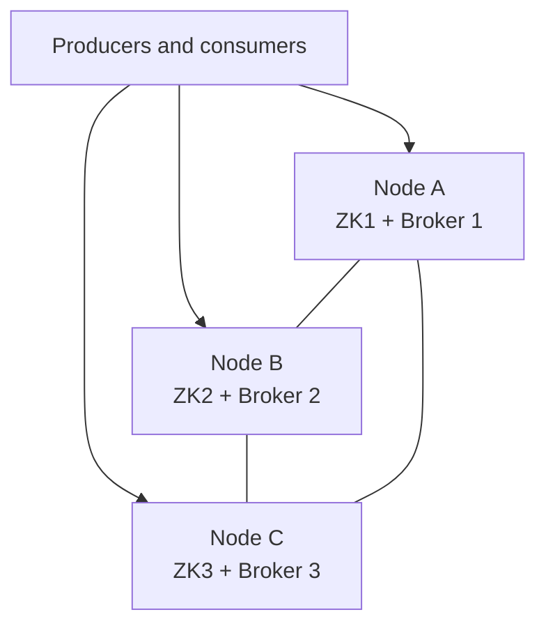

# Lab 10 – Multi-Node Cluster Design and Configuration

**Lab Number:** 10  
**Day:** 1  
**Duration:** 30 minutes  
**Difficulty:** Intermediate  
**Environment:** Windows 10 / Windows 11  
**Mode:** Individual or pairs

---

## Description

This lab takes the three-broker laptop cluster and redesigns it as a **three-machine** QuickCart environment.

You will draw the target architecture, write ZooKeeper ensemble and broker properties for three nodes, fix `advertised.listeners` so clients can reach the correct host, and complete a readiness checklist.

If the classroom has only one machine, you will **not** start a second physical cluster. You will produce configuration files that a production engineer could apply on three VMs. If the trainer provides extra VMs, optional Step 8 uses them.

---

## Prerequisites

- Labs 07–09 are complete
- You can explain `broker.id`, `listeners`, `log.dirs`, and `zookeeper.connect`
- You understand that Lab 07 runs three brokers on **one** host
- The Day 1 three-broker cluster can stay running in the background
- Notepad or VS Code is available to write config files

---

## Business Use Case

QuickCart’s laptop cluster is fine for training. It is not fine for production.

Risks of “three brokers on one Windows machine”:

- one disk failure loses every replica
- one OS patch restarts all brokers together
- one NIC or power supply takes the entire cluster down

The platform team wants this instead:

- three VMs or three EC2 instances
- one Kafka broker per VM
- a three-node ZooKeeper ensemble
- clients connect through real host names, not `localhost`

Your job is to produce the configuration package.

---

## Architecture

```text
                    QUICKCART PRODUCTION-STYLE LAYOUT

     +------------------+   +------------------+   +------------------+
     | Node A           |   | Node B           |   | Node C           |
     | zk-1 :2181       |   | zk-2 :2181       |   | zk-3 :2181       |
     | broker.id=1      |   | broker.id=2      |   | broker.id=3      |
     | kafka :9092      |   | kafka :9092      |   | kafka :9092      |
     | 10.0.1.11        |   | 10.0.1.12        |   | 10.0.1.13        |
     +---------+--------+   +---------+--------+   +---------+--------+
               \                      |                      /
                \                     |                     /
                 +--------------------+--------------------+
                          ZooKeeper ensemble
                          10.0.1.11:2181
                          10.0.1.12:2181
                          10.0.1.13:2181

 Clients bootstrap: 10.0.1.11:9092,10.0.1.12:9092,10.0.1.13:9092
```



Lab 07 used different **ports** on one host. Multi-node uses the same port on different **hosts**.

---

## Detailed Steps

### Step 0 – Initial Setup

Create a folder for the design package:

```powershell
New-Item -ItemType Directory -Force -Path C:\kafka-labs\multi-node-design
Set-Location C:\kafka-labs\multi-node-design
```

Create empty files you will fill in this lab:

```powershell
New-Item -ItemType File -Force -Path .\node-a-zookeeper.properties
New-Item -ItemType File -Force -Path .\node-b-zookeeper.properties
New-Item -ItemType File -Force -Path .\node-c-zookeeper.properties
New-Item -ItemType File -Force -Path .\node-a-server.properties
New-Item -ItemType File -Force -Path .\node-b-server.properties
New-Item -ItemType File -Force -Path .\node-c-server.properties
New-Item -ItemType File -Force -Path .\hosts-and-ids.txt
```

If the trainer issued real VM IPs, write them in `hosts-and-ids.txt`. Otherwise use the course sample addresses:

```text
node-a  10.0.1.11  zookeeper myid=1  broker.id=1
node-b  10.0.1.12  zookeeper myid=2  broker.id=2
node-c  10.0.1.13  zookeeper myid=3  broker.id=3
```

Save `hosts-and-ids.txt` with those lines.

---

### Step 1 – Contrast Laptop Cluster vs Multi-Node Cluster

Complete this table before writing configs.

| Decision | Lab 07 laptop cluster | Multi-node cluster |
| --- | --- | --- |
| Number of OS instances | 1 | 3 |
| Broker ports | 9092, 9093, 9094 | 9092 on each node |
| `listeners` host | `localhost` | node IP or DNS name |
| `log.dirs` | three folders on C: | local disk on each VM |
| ZooKeeper | one process on 2181 | three-node ensemble |
| Single disk failure | all replicas at risk | one replica at risk |

---

### Step 2 – Design the ZooKeeper Ensemble

Each ZooKeeper node needs:

- a unique `myid` file
- the same `server.1`, `server.2`, `server.3` list
- its own `dataDir`

Write this into `node-a-zookeeper.properties`. Node B and Node C use the same file except you will place a different `myid`.

```properties
tickTime=2000
initLimit=10
syncLimit=5
dataDir=C:/kafka-labs/data/zookeeper
clientPort=2181
maxClientCnxns=0

server.1=10.0.1.11:2888:3888
server.2=10.0.1.12:2888:3888
server.3=10.0.1.13:2888:3888
```

Copy the same content into `node-b-zookeeper.properties` and `node-c-zookeeper.properties`.

On each real VM you would also create:

```text
Node A:  C:\kafka-labs\data\zookeeper\myid   contains 1
Node B:  C:\kafka-labs\data\zookeeper\myid   contains 2
Node C:  C:\kafka-labs\data\zookeeper\myid   contains 3
```

Document that in `hosts-and-ids.txt`.

**Why three ZooKeeper nodes?**  
An ensemble needs a majority. Two of three nodes can keep the ensemble available. A single ZooKeeper process is a single point of failure.

---

### Step 3 – Write Broker Configs for Each Node

Edit `node-a-server.properties`:

```properties
broker.id=1
listeners=PLAINTEXT://0.0.0.0:9092
advertised.listeners=PLAINTEXT://10.0.1.11:9092
log.dirs=C:/kafka-labs/data/kafka
zookeeper.connect=10.0.1.11:2181,10.0.1.12:2181,10.0.1.13:2181
offsets.topic.replication.factor=3
transaction.state.log.replication.factor=3
transaction.state.log.min.isr=2
min.insync.replicas=2
default.replication.factor=3
num.partitions=3
```

Edit `node-b-server.properties` with:

```properties
broker.id=2
advertised.listeners=PLAINTEXT://10.0.1.12:9092
```

Keep the same `listeners`, `zookeeper.connect`, and replication settings.

Edit `node-c-server.properties` with:

```properties
broker.id=3
advertised.listeners=PLAINTEXT://10.0.1.13:9092
```

---

### Step 4 – Understand `listeners` vs `advertised.listeners`

This is the most common multi-node mistake.

| Property | Meaning |
| --- | --- |
| `listeners` | The address the broker **binds** on the local machine |
| `advertised.listeners` | The address the broker **tells clients to use** |

If `advertised.listeners` is `localhost:9092` on Node A, a client on Node B tries to talk to **its own** localhost. Metadata looks healthy. Produce/consume fails.

Complete:

```text
A client running on 10.0.1.50 bootstraps to 10.0.1.11:9092.
The leader for partition 0 is broker 2.

The client must next connect to: ______________________
That value comes from: advertised.listeners / listeners
```

Correct answer: `10.0.1.12:9092`, from `advertised.listeners`.

---

### Step 5 – Topic Placement Rules for Production

Write these rules into `hosts-and-ids.txt` under a heading `Topic rules`.

```text
1. Create business topics only after all three brokers are in /brokers/ids.
2. Use replication-factor 3 for payment, order, and inventory topics.
3. Use min.insync.replicas=2 so a single broker loss still allows writes
   when the producer uses acks=all.
4. Do not create RF 1 topics and "fix them later" unless you have a
   partition-reassignment plan.
```

Lab 03’s RF 1 topics became unusable when broker 0 disappeared. That is the same class of mistake on three VMs if you create a topic before all brokers join.

---

### Step 6 – Startup Order

Write this startup sequence in `hosts-and-ids.txt`:

```text
1. Start ZooKeeper on Node A, B, and C.
2. Confirm the ensemble has a leader.
3. Start Kafka on Node A, B, and C.
4. Confirm /brokers/ids = [1, 2, 3].
5. Create topics with RF 3.
6. Point applications at all three bootstrap servers.
```

Shutdown order is the reverse: stop producers/consumers, stop brokers, then stop ZooKeeper.

---

### Step 7 – Learner Design Review

Answer these before you leave the lab. Use your config files as evidence.

1. If Node B loses power, how many ZooKeeper nodes remain? Is that a majority?
2. If Node B loses power, how many Kafka replicas remain for an RF 3 topic?
3. Why is `advertised.listeners=PLAINTEXT://localhost:9092` wrong on Node A?
4. Why does each production node use port 9092 instead of 9092/9093/9094?

Expected:

1. Two ZooKeeper nodes remain. Two of three is a majority.
2. Two Kafka replicas remain. Lab 08 showed that is enough for leader election from ISR.
3. Remote clients would be told to connect to themselves.
4. The machines are different. The port can be the standard Kafka port on each host.

---

### Step 8 – Optional: Apply the Design on Extra VMs

Do this only if the trainer provides three reachable machines.

On each VM:

1. Repeat Lab 01 install.
2. Copy the matching ZooKeeper and server properties.
3. Create `data\zookeeper\myid` with 1, 2, or 3.
4. Open firewall ports `2181`, `2888`, `3888`, and `9092`.
5. Start ZooKeeper, then Kafka.
6. From any node, create a test topic with `--replication-factor 3`.
7. Describe the topic and confirm replicas land on all three broker ids.

If extra VMs are not available, skip this step. Your design package is the deliverable.

---

## Conclusion

A multi-node cluster is the same Kafka architecture you already ran, with one important change: each process has its own failure domain.

You wrote a three-node ZooKeeper ensemble, three broker configs, and the listener rule that makes remote clients work. You also recorded topic and startup rules so QuickCart does not recreate RF 1 topics on a three-node cluster.

The laptop cluster from Lab 07 remains the hands-on environment for the capstone. This lab is the map from training hardware to production hardware.

**You are ready for Lab 11 when:**

- `C:\kafka-labs\multi-node-design` contains the six config files
- `hosts-and-ids.txt` has node addresses, myid values, and topic rules
- You can explain `advertised.listeners` without notes

Next lab: [11-capstone-payment-processing.md](11-capstone-payment-processing.md)

---

## Knowledge Check

1. What majority size does a 3-node ZooKeeper ensemble need?
2. What is the bootstrap string you would give QuickCart applications?
3. Why is Lab 07 still valid training if production uses three VMs?
4. Which Day 1 lesson made RF 1 topics dangerous?

**Expected answers**

1. Two nodes.
2. `10.0.1.11:9092,10.0.1.12:9092,10.0.1.13:9092` or the trainer’s real hosts.
3. Partitioning, replication, ISR, and consumer groups behave the same. Only the failure domain changes.
4. Lab 07 Step 10, when broker 0 was removed.

---

## Common Issues

| Symptom | Likely cause | What to do |
| --- | --- | --- |
| Students try to start these configs on the laptop | Sample IPs are not local | Keep Lab 07 running; treat this lab as design unless VMs exist |
| Confusion about ports 9093/9094 | Those ports exist only to run three brokers on one OS | Multi-node uses 9092 per machine |
| Ensemble will not form on real VMs | Firewall or wrong `myid` | Check `myid`, `server.N` lines, and ports 2888/3888 |
| Clients connect then fail after metadata | `advertised.listeners` still `localhost` | Set the node’s real IP or DNS name |
