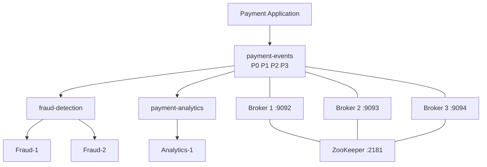

# Lab 11 – Day 1 Capstone: Real-Time Payment Processing with Kafka

**Lab Number:** 11  
**Day:** 1  
**Duration:** 60–75 minutes  
**Difficulty:** Intermediate  
**Environment:** Windows 10 / Windows 11  
**Mode:** Individual or pairs

---

## Description

This is the Day 1 capstone. You perform the complete workflow yourself: cluster verification, topic creation, produce, partitions, consumer group, offsets and lag, rebalancing, independent subscribers, broker failure, replication and ISR, then recovery.

The lab consolidates Kafka architecture and cluster-management concepts from the Day 1 syllabus. It is not a new Java exercise. Day 2 starts producer and consumer APIs.

Work from the steps. Do not wait for the trainer to type commands for you.

---

## Prerequisites

- Labs 01–10 are complete
- `C:\kafka-labs\kafka\config\server-1.properties`, `server-2.properties`, and `server-3.properties` exist
- You can start ZooKeeper and three brokers without looking at Lab 07
- You can create a topic, produce, consume, and describe a consumer group
- You understand leader, follower, replica, ISR, offset, lag, and rebalance
- At least eight PowerShell terminals are available

If the three-broker cluster is already running from earlier labs, you may reuse it. You must still complete every verification checkpoint.

---

## Business Use Case

QuickCart processes thousands of customer payments. Several systems need payment events independently:

- **Fraud Detection** must inspect every payment, split across workers
- **Analytics** must read the same payments with its own offsets
- The platform team requires scalable ingestion, replicated storage, observable lag, and continued processing after one broker fails

You will implement and validate that architecture on the training cluster.

---

## Architecture

```text
                         QUICKCART
                    PAYMENT APPLICATION
                            |
                            |
                     Payment Events
                            |
                            v
                 +---------------------+
                 |    Apache Kafka     |
                 |                     |
                 |   payment-events    |
                 |                     |
                 | P0 | P1 | P2 | P3  |
                 +----------+----------+
                            |
              +-------------+-------------+
              |                           |
              v                           v
      Fraud Detection              Analytics Service
      Consumer Group               Consumer Group


                 KAFKA CLUSTER

          +----------+----------+----------+
          | Broker 1 | Broker 2 | Broker 3 |
          |  :9092   |  :9093   |  :9094  |
          +----------+----------+----------+
                \         |         /
                 \        |        /
                  +-------+-------+
                      ZooKeeper
                        :2181
```



---

## Detailed Steps

### Step 0 – Initial Setup

Prepare the workstation before you start services.

1. Close leftover console producers and consumers from Labs 08 and 09 with `Ctrl+C`.
2. Confirm Kafka home and the three broker files:

```powershell
cd C:\kafka-labs\kafka

Get-ChildItem .\config\zookeeper.properties
Get-ChildItem .\config\server-1.properties
Get-ChildItem .\config\server-2.properties
Get-ChildItem .\config\server-3.properties
```

3. If a previous `payment-events` topic exists from a failed attempt, tell the trainer before deleting it. Otherwise create it only when you reach Step 5.
4. Label your terminals:

| Terminal | Role |
| ---: | --- |
| 1 | ZooKeeper |
| 2 | Broker 1 |
| 3 | Broker 2 |
| 4 | Broker 3 |
| 5 | CLI / describe / groups |
| 6 | Producer |
| 7 | Fraud consumer 1 |
| 8 | Fraud consumer 2 |
| 9 | Analytics consumer |

5. If ZooKeeper and the three brokers are **already running and healthy**, skip to Step 4. If anything is missing, start from Step 1.

Health check for a running cluster:

```powershell
netstat -ano | findstr ":2181"
netstat -ano | findstr ":9092"
netstat -ano | findstr ":9093"
netstat -ano | findstr ":9094"
```

---

### Step 1 – Start ZooKeeper

Open **PowerShell Terminal 1**:

```powershell
cd C:\kafka-labs\kafka

.\bin\windows\zookeeper-server-start.bat `
  .\config\zookeeper.properties
```

Keep the terminal running.

**Checkpoint**

Verify that ZooKeeper is listening on:

```text
2181
```

```powershell
netstat -ano | findstr ":2181"
```

---

### Step 2 – Start Broker 1

Open **Terminal 2**:

```powershell
cd C:\kafka-labs\kafka

.\bin\windows\kafka-server-start.bat `
  .\config\server-1.properties
```

Expected:

```text
Broker ID: 1
Port: 9092
```

---

### Step 3 – Start Broker 2

Open **Terminal 3**:

```powershell
cd C:\kafka-labs\kafka

.\bin\windows\kafka-server-start.bat `
  .\config\server-2.properties
```

Expected:

```text
Broker ID: 2
Port: 9093
```

---

### Step 4 – Start Broker 3

Open **Terminal 4**:

```powershell
cd C:\kafka-labs\kafka

.\bin\windows\kafka-server-start.bat `
  .\config\server-3.properties
```

Expected:

```text
Broker ID: 3
Port: 9094
```

At this point:

```text
                    ZooKeeper
                       2181
                         |
          +--------------+--------------+
          |              |              |
          v              v              v
      Broker 1       Broker 2       Broker 3
       :9092          :9093          :9094
```

**Checkpoint**

All four ports are listening. If a broker failed, fix that before creating the topic.

---

### Step 5 – Create `payment-events`

Open **Terminal 5**:

```powershell
cd C:\kafka-labs\kafka
```

Run:

```powershell
.\bin\windows\kafka-topics.bat `
  --create `
  --topic payment-events `
  --bootstrap-server localhost:9092 `
  --partitions 4 `
  --replication-factor 3
```

Expected:

```text
Created topic payment-events.
```

What did you create?

```text
Topic:              payment-events
Partitions:         4
Replication Factor: 3
```

Conceptually:

```text
payment-events

P0  ── 3 replicas
P1  ── 3 replicas
P2  ── 3 replicas
P3  ── 3 replicas
```

**Trainer questions**

**Why four partitions?**  
Partitions allow Kafka to distribute records and support parallel consumption.

**Why replication factor 3?**  
Each partition can have copies across all three brokers, providing resilience against broker failure.

---

### Step 6 – Inspect Partition Distribution

```powershell
.\bin\windows\kafka-topics.bat `
  --describe `
  --topic payment-events `
  --bootstrap-server localhost:9092
```

You should see information similar to:

```text
Topic: payment-events
PartitionCount: 4
ReplicationFactor: 3

Partition: 0  Leader: 1  Replicas: 1,2,3  Isr: 1,2,3
Partition: 1  Leader: 2  Replicas: 2,3,1  Isr: 2,3,1
Partition: 2  Leader: 3  Replicas: 3,1,2  Isr: 3,1,2
Partition: 3  Leader: 1  Replicas: 1,3,2  Isr: 1,3,2
```

**Do not expect the exact broker assignments above; Kafka may assign them differently.**

Record **your** result. This table is required during the broker-failure steps.

| Partition | Leader | Replicas | ISR |
| --------- | -----: | -------- | --- |
| P0        |        |          |     |
| P1        |        |          |     |
| P2        |        |          |     |
| P3        |        |          |     |

---

### Step 7 – Produce Payment Events

Open **Terminal 6**:

```powershell
cd C:\kafka-labs\kafka

.\bin\windows\kafka-console-producer.bat `
  --bootstrap-server localhost:9092,localhost:9093,localhost:9094 `
  --topic payment-events
```

Enter:

```text
PAY1001,CUSTOMER101,1500,SUCCESS
PAY1002,CUSTOMER102,2200,SUCCESS
PAY1003,CUSTOMER103,700,FAILED
PAY1004,CUSTOMER104,9000,SUCCESS
PAY1005,CUSTOMER105,3500,PENDING
PAY1006,CUSTOMER106,12500,SUCCESS
PAY1007,CUSTOMER107,4000,FAILED
PAY1008,CUSTOMER108,2800,SUCCESS
PAY1009,CUSTOMER109,6500,SUCCESS
PAY1010,CUSTOMER110,1900,PENDING
```

Leave the producer running.

Business interpretation:

```text
Payment Application
        |
        | payment events
        v
+--------------------+
|   payment-events   |
|                    |
| P0 P1 P2 P3        |
+--------------------+
```

---

### Step 8 – Verify the Events

Start a temporary consumer in a spare terminal:

```powershell
cd C:\kafka-labs\kafka

.\bin\windows\kafka-console-consumer.bat `
  --bootstrap-server localhost:9092 `
  --topic payment-events `
  --from-beginning
```

You should see the payment records.

Stop this temporary consumer:

```text
Ctrl+C
```

**Checkpoint**

You should now be able to answer:

- Who produced the data? → Payment application / console producer
- Where is it stored? → `payment-events`
- How many partitions? → 4
- How many replicas per partition? → 3

---

### Step 9 – Start Fraud Consumer 1

Now simulate a real downstream microservice.

```text
                 payment-events

           P0   P1   P2   P3
            \   /     \   /
             \ /       \ /
              v         v

         Fraud-1      Fraud-2
             \         /
              \       /
           fraud-detection
           Consumer Group
```

Open **Terminal 7**:

```powershell
cd C:\kafka-labs\kafka

.\bin\windows\kafka-console-consumer.bat `
  --bootstrap-server localhost:9092,localhost:9093,localhost:9094 `
  --topic payment-events `
  --group fraud-detection
```

Leave it running.

These fraud consumers start at the latest offset. They will process the next batch, not necessarily PAY1001–PAY1010.

---

### Step 10 – Start Fraud Consumer 2

Open **Terminal 8** and execute exactly the same command:

```powershell
cd C:\kafka-labs\kafka

.\bin\windows\kafka-console-consumer.bat `
  --bootstrap-server localhost:9092,localhost:9093,localhost:9094 `
  --topic payment-events `
  --group fraud-detection
```

Now there are:

```text
Consumer Group: fraud-detection

Consumer 1
Consumer 2
```

Kafka distributes the four partitions between them.

---

### Step 11 – Produce More Payments

Go back to the producer terminal.

Enter another batch:

```text
PAY1011,CUSTOMER111,8000,SUCCESS
PAY1012,CUSTOMER112,500,FAILED
PAY1013,CUSTOMER113,15000,SUCCESS
PAY1014,CUSTOMER114,7000,PENDING
PAY1015,CUSTOMER115,4500,SUCCESS
PAY1016,CUSTOMER116,2700,SUCCESS
PAY1017,CUSTOMER117,9100,FAILED
PAY1018,CUSTOMER118,1300,SUCCESS
```

Observe both fraud consumer terminals.

You should notice that **neither consumer necessarily receives every message**.

Together, the consumers process the partitions assigned to the `fraud-detection` group.

---

### Step 12 – Inspect Consumer Group Assignment

In **Terminal 5**:

```powershell
.\bin\windows\kafka-consumer-groups.bat `
  --bootstrap-server localhost:9092 `
  --describe `
  --group fraud-detection
```

Inspect columns such as:

```text
TOPIC
PARTITION
CURRENT-OFFSET
LOG-END-OFFSET
LAG
CONSUMER-ID
HOST
CLIENT-ID
```

Example conceptually:

```text
payment-events  0  ...  Consumer-A
payment-events  1  ...  Consumer-A
payment-events  2  ...  Consumer-B
payment-events  3  ...  Consumer-B
```

Complete:

| Partition | Assigned Consumer | Current Offset | Log End Offset | Lag |
| --------- | ----------------- | -------------: | -------------: | --: |
| 0         |                   |                |                |     |
| 1         |                   |                |                |     |
| 2         |                   |                |                |     |
| 3         |                   |                |                |     |

---

### Step 13 – Understand Consumer Lag

```text
Log End Offset = latest record available

Current Offset = consumer progress

Lag ≈ records still waiting to be processed
```

Example:

```text
LOG-END-OFFSET = 1000
CURRENT-OFFSET = 950

LAG = 50
```

Business meaning:

> Fraud Detection still has approximately 50 records to catch up on for that partition.

This is an operational view of Kafka, not only a development concept.

---

### Step 14 – Demonstrate Consumer Rebalancing

In the second fraud consumer terminal:

```text
Ctrl+C
```

Now:

```text
Before

P0 --> Consumer 1
P1 --> Consumer 1
P2 --> Consumer 2
P3 --> Consumer 2


Consumer 2 stops


After Rebalance

P0 ─┐
P1 ─┤
P2 ─┼--> Consumer 1
P3 ─┘
```

Actual assignment can vary.

Verify:

```powershell
.\bin\windows\kafka-consumer-groups.bat `
  --bootstrap-server localhost:9092 `
  --describe `
  --group fraud-detection
```

The remaining consumer should handle the group’s active assignments.

Restart Consumer 2:

```powershell
cd C:\kafka-labs\kafka

.\bin\windows\kafka-console-consumer.bat `
  --bootstrap-server localhost:9092,localhost:9093,localhost:9094 `
  --topic payment-events `
  --group fraud-detection
```

Another rebalance occurs.

Key takeaway:

```text
Consumer joins/leaves
        ↓
Group membership changes
        ↓
Partition reassignment
        ↓
Consumers continue processing
```

---

### Step 15 – Demonstrate Independent Consumer Groups

This is the Pub/Sub proof.

Fraud Detection is already consuming the payment events. Analytics also wants the **same events**.

Open **Terminal 9**:

```powershell
cd C:\kafka-labs\kafka

.\bin\windows\kafka-console-consumer.bat `
  --bootstrap-server localhost:9092,localhost:9093,localhost:9094 `
  --topic payment-events `
  --group payment-analytics `
  --from-beginning
```

You now have:

```text
                  payment-events
                       |
              +--------+--------+
              |                 |
              v                 v
      fraud-detection    payment-analytics
       Consumer Group     Consumer Group
```

Both logical applications can independently process the payment stream.

This connects the morning’s Pub/Sub discussion to an actual Kafka implementation.

---

### Step 16 – Record Leaders Before Broker Failure

Before stopping anything:

```powershell
.\bin\windows\kafka-topics.bat `
  --describe `
  --topic payment-events `
  --bootstrap-server localhost:9092
```

Record:

| Partition | Leader Before Failure |
| --------- | --------------------: |
| 0         |                       |
| 1         |                       |
| 2         |                       |
| 3         |                       |

Identify a broker that currently leads at least one partition. Write it down:

```text
Broker I will stop: ________
Port: ________
Partitions it leads: ________
```

---

### Step 17 – Stop That Broker

For example, if Broker 1 is selected, go to its terminal and execute:

```text
Ctrl+C
```

Architecture becomes:

```text
      Broker 1       Broker 2       Broker 3

         X             RUNNING        RUNNING
      FAILED
```

Do not stop a second broker.

---

### Step 18 – Observe Leader Election and ISR

Run the describe command against a broker that is still running.

For example, after stopping Broker 1:

```powershell
.\bin\windows\kafka-topics.bat `
  --describe `
  --topic payment-events `
  --bootstrap-server localhost:9093
```

Compare the output with your earlier table.

Complete:

| Partition | Leader Before | Leader After | ISR Before | ISR After |
| --------- | ------------: | -----------: | ---------- | --------- |
| 0         |               |              |            |           |
| 1         |               |              |            |           |
| 2         |               |              |            |           |
| 3         |               |              |            |           |

You should observe that partitions formerly led by the failed broker can elect another eligible in-sync replica.

Conceptually:

```text
Before

P0
Leader: Broker 1
Followers: Broker 2, Broker 3

            Broker 1
             LEADER
            /      \
           /        \
      Broker 2    Broker 3
      FOLLOWER    FOLLOWER


Broker 1 FAILS


After

             X
          Broker 1

      Broker 2
       LEADER
          |
      Broker 3
      FOLLOWER
```

This demonstrates **leader, follower, replication, and ISR**.

---

### Step 19 – Verify Kafka Still Works

With one broker stopped, return to the producer and send:

```text
PAY1019,CUSTOMER119,5200,SUCCESS
PAY1020,CUSTOMER120,8500,FAILED
PAY1021,CUSTOMER121,11000,SUCCESS
```

If the producer cannot connect, restart it using a living broker in the bootstrap list.

Observe the running consumers.

The objective is to verify that the replicated cluster can continue processing despite losing one broker, assuming the remaining replicas and topic configuration permit it.

---

### Step 20 – Recover the Failed Broker

Restart the stopped broker.

For Broker 1:

```powershell
cd C:\kafka-labs\kafka

.\bin\windows\kafka-server-start.bat `
  .\config\server-1.properties
```

Use `server-2.properties` or `server-3.properties` if you stopped those brokers.

Wait briefly, then:

```powershell
.\bin\windows\kafka-topics.bat `
  --describe `
  --topic payment-events `
  --bootstrap-server localhost:9092
```

If Broker 1 is still starting, use `localhost:9093` until 9092 is listening.

Observe the ISR.

You should eventually see the restarted broker return to the appropriate ISR sets once it catches up.

```text
Broker Restarts
      ↓
Replica reconnects
      ↓
Replica catches up
      ↓
Returns to ISR
```

---

### Step 21 – Final Student Investigation

Perform these checks without copying commands from an earlier lab file if you can avoid it. Use this section only when you are stuck.

#### Challenge A – Find all topics

Expected command concept:

```text
kafka-topics --list
```

Write the topics you see:

```text
________________________________________________
```

#### Challenge B – Describe `payment-events`

Identify:

- number of partitions
- replication factor
- leader of P0
- replicas of P0
- ISR of P0

| Item | Your value |
| --- | --- |
| Partitions | |
| RF | |
| P0 leader | |
| P0 replicas | |
| P0 ISR | |

#### Challenge C – Inspect `fraud-detection`

Identify:

- active consumers
- assigned partitions
- current offsets
- end offsets
- lag

#### Challenge D – Scaling question

Start four consumers in:

```text
fraud-detection
```

With four partitions, observe the assignments.

Then start a **fifth consumer**.

Ask:

> What happens to Consumer 5?

Expected concept:

```text
4 Partitions
5 Consumers

P0 --> C1
P1 --> C2
P2 --> C3
P3 --> C4

C5 --> No partition
```

This makes the relationship between partitions and consumer parallelism concrete.

---

### Step 22 – Architecture Review

Explain this architecture after completing the lab:

```text
                         QUICKCART
                    PAYMENT APPLICATION
                            |
                         PRODUCER
                            |
                            v
              +---------------------------+
              |      payment-events       |
              |                           |
              | P0    P1    P2    P3     |
              +------------+--------------+
                           |
              +------------+-------------+
              |                          |
              v                          v

       FRAUD DETECTION              ANALYTICS
       Consumer Group              Consumer Group

       C1        C2                Analytics-1
        \        /
         \      /
          Partitions


                 KAFKA CLUSTER

          +----------+----------+----------+
          | Broker 1 | Broker 2 | Broker 3 |
          |  :9092   |  :9093   |  :9094  |
          +----------+----------+----------+
                \         |         /
                 \        |        /
                  +-------+-------+
                      ZooKeeper
```

Point to the running terminals and name each box.

---

## Conclusion

You built QuickCart’s payment event backbone on a three-broker Kafka cluster.

`payment-events` has four partitions and three replicas. Fraud Detection shares work inside one consumer group. Analytics subscribes independently. When a consumer left, Kafka rebalanced. When a broker failed, a remaining in-sync replica became leader and payments continued. When the broker returned, it caught up and rejoined ISR.

This is the Day 1 finish line. You are not writing Java clients yet. According to the training plan, producer/consumer code, sync/async producers, custom partitioners/serializers, and application-level consumer scaling belong to Day 2.

**Day 1 is complete when you can run this flow without trainer assistance:**

```text
Install/Start Kafka
        ↓
Create Topic
        ↓
Understand Partitions
        ↓
Produce Events
        ↓
Consume Events
        ↓
Create Consumer Group
        ↓
Inspect Offsets & Lag
        ↓
Observe Rebalancing
        ↓
Inspect Leader/Followers/ISR
        ↓
Simulate Broker Failure
        ↓
Observe Leader Change
        ↓
Recover Broker
```

---

## Knowledge Check

Before declaring the lab complete, answer these questions:

1. **Why did we create four partitions?**  
   To provide partitioned storage and allow parallel processing.

2. **Why did we use replication factor 3?**  
   To maintain multiple copies of each partition across the three-broker lab cluster.

3. **What is a leader?**  
   The replica currently handling operations for a partition.

4. **What is a follower?**  
   A replica maintaining a copy of the leader's partition data.

5. **What is ISR?**  
   The set of replicas currently considered in sync.

6. **What is an offset?**  
   A record's position within a partition.

7. **What is consumer lag?**  
   The difference between the available progress in a partition and the consumer group's processing progress.

8. **Why didn't both Fraud consumers receive every record?**  
   They belong to the same consumer group, so partitions are divided among group members.

9. **Why could Analytics receive the same events as Fraud Detection?**  
   Analytics uses a different consumer group with independent offsets.

10. **What happened when a consumer stopped?**  
    Kafka rebalanced the group's partition assignments.

11. **What happened when a broker stopped?**  
    For partitions it led, another eligible in-sync replica could become leader.

12. **Why didn't the fifth Fraud consumer improve parallelism with only four partitions?**  
    Within one consumer group, a partition can be actively assigned to only one consumer at a time.

---

## Completion Criteria

A learner has successfully completed Day 1 when they can demonstrate the flow above and have filled:

- the `payment-events` partition / leader / ISR table
- the `fraud-detection` assignment and lag table
- the before/after broker-failure leader table
- Challenge D observation about the fifth consumer

---

## Common Issues

| Symptom | Likely cause | What to do |
| --- | --- | --- |
| Topic create fails with RF 3 | A broker is down | Start all three brokers, then create the topic |
| Temporary consumer shows no data | Topic is empty or you used the wrong name | Confirm `payment-events` and `--from-beginning` |
| Fraud consumers show the first 10 payments | You added `--from-beginning` by habit | That is acceptable; still produce PAY1011–PAY1018 and watch the split |
| Describe hangs after Broker 1 stop | Bootstrap still points only at 9092 | Use 9093 or 9094 |
| Producer fails during the outage | Bootstrap list has only the dead broker | Include living brokers |
| Fifth consumer still gets a partition | You have more than four partitions or extra topics | Describe `payment-events` and the group again |
| Old Lab 09 consumers join `fraud-detection` | A leftover terminal used the same group name | Stop leftover consumers |

---

## After This Lab

Stop extra consumers to free memory. You may leave the three-broker cluster running if Day 2 starts on the same machine.

Day 2 reuses this Kafka environment and builds Java producer and consumer applications around QuickCart.
