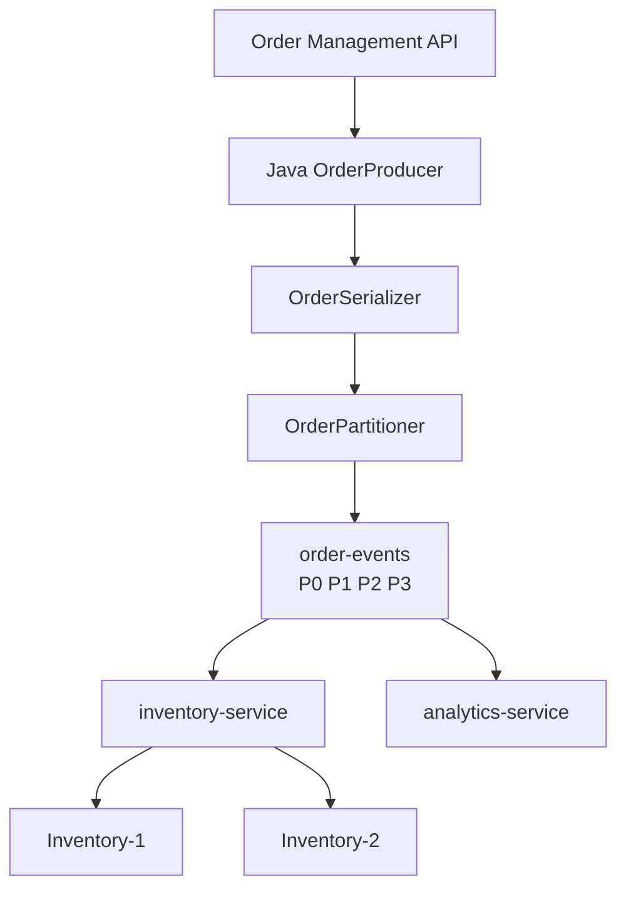

# Apache Kafka – Day 2 Hands-on Lab Guide

**Theme:** Building Production-Ready Kafka Applications with Java  
**Duration:** 8 hours  
**Environment:** Windows 10 / Windows 11  
**Language:** Java 17+  
**Build:** Maven  
**IDE:** IntelliJ IDEA / VS Code  
**Kafka:** Reuse the Day 1 three-broker cluster  
**Business story:** QuickCart order-event microservices

Start here. Complete the labs in order. Each exercise is a separate learner-ready file.

Day 1 built Kafka infrastructure. Day 2 builds the Java services that produce and consume QuickCart events.

---

## How to Use This Guide

1. Read this page once at the start of Day 2.
2. Start the Day 1 three-broker cluster before Lab 01.
3. Open the next lab file only when the previous lab is complete.
4. Do not skip **Step 0**. It confirms Kafka, Java, and the project before you change code.
5. Keep ZooKeeper and the three brokers running all day unless a step says otherwise.

If a command or Java program fails, use the **Common Issues** section at the end of that lab before asking for help.

---

## What You Will Be Able to Do

By the end of Day 2 you will be able to:

- Build a Maven Java project that uses the Kafka client API
- Write synchronous and asynchronous producers
- Write a Java consumer that polls records and commits offsets
- Serialize Java objects to JSON and route high-value orders with a custom partitioner
- Scale consumers in a group, observe rebalancing, and start one consumer per thread
- Tune `acks`, retries, batching, compression, `client.id`, and observe lag/backpressure
- Manage compacted topics, retention, log dirs, record deletion, and partition reassignment

---

## Lab Roadmap

| Lab | File | Exercise | Main topics | Time |
| ---: | --- | --- | --- | ---: |
| 01 | [01-java-project-setup.md](01-java-project-setup.md) | Java Kafka project setup | Client API, Maven, folders | 30 min |
| 02 | [02-java-producer.md](02-java-producer.md) | Java producer | Producer API, sync/async, callbacks, acks | 60 min |
| 03 | [03-java-consumer.md](03-java-consumer.md) | Java consumer | Consumer API, offsets, single consumer | 60 min |
| 04 | [04-serializer-partitioner.md](04-serializer-partitioner.md) | Serializer and partitioner | JSON serialization, custom partition | 60 min |
| 05 | [05-consumer-groups-scaling.md](05-consumer-groups-scaling.md) | Consumer groups and scaling | Multiple consumers, rebalance, threads | 60 min |
| 06 | [06-performance-reliability.md](06-performance-reliability.md) | Performance and reliability | Batching, compression, retries, backpressure | 60 min |
| 07 | [07-topic-partition-management.md](07-topic-partition-management.md) | Topic and partition management | Retention, compaction, log dirs, reassignment | 60 min |
| 08 | [08-capstone-order-processing.md](08-capstone-order-processing.md) | Day 2 capstone | End-to-end developer challenge | 75–90 min |

Total hands-on time is about 7.5 hours, plus short debriefs.

Docker, disaster recovery, and MirrorMaker are **instructor-led extensions** at the end of this page. They are in the Day 2 syllabus but are not separate learner labs.

---

## Day 2 Architecture You Are Building

```text
                         QUICKCART

                   Order Management API
                           |
                     Java Producer
                    (serializer +
                     partitioner)
                           |
                           v
                 +--------------------+
                 |    order-events    |
                 | P0 | P1 | P2 | P3 |
                 +---------+----------+
                           |
            +--------------+---------------+
            |              |               |
            v              v               v
       Inventory       Fraud/Risk      Analytics
       Consumer         Consumer         Consumer

                 Different Consumer Groups

        Broker 1 :9092    Broker 2 :9093    Broker 3 :9094
```



---

## Standard Lab Environment

| Item | Value |
| --- | --- |
| Kafka home | `C:\kafka-labs\kafka` |
| Java project | `C:\kafka-labs\quickcart-kafka` |
| ZooKeeper | `localhost:2181` |
| Bootstrap servers | `localhost:9092,localhost:9093,localhost:9094` |
| Broker 1 / 2 / 3 | `:9092` / `:9093` / `:9094` |
| Java | JDK 17 or later |
| Maven | 3.8 or later |
| Kafka clients | Match the Day 1 broker version (**3.8.x or 3.9.x**) |
| Main topic | `order-events` — 4 partitions, RF 3 |

Always change directory before running a Kafka script:

```powershell
cd C:\kafka-labs\kafka
```

Always change directory before running Maven:

```powershell
cd C:\kafka-labs\quickcart-kafka
```

---

## Start the Day 1 Cluster

Day 2 reuses the three-broker cluster from Day 1 Lab 07.

| Terminal | Process | Command |
| ---: | --- | --- |
| 1 | ZooKeeper | `.\bin\windows\zookeeper-server-start.bat .\config\zookeeper.properties` |
| 2 | Broker 1 | `.\bin\windows\kafka-server-start.bat .\config\server-1.properties` |
| 3 | Broker 2 | `.\bin\windows\kafka-server-start.bat .\config\server-2.properties` |
| 4 | Broker 3 | `.\bin\windows\kafka-server-start.bat .\config\server-3.properties` |
| 5 | Kafka CLI | topic / consumer-group commands |
| 6+ | Java apps / extra CLI | producers and consumers |

If `server-1.properties` is missing, complete Day 1 Labs 01, 02, and 07 before continuing.

---

## Lab File Template

Every lab file uses the same learner structure as Day 1:

1. **Title and lab number**
2. **Description**
3. **Prerequisites**
4. **Business use case**
5. **Architecture diagram**
6. **Detailed steps**, starting with **Step 0**
7. **Checkpoints** and observation tables
8. **Conclusion**
9. **Knowledge check**
10. **Common issues**

---

## Rules for Learners

- Complete labs in sequence. Later labs reuse the same Maven project.
- Use the three-broker cluster. Do not start Day 1’s single-broker `server.properties`.
- If `order-events` already exists from Day 1 with RF 1, follow Lab 02 Step 0 before producing.
- Record partition, offset, and lag values from **your** run. Sample output will differ.
- `KafkaConsumer` is not shared across threads. Each worker creates its own consumer.
- Docker, DR, and MirrorMaker are trainer demos unless your trainer says otherwise.

---

## Suggested Day Plan

| Block | Labs | Focus |
| --- | --- | --- |
| Morning 1 (90 min) | 01, 02 | Project setup and Java producer |
| Morning 2 (90 min) | 03, start 04 | Java consumer, then serializer |
| Afternoon 1 (90 min) | 04 finish, 05 | Partitioner, consumer groups |
| Afternoon 2 (90 min) | 06, 07 | Reliability, topic management |
| Close (75–90 min) | 08 | Developer capstone |

---

## Instructor Extensions

These items are in the Day 2 syllabus. Deliver them as short trainer sessions so the Java labs stay developer-focused.

### Docker demo (about 20 minutes)

```text
Windows
   |
Docker Desktop
   |
docker compose
   |
+-----------------------+
| Kafka infrastructure  |
+-----------------------+
```

Demonstrate:

```powershell
docker compose up -d
docker ps
```

Then point the **same** Java producer/consumer at the container bootstrap server.

Lesson:

> Java Kafka client code is largely independent of whether Kafka runs on a VM, Docker, Kubernetes, or a managed service. Connection and security settings change. The producer/consumer programming model stays the same.

### DR and MirrorMaker (discussion)

```text
           Primary Kafka Cluster
                   |
             MirrorMaker
                   |
                   v
          DR Kafka Cluster


Mumbai / Primary
      |
      | replication
      v
DR Kafka Cluster
```

Discuss disaster recovery, cross-cluster replication, migration, data-center movement, and active/passive patterns. Do not build a second cluster during the developer labs.

### Configuration challenge

Give each team these producer settings from the Day 2 syllabus and ask them to categorize:

| Requirement | Configuration area |
| --- | --- |
| Reliability | `acks`, `retries` |
| Batching | `batch.size`, `linger.ms` |
| Compression | `compression.type` |
| Buffering | `buffer.memory` |
| Identification | `client.id` |
| In-flight requests | `max.in.flight.requests.per.connection` |
| Timeouts | client timeout-related configuration |

Discuss trade-offs. Do not prescribe one configuration for every workload.

---

## Day 2 Final Architecture

By the capstone, learners should be able to explain this flow:

```text
                         JAVA APPLICATION

                         OrderProducer
                              |
                    Custom Serializer
                              |
                    Custom Partitioner
                              |
                              v
                +---------------------------+
                |       Apache Kafka        |
                |      order-events         |
                | P0    P1    P2    P3     |
                +-------------+-------------+
                              |
             +----------------+----------------+
             |                                 |
             v                                 v
      inventory-service                 analytics-service
       C1  C2  C3  C4                     C1
       P0  P1  P2  P3

             +--> offsets
             +--> consumer lag
             +--> rebalancing
             +--> backpressure
```

---

## Docker Compose 
### Create a `docker-compose.yaml` file

```yaml
version: '3'

services:

  zookeeper:
    image: wurstmeister/zookeeper
    container_name: zookeeper
    ports:
      - "2181:2181"

  kafka1:
    image: wurstmeister/kafka
    container_name: kafka1
    depends_on:
      - zookeeper
    ports:
      - "9092:9092"
    environment:
      KAFKA_BROKER_ID: 1
      KAFKA_ZOOKEEPER_CONNECT: zookeeper:2181
      KAFKA_LISTENERS: PLAINTEXT://0.0.0.0:9092
      KAFKA_ADVERTISED_LISTENERS: PLAINTEXT://localhost:9092
      KAFKA_OFFSETS_TOPIC_REPLICATION_FACTOR: 3
      KAFKA_TRANSACTION_STATE_LOG_REPLICATION_FACTOR: 3
      KAFKA_TRANSACTION_STATE_LOG_MIN_ISR: 2

  kafka2:
    image: wurstmeister/kafka
    container_name: kafka2
    depends_on:
      - zookeeper
    ports:
      - "9093:9093"
    environment:
      KAFKA_BROKER_ID: 2
      KAFKA_ZOOKEEPER_CONNECT: zookeeper:2181
      KAFKA_LISTENERS: PLAINTEXT://0.0.0.0:9093
      KAFKA_ADVERTISED_LISTENERS: PLAINTEXT://localhost:9093
      KAFKA_OFFSETS_TOPIC_REPLICATION_FACTOR: 3
      KAFKA_TRANSACTION_STATE_LOG_REPLICATION_FACTOR: 3
      KAFKA_TRANSACTION_STATE_LOG_MIN_ISR: 2

  kafka3:
    image: wurstmeister/kafka
    container_name: kafka3
    depends_on:
      - zookeeper
    ports:
      - "9094:9094"
    environment:
      KAFKA_BROKER_ID: 3
      KAFKA_ZOOKEEPER_CONNECT: zookeeper:2181
      KAFKA_LISTENERS: PLAINTEXT://0.0.0.0:9094
      KAFKA_ADVERTISED_LISTENERS: PLAINTEXT://localhost:9094
      KAFKA_OFFSETS_TOPIC_REPLICATION_FACTOR: 3
      KAFKA_TRANSACTION_STATE_LOG_REPLICATION_FACTOR: 3
      KAFKA_TRANSACTION_STATE_LOG_MIN_ISR: 2

```
```bash
docker compose up -d
docker ps
```


## Start Lab 01

Open [01-java-project-setup.md](01-java-project-setup.md) and complete **Step 0**.
