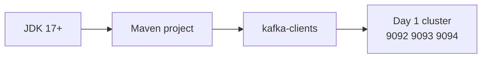

# Lab 01 – Build the Java Kafka Development Environment

**Lab Number:** 01  
**Day:** 2  
**Duration:** 30 minutes  
**Difficulty:** Beginner  
**Environment:** Windows 10 / Windows 11  
**Mode:** Individual

---

## Description

This lab creates the reusable Maven project that every later Day 2 lab uses.

You will start the Day 1 three-broker cluster, verify Java and Maven, create `C:\kafka-labs\quickcart-kafka`, add a `pom.xml` that matches your Kafka version, and compile an empty project.

You do **not** produce events in this lab. The first Java producer is Lab 02.

---

## Prerequisites

- Day 1 Labs 01, 02, and 07 are complete
- `C:\kafka-labs\kafka\config\server-1.properties` exists
- JDK 17 or later is installed and `JAVA_HOME` is set
- Maven 3.8 or later is installed
- IntelliJ IDEA or VS Code is available
- Ports `2181`, `9092`, `9093`, and `9094` can be used

---

## Business Use Case

QuickCart developers need one shared Java project for Kafka microservices: Order API, Inventory, Fraud, and Analytics.

If each engineer starts from a different folder or a different Kafka client version, later labs fail in different ways. This lab standardizes the project.

---

## Architecture

```text
C:\kafka-labs\
    kafka\                 Day 1 Kafka home
    quickcart-kafka\       Day 2 Java project
        pom.xml
        src\main\java\com\quickcart\kafka\
            config\
            model\
            producer\
            consumer\
            serializer\
            partitioner\
```



---

## Detailed Steps

### Step 0 – Initial Setup

Open **Terminal 1–4** and start the Day 1 cluster if it is not already running.

From `C:\kafka-labs\kafka`:

Terminal 1:

```powershell
cd C:\kafka-labs\kafka
.\bin\windows\zookeeper-server-start.bat .\config\zookeeper.properties
```

Terminal 2:

```powershell
cd C:\kafka-labs\kafka
.\bin\windows\kafka-server-start.bat .\config\server-1.properties
```

Terminal 3:

```powershell
cd C:\kafka-labs\kafka
.\bin\windows\kafka-server-start.bat .\config\server-2.properties
```

Terminal 4:

```powershell
cd C:\kafka-labs\kafka
.\bin\windows\kafka-server-start.bat .\config\server-3.properties
```

Wait until all three brokers report they have started.

**Checkpoint**

```powershell
netstat -ano | findstr ":2181"
netstat -ano | findstr ":9092"
netstat -ano | findstr ":9093"
netstat -ano | findstr ":9094"
```

All four ports should be `LISTENING`.

---

### Step 1 – Verify Java, Maven, and Kafka

Open a new PowerShell window:

```powershell
java -version
mvn -version
```

Expected: Java 17 or later, and a Maven version.

Verify Kafka:

```powershell
cd C:\kafka-labs\kafka

.\bin\windows\kafka-topics.bat `
  --list `
  --bootstrap-server localhost:9092
```

The command must connect. The topic list may be empty or may show Day 1 topics.

Record:

| Check | Your value |
| --- | --- |
| Java version | |
| Maven version | |
| `kafka-topics --list` succeeded? | Yes / No |

**Do not continue if Maven or Kafka is missing.**

---

### Step 2 – Create the project folders

```powershell
New-Item -ItemType Directory -Force -Path C:\kafka-labs\quickcart-kafka
cd C:\kafka-labs\quickcart-kafka

$packages = @(
  "src\main\java\com\quickcart\kafka\config",
  "src\main\java\com\quickcart\kafka\model",
  "src\main\java\com\quickcart\kafka\producer",
  "src\main\java\com\quickcart\kafka\consumer",
  "src\main\java\com\quickcart\kafka\serializer",
  "src\main\java\com\quickcart\kafka\partitioner"
)

foreach ($p in $packages) {
  New-Item -ItemType Directory -Force -Path $p | Out-Null
}

Get-ChildItem -Recurse src
```

Expected tree:

```text
quickcart-kafka
│
├── src
│   └── main
│       └── java
│           └── com
│               └── quickcart
│                   └── kafka
│                       ├── config
│                       ├── model
│                       ├── producer
│                       ├── consumer
│                       ├── serializer
│                       └── partitioner
```

Open this folder in IntelliJ or VS Code as a Maven project after you create `pom.xml`.

---

### Step 3 – Match the Kafka client version

The Kafka **client** version in Maven should match the Kafka **broker** version from Day 1.

If you installed Kafka 3.8.1, use `3.8.1`. If you installed 3.9.x, use that version.

```powershell
Get-ChildItem C:\kafka-labs\kafka\libs\kafka-clients*.jar
```

Write the version you will put in `pom.xml`:

```text
Kafka client version: ______________
```

---

### Step 4 – Create `pom.xml`

Create `C:\kafka-labs\quickcart-kafka\pom.xml`.

Replace `3.8.1` if your broker version is different. Keep Jackson as shown unless the trainer gives another version.

```xml
<project xmlns="http://maven.apache.org/POM/4.0.0"
         xmlns:xsi="http://www.w3.org/2001/XMLSchema-instance"
         xsi:schemaLocation="http://maven.apache.org/POM/4.0.0
         https://maven.apache.org/xsd/maven-4.0.0.xsd">

    <modelVersion>4.0.0</modelVersion>

    <groupId>com.quickcart</groupId>
    <artifactId>quickcart-kafka</artifactId>
    <version>1.0-SNAPSHOT</version>

    <properties>
        <maven.compiler.source>17</maven.compiler.source>
        <maven.compiler.target>17</maven.compiler.target>
        <project.build.sourceEncoding>UTF-8</project.build.sourceEncoding>
        <kafka.client.version>3.8.1</kafka.client.version>
    </properties>

    <dependencies>

        <dependency>
            <groupId>org.apache.kafka</groupId>
            <artifactId>kafka-clients</artifactId>
            <version>${kafka.client.version}</version>
        </dependency>

        <dependency>
            <groupId>com.fasterxml.jackson.core</groupId>
            <artifactId>jackson-databind</artifactId>
            <version>2.17.2</version>
        </dependency>

    </dependencies>

</project>
```

Save the file.

---

### Step 5 – Add a shared configuration class

Create `src\main\java\com\quickcart\kafka\config\KafkaConfig.java`:

```java
package com.quickcart.kafka.config;

public final class KafkaConfig {

    public static final String BOOTSTRAP_SERVERS =
            "localhost:9092,localhost:9093,localhost:9094";

    public static final String ORDER_TOPIC = "order-events";

    private KafkaConfig() {}
}
```

Later labs import these constants so bootstrap servers are not copied incorrectly.

---

### Step 6 – Compile

```powershell
cd C:\kafka-labs\quickcart-kafka
mvn clean compile
```

Expected: `BUILD SUCCESS`.

If Maven cannot download artifacts, fix proxy/network access before Lab 02.

---

## Conclusion

You now have a standard QuickCart Java project on top of the Day 1 Kafka cluster.

The project compiles, the package folders exist, and `kafka-clients` matches the training brokers. Lab 02 adds the `Order` model and the first producer.

**You are ready for Lab 02 when:**

- ZooKeeper and three brokers are running
- `mvn clean compile` succeeds
- `C:\kafka-labs\quickcart-kafka\pom.xml` exists

Next lab: [02-java-producer.md](02-java-producer.md)

---

## Knowledge Check

1. Why should the Maven `kafka-clients` version match the broker version?
2. Why do we keep one project instead of a new project per lab?
3. Which bootstrap string will every Day 2 client use?

**Expected answers**

1. Protocol and default configuration stay compatible with the cluster you started on Day 1.
2. Later labs add serializer, partitioner, and extra consumers to the same codebase.
3. `localhost:9092,localhost:9093,localhost:9094`

---

## Common Issues

| Symptom | Likely cause | What to do |
| --- | --- | --- |
| `mvn` is not recognized | Maven not on `PATH` | Install Maven and open a new PowerShell |
| `BUILD FAILURE` on dependencies | No internet or wrong version | Check `kafka.client.version` and network |
| `kafka-topics` cannot connect | Cluster is down | Start ZooKeeper, then brokers 1–3 |
| IDE does not see packages | Project not imported as Maven | Re-open `quickcart-kafka` as a Maven project |
