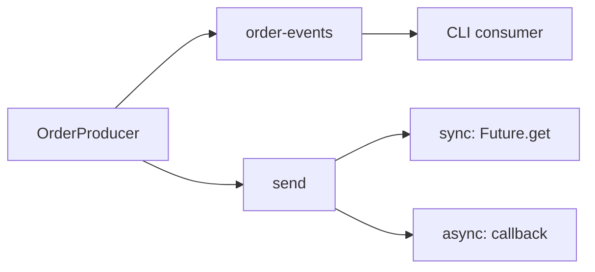

# Lab 02 – Build Java Kafka Producers

**Lab Number:** 02  
**Day:** 2  
**Duration:** 60 minutes  
**Difficulty:** Beginner  
**Environment:** Windows 10 / Windows 11  
**Mode:** Individual

---

## Description

This lab covers the Day 2 Producer API and synchronous / asynchronous send patterns.

You will create the `order-events` topic, add the `Order` model, publish a first string record, send one order synchronously and print partition/offset, then publish 20 orders asynchronously with a callback.

---

## Prerequisites

- Lab 01 is complete
- `C:\kafka-labs\quickcart-kafka` compiles
- The Day 1 three-broker cluster is running
- You can open a CLI consumer to verify records

---

## Business Use Case

Every successful QuickCart checkout must generate an `ORDER_CREATED` event so Inventory, Fraud, and Analytics can react without calling the Order database.

The Order Management API will become a Java producer. Today you build that producer.

---

## Architecture

```text
                    Order Management API
                            |
                      OrderProducer
                            |
                            v
                  +--------------------+
                  |    order-events    |
                  | P0 | P1 | P2 | P3  |
                  +--------------------+
                            |
                            v
                  CLI consumer (verify)
```



---

## Detailed Steps

### Step 0 – Initial Setup

Confirm the cluster and project:

```powershell
cd C:\kafka-labs\kafka

.\bin\windows\kafka-topics.bat `
  --list `
  --bootstrap-server localhost:9092
```

```powershell
cd C:\kafka-labs\quickcart-kafka
mvn -q compile
```

If `order-events` already exists from Day 1, describe it:

```powershell
cd C:\kafka-labs\kafka

.\bin\windows\kafka-topics.bat `
  --describe `
  --topic order-events `
  --bootstrap-server localhost:9092
```

Day 2 needs **4 partitions** and **replication factor 3**.

- If the topic does not exist, create it in Step 1.
- If it exists with 1 partition or RF 1 (Day 1 single-broker leftover), delete it only after the trainer agrees, then create it in Step 1:

```powershell
.\bin\windows\kafka-topics.bat `
  --delete `
  --topic order-events `
  --bootstrap-server localhost:9092
```

Wait until `--list` no longer shows `order-events` before recreating it.

---

### Step 1 – Create `order-events`

```powershell
cd C:\kafka-labs\kafka

.\bin\windows\kafka-topics.bat `
  --create `
  --topic order-events `
  --bootstrap-server localhost:9092 `
  --partitions 4 `
  --replication-factor 3
```

Expected:

```text
Created topic order-events.
```

Describe and record:

| Field | Required | Your value |
| --- | --- | --- |
| Partitions | 4 | |
| Replication factor | 3 | |
| P0 leader | any living broker | |

---

### Step 2 – Create the Order model

Create `src\main\java\com\quickcart\kafka\model\Order.java`.

Jackson and later labs need getters and setters. Include them now.

```java
package com.quickcart.kafka.model;

public class Order {

    private String orderId;
    private String customerId;
    private String product;
    private int quantity;
    private double amount;

    public Order() {}

    public Order(String orderId,
                 String customerId,
                 String product,
                 int quantity,
                 double amount) {
        this.orderId = orderId;
        this.customerId = customerId;
        this.product = product;
        this.quantity = quantity;
        this.amount = amount;
    }

    public String getOrderId() {
        return orderId;
    }

    public void setOrderId(String orderId) {
        this.orderId = orderId;
    }

    public String getCustomerId() {
        return customerId;
    }

    public void setCustomerId(String customerId) {
        this.customerId = customerId;
    }

    public String getProduct() {
        return product;
    }

    public void setProduct(String product) {
        this.product = product;
    }

    public int getQuantity() {
        return quantity;
    }

    public void setQuantity(int quantity) {
        this.quantity = quantity;
    }

    public double getAmount() {
        return amount;
    }

    public void setAmount(double amount) {
        this.amount = amount;
    }

    @Override
    public String toString() {
        return orderId + "," + customerId + "," + product + ","
                + quantity + "," + amount;
    }
}
```

---

### Step 3 – First Java producer (string value)

Create `src\main\java\com\quickcart\kafka\producer\OrderProducer.java`.

This first version sends a **string** so you can see the Producer API before custom serialization.

```java
package com.quickcart.kafka.producer;

import com.quickcart.kafka.config.KafkaConfig;
import org.apache.kafka.clients.producer.KafkaProducer;
import org.apache.kafka.clients.producer.ProducerConfig;
import org.apache.kafka.clients.producer.ProducerRecord;
import org.apache.kafka.common.serialization.StringSerializer;

import java.util.Properties;

public class OrderProducer {

    public static void main(String[] args) {
        Properties properties = new Properties();

        properties.put(
                ProducerConfig.BOOTSTRAP_SERVERS_CONFIG,
                KafkaConfig.BOOTSTRAP_SERVERS
        );
        properties.put(
                ProducerConfig.KEY_SERIALIZER_CLASS_CONFIG,
                StringSerializer.class.getName()
        );
        properties.put(
                ProducerConfig.VALUE_SERIALIZER_CLASS_CONFIG,
                StringSerializer.class.getName()
        );

        KafkaProducer<String, String> producer =
                new KafkaProducer<>(properties);

        String order = "ORD1001,C101,Laptop,1,75000";

        ProducerRecord<String, String> record =
                new ProducerRecord<>(
                        KafkaConfig.ORDER_TOPIC,
                        "ORD1001",
                        order
                );

        producer.send(record);
        producer.flush();
        producer.close();

        System.out.println("Published " + order);
    }
}
```

Run `OrderProducer` from the IDE, or:

```powershell
cd C:\kafka-labs\quickcart-kafka
mvn -q compile exec:java "-Dexec.mainClass=com.quickcart.kafka.producer.OrderProducer"
```

If `exec-maven-plugin` is not configured, run the class from IntelliJ / VS Code.

---

### Step 4 – Verify through the CLI

```powershell
cd C:\kafka-labs\kafka

.\bin\windows\kafka-console-consumer.bat `
  --bootstrap-server localhost:9092 `
  --topic order-events `
  --from-beginning `
  --property print.key=true
```

Expected (key, then value):

```text
ORD1001    ORD1001,C101,Laptop,1,75000
```

Stop the consumer with `Ctrl+C` after you see the record.

**Checkpoint**

- The Java program exited without an exception
- The CLI showed key `ORD1001`

---

### Step 5 – Synchronous producer

Change the fire-and-forget `send` to wait for the broker result.

Replace the send block with:

```java
import org.apache.kafka.clients.producer.RecordMetadata;

RecordMetadata metadata = producer.send(record).get();

System.out.println("Topic = " + metadata.topic());
System.out.println("Partition = " + metadata.partition());
System.out.println("Offset = " + metadata.offset());
```

Add `throws Exception` on `main` because `.get()` can throw.

Explain:

```text
send()
   |
   +--> Future
           |
           +--> get()
                 |
                 +--> waits
```

This makes the send effectively synchronous from the application's perspective.

Run `OrderProducer` again.

**Student observation**

| Field | Your value |
| --- | --- |
| Topic | |
| Partition | |
| Offset | |

---

### Step 6 – Asynchronous producer with callback

Remove `.get()`. Use a completion callback. Generate **20 orders**.

Replace `OrderProducer.java` with this version:

```java
package com.quickcart.kafka.producer;

import com.quickcart.kafka.config.KafkaConfig;
import org.apache.kafka.clients.producer.KafkaProducer;
import org.apache.kafka.clients.producer.ProducerConfig;
import org.apache.kafka.clients.producer.ProducerRecord;
import org.apache.kafka.common.serialization.StringSerializer;

import java.util.Properties;

public class OrderProducer {

    public static void main(String[] args) {
        Properties properties = new Properties();

        properties.put(
                ProducerConfig.BOOTSTRAP_SERVERS_CONFIG,
                KafkaConfig.BOOTSTRAP_SERVERS
        );
        properties.put(
                ProducerConfig.KEY_SERIALIZER_CLASS_CONFIG,
                StringSerializer.class.getName()
        );
        properties.put(
                ProducerConfig.VALUE_SERIALIZER_CLASS_CONFIG,
                StringSerializer.class.getName()
        );

        KafkaProducer<String, String> producer =
                new KafkaProducer<>(properties);

        for (int i = 1; i <= 20; i++) {
            String orderId = String.format("ORD1%03d", i);
            String order = orderId + ",C101,Laptop,1,75000";

            ProducerRecord<String, String> record =
                    new ProducerRecord<>(
                            KafkaConfig.ORDER_TOPIC,
                            orderId,
                            order
                    );

            producer.send(record, (metadata, exception) -> {
                if (exception != null) {
                    System.err.println(
                            "Failed to publish order: "
                                    + exception.getMessage()
                    );
                } else {
                    System.out.println(
                            "Published -> " + orderId
                                    + " Partition: " + metadata.partition()
                                    + ", Offset: " + metadata.offset()
                    );
                }
            });
        }

        producer.flush();
        producer.close();
    }
}
```

Run the program. Compare the console: callbacks can complete out of order relative to the loop. That is expected for async sends.

**Discussion**

> Which approach would you choose for a high-volume order ingestion API?

The objective is not simply “async is better.” Consider throughput, acknowledgement, error handling, and business requirements.

Write your choice:

```text
I would choose: sync / async
Because: ________________________________________________
```

---

## Conclusion

You published QuickCart `ORDER_CREATED` events from Java.

You used a string serializer, verified records with the CLI, waited with `Future.get()`, then switched to callbacks and 20 asynchronous sends. Lab 03 reads those events with a Java consumer. Lab 04 replaces the string with a JSON `Order` object.

**You are ready for Lab 03 when:**

- `order-events` has 4 partitions and RF 3
- You recorded a synchronous partition and offset
- The async producer printed 20 callback lines

Next lab: [03-java-consumer.md](03-java-consumer.md)

---

## Knowledge Check

1. What does `producer.send(record)` return?
2. What does `.get()` change about that send?
3. Why is `flush()` called before `close()` in the async example?
4. Why is the order id used as the key?

**Expected answers**

1. A `Future<RecordMetadata>`.
2. The application thread waits until the send succeeds or fails.
3. So queued async requests finish before the JVM exits.
4. Same key goes to the same partition, which keeps that order’s events ordered.

---

## Common Issues

| Symptom | Likely cause | What to do |
| --- | --- | --- |
| Topic create fails with RF 3 | A broker is down | Start all three brokers |
| `TopicExistsException` | Leftover Day 1 topic | Describe it; delete only if RF/partitions are wrong |
| Program ends with no CLI data | Missing `flush()` / `close()` | Add both after `send` |
| Callback never prints | Process exited too soon | Keep `flush()` and `close()` |
| IDE cannot resolve Kafka classes | Maven not imported | Reimport `pom.xml` |
