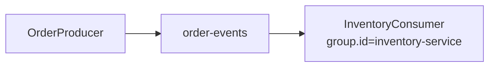

# Lab 03 – Build Java Kafka Consumers

**Lab Number:** 03  
**Day:** 2  
**Duration:** 60 minutes  
**Difficulty:** Beginner  
**Environment:** Windows 10 / Windows 11  
**Mode:** Individual

---

## Description

This lab covers writing a Java consumer and single-consumer behavior from the Day 2 syllabus.

You will create `InventoryConsumer`, poll `order-events`, print partition and offset, produce more orders, then stop and restart the consumer to see committed group offsets.

---

## Prerequisites

- Lab 02 is complete
- `order-events` exists with 4 partitions and RF 3
- `OrderProducer` can publish events
- The three-broker cluster is running

---

## Business Use Case

The Inventory service must reserve stock whenever an order is created.

```text
Order Producer
      |
      v
order-events
      |
      v
Inventory Consumer
```

Inventory is a **single consumer** in this lab. Lab 05 adds more instances and rebalancing.

---

## Architecture

```text
                 OrderProducer
                       |
                       v
                 order-events
                 P0 P1 P2 P3
                       |
                       v
              inventory-service
              InventoryConsumer
                       |
                       +-- partition
                       +-- offset
                       +-- value
```



---

## Detailed Steps

### Step 0 – Initial Setup

Confirm Kafka and the topic:

```powershell
cd C:\kafka-labs\kafka

.\bin\windows\kafka-topics.bat `
  --describe `
  --topic order-events `
  --bootstrap-server localhost:9092
```

If the producer is not ready, compile the project:

```powershell
cd C:\kafka-labs\quickcart-kafka
mvn -q compile
```

Stop leftover console consumers so they do not join `inventory-service` by accident.

---

### Step 1 – Consumer configuration

Create `src\main\java\com\quickcart\kafka\consumer\InventoryConsumer.java`:

```java
package com.quickcart.kafka.consumer;

import com.quickcart.kafka.config.KafkaConfig;
import org.apache.kafka.clients.consumer.ConsumerConfig;
import org.apache.kafka.clients.consumer.ConsumerRecord;
import org.apache.kafka.clients.consumer.ConsumerRecords;
import org.apache.kafka.clients.consumer.KafkaConsumer;
import org.apache.kafka.common.serialization.StringDeserializer;

import java.time.Duration;
import java.util.Collections;
import java.util.Properties;

public class InventoryConsumer {

    public static void main(String[] args) {
        Properties properties = new Properties();

        properties.put(
                ConsumerConfig.BOOTSTRAP_SERVERS_CONFIG,
                KafkaConfig.BOOTSTRAP_SERVERS
        );
        properties.put(
                ConsumerConfig.KEY_DESERIALIZER_CLASS_CONFIG,
                StringDeserializer.class.getName()
        );
        properties.put(
                ConsumerConfig.VALUE_DESERIALIZER_CLASS_CONFIG,
                StringDeserializer.class.getName()
        );
        properties.put(
                ConsumerConfig.GROUP_ID_CONFIG,
                "inventory-service"
        );
        properties.put(
                ConsumerConfig.AUTO_OFFSET_RESET_CONFIG,
                "earliest"
        );

        KafkaConsumer<String, String> consumer =
                new KafkaConsumer<>(properties);

        consumer.subscribe(
                Collections.singletonList(KafkaConfig.ORDER_TOPIC)
        );

        System.out.println("InventoryConsumer subscribed to "
                + KafkaConfig.ORDER_TOPIC);

        try {
            while (true) {
                ConsumerRecords<String, String> records =
                        consumer.poll(Duration.ofMillis(1000));

                for (ConsumerRecord<String, String> record : records) {
                    System.out.println("Order = " + record.value());
                    System.out.println("Partition = " + record.partition());
                    System.out.println("Offset = " + record.offset());
                    System.out.println("Key = " + record.key());
                    System.out.println("-----");
                }
            }
        } finally {
            consumer.close();
        }
    }
}
```

`AUTO_OFFSET_RESET_CONFIG=earliest` applies only when this group has **no** committed offset yet. After the group has stored progress, a restart continues from that progress.

---

### Step 2 – Poll records end to end

Run:

```text
InventoryConsumer
```

Leave it running.

In a second IDE run configuration, start:

```text
OrderProducer
```

You now have the first end-to-end **Java** Kafka application: Java produce and Java consume.

**Checkpoint**

The consumer should print orders, partitions, and offsets. If it prints nothing, the producer may have published only to offsets this group already committed. Run `OrderProducer` again while the consumer is up.

---

### Step 3 – Understand offsets

Produce another five events (run `OrderProducer` again, or temporarily change the loop to 5 new ids if you do not want 20 more duplicates).

Observe lines similar to:

```text
Partition = 2
Offset = 10

Partition = 2
Offset = 11

Partition = 0
Offset = 8
```

Your numbers will differ.

Reinforce:

```text
Offsets belong to partitions.

NOT:

one global offset for the topic.
```

Complete from **your** consumer output:

| Order key | Partition | Offset |
| --- | ---: | ---: |
| | | |
| | | |
| | | |
| | | |
| | | |

---

### Step 4 – Restart the consumer

Stop:

```text
InventoryConsumer
```

Use the IDE stop button or `Ctrl+C` in the run terminal.

Produce another five orders while the consumer is **down**.

Restart `InventoryConsumer`.

Observe that the consumer group continues based on its stored progress. It should receive the five new orders. It should **not** replay the entire topic unless you change `group.id`.

This connects Day 1’s offset discussion with actual Java behavior.

Describe the group:

```powershell
cd C:\kafka-labs\kafka

.\bin\windows\kafka-consumer-groups.bat `
  --bootstrap-server localhost:9092 `
  --describe `
  --group inventory-service
```

Complete:

| Partition | CURRENT-OFFSET | LOG-END-OFFSET | LAG |
| ---: | ---: | ---: | ---: |
| 0 | | | |
| 1 | | | |
| 2 | | | |
| 3 | | | |

---

### Step 5 – Optional reset for later labs

If you need a clean inventory group later, the trainer may ask you to reset offsets. Do **not** do this unless asked:

```powershell
.\bin\windows\kafka-consumer-groups.bat `
  --bootstrap-server localhost:9092 `
  --group inventory-service `
  --topic order-events `
  --reset-offsets `
  --to-earliest `
  --execute
```

Leave `InventoryConsumer` stopped when you finish this lab, or keep it running if you immediately continue to Lab 04.

---

## Conclusion

Inventory can now react to QuickCart orders from Java.

You configured `group.id=inventory-service`, polled records, printed per-partition offsets, and proved that a restart continues from committed progress instead of from a global topic offset.

**You are ready for Lab 04 when:**

- `InventoryConsumer` printed partition and offset
- A restart after producing still delivered the new events
- You filled the consumer-group lag table

Next lab: [04-serializer-partitioner.md](04-serializer-partitioner.md)

---

## Knowledge Check

1. What does `subscribe` tell the consumer?
2. When does `auto.offset.reset=earliest` apply?
3. Why did the restarted consumer skip old records?
4. Why are offsets different on partition 0 and partition 2?

**Expected answers**

1. Which topic(s) to join and that the group coordinator may assign partitions.
2. Only when the group has no committed offset for a partition.
3. The group had already committed offsets.
4. Each partition has its own log and offset sequence.

---

## Common Issues

| Symptom | Likely cause | What to do |
| --- | --- | --- |
| Consumer prints nothing | Group already caught up | Run `OrderProducer` again |
| Consumer replays everything | New `group.id` or reset | That is expected for a new group |
| `TimeoutException` / no brokers | Cluster down | Start ZooKeeper and three brokers |
| Two inventory apps fight for partitions | Leftover consumer still running | Stop extra instances until Lab 05 |
