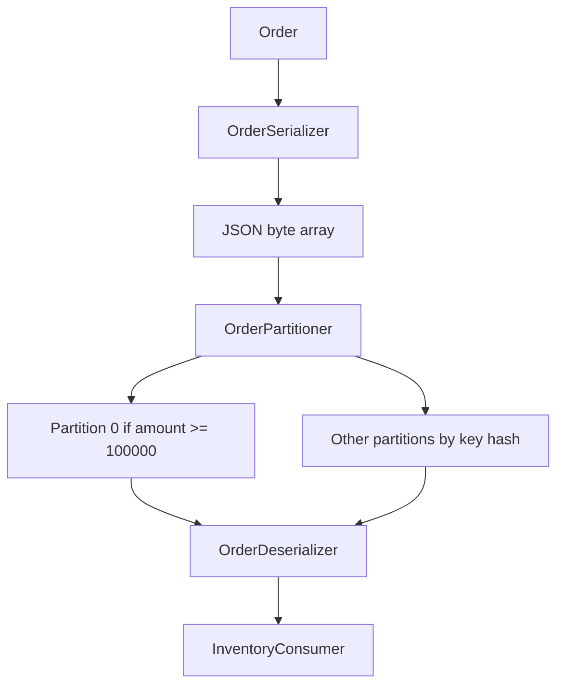

# Lab 04 – Custom Serializer and Custom Partitioner

**Lab Number:** 04  
**Day:** 2  
**Duration:** 60 minutes  
**Difficulty:** Intermediate  
**Environment:** Windows 10 / Windows 11  
**Mode:** Individual

---

## Description

This lab implements the custom serializer and custom partitioner required by the Day 2 syllabus.

You will serialize an `Order` object to JSON bytes, consume those bytes from the CLI, add a matching deserializer for Inventory, then route high-value orders to partition 0 with `OrderPartitioner`.

---

## Prerequisites

- Labs 01–03 are complete
- `Order.java` exists with getters and setters
- `order-events` has 4 partitions
- The cluster is running
- Jackson is in `pom.xml` from Lab 01

---

## Business Use Case

QuickCart cannot keep converting orders to hand-built CSV strings. Downstream services need a structured `Order` object.

The risk team also wants a demonstration rule:

```text
amount >= 100000
        ↓
Partition 0
```

High-value orders land on a dedicated partition so a specialist consumer can watch that partition later.

---

## Architecture

```text
Order object
     ↓
OrderSerializer
     ↓
JSON bytes
     ↓
OrderPartitioner
     ↓
order-events
     ↓
OrderDeserializer
     ↓
Java Order
```



---

## Detailed Steps

### Step 0 – Initial Setup

```powershell
cd C:\kafka-labs\quickcart-kafka
mvn -q compile
```

Confirm Jackson is on the classpath. If compile fails on `ObjectMapper`, fix Lab 01 `pom.xml` before continuing.

Stop `InventoryConsumer` if it is still running with the **string** deserializer. You will start it again after Step 4.

---

### Step 1 – Custom Order serializer

Currently:

```text
Order object
     ↓
manual String
     ↓
Kafka
```

Target:

```text
Order
   ↓
OrderSerializer
   ↓
JSON bytes
   ↓
Kafka
```

Create `src\main\java\com\quickcart\kafka\serializer\OrderSerializer.java`:

```java
package com.quickcart.kafka.serializer;

import com.fasterxml.jackson.databind.ObjectMapper;
import com.quickcart.kafka.model.Order;
import org.apache.kafka.common.serialization.Serializer;

public class OrderSerializer implements Serializer<Order> {

    private final ObjectMapper mapper = new ObjectMapper();

    @Override
    public byte[] serialize(String topic, Order order) {
        if (order == null) {
            return null;
        }
        try {
            return mapper.writeValueAsBytes(order);
        } catch (Exception e) {
            throw new RuntimeException("Unable to serialize Order", e);
        }
    }
}
```

---

### Step 2 – Custom Order deserializer

Inventory must turn those bytes back into an `Order`. This is the other side of the same contract.

Create `src\main\java\com\quickcart\kafka\serializer\OrderDeserializer.java`:

```java
package com.quickcart.kafka.serializer;

import com.fasterxml.jackson.databind.ObjectMapper;
import com.quickcart.kafka.model.Order;
import org.apache.kafka.common.serialization.Deserializer;

public class OrderDeserializer implements Deserializer<Order> {

    private final ObjectMapper mapper = new ObjectMapper();

    @Override
    public Order deserialize(String topic, byte[] data) {
        if (data == null || data.length == 0) {
            return null;
        }
        try {
            return mapper.readValue(data, Order.class);
        } catch (Exception e) {
            throw new RuntimeException("Unable to deserialize Order", e);
        }
    }
}
```

---

### Step 3 – Publish an Order object

Update `OrderProducer` to send `Order` values.

```java
package com.quickcart.kafka.producer;

import com.quickcart.kafka.config.KafkaConfig;
import com.quickcart.kafka.model.Order;
import com.quickcart.kafka.serializer.OrderSerializer;
import org.apache.kafka.clients.producer.KafkaProducer;
import org.apache.kafka.clients.producer.ProducerConfig;
import org.apache.kafka.clients.producer.ProducerRecord;
import org.apache.kafka.common.serialization.StringSerializer;

import java.util.Properties;

public class OrderProducer {

    public static void main(String[] args) {
        Properties properties = new Properties();

        properties.put(
                ProducerConfig.BOOTSTRAP_SERVERS_CONFIG,
                KafkaConfig.BOOTSTRAP_SERVERS
        );
        properties.put(
                ProducerConfig.KEY_SERIALIZER_CLASS_CONFIG,
                StringSerializer.class.getName()
        );
        properties.put(
                ProducerConfig.VALUE_SERIALIZER_CLASS_CONFIG,
                OrderSerializer.class.getName()
        );

        KafkaProducer<String, Order> producer =
                new KafkaProducer<>(properties);

        Order order = new Order(
                "ORD2001",
                "C201",
                "Laptop",
                1,
                75000
        );

        ProducerRecord<String, Order> record =
                new ProducerRecord<>(
                        KafkaConfig.ORDER_TOPIC,
                        order.getOrderId(),
                        order
                );

        producer.send(record, (metadata, exception) -> {
            if (exception != null) {
                System.err.println("Failed: " + exception.getMessage());
            } else {
                System.out.println(
                        "Published " + order.getOrderId()
                                + " partition=" + metadata.partition()
                                + " offset=" + metadata.offset()
                );
            }
        });

        producer.flush();
        producer.close();
    }
}
```

Run `OrderProducer`.

---

### Step 4 – Verify JSON from the CLI

```powershell
cd C:\kafka-labs\kafka

.\bin\windows\kafka-console-consumer.bat `
  --bootstrap-server localhost:9092 `
  --topic order-events `
  --from-beginning
```

Look for a record conceptually similar to:

```json
{"orderId":"ORD2001","customerId":"C201","product":"Laptop","quantity":1,"amount":75000.0}
```

Field order and `.0` on `amount` can vary. That is still valid JSON.

Stop the consumer with `Ctrl+C`.

Explain:

```text
Java Object
     ↓
Serialization
     ↓
byte[]
     ↓
Kafka
```

and on the other side:

```text
Kafka byte[]
     ↓
Deserialization
     ↓
Java Object
```

---

### Step 5 – Point Inventory at the deserializer

Older CSV records on `order-events` will fail JSON parsing. For this lab, either:

- start a **new** group so you only care about new JSON records, or
- produce after the consumer is running so you only process new records

Update `InventoryConsumer` deserializer and print fields from the `Order` object:

```java
properties.put(
        ConsumerConfig.VALUE_DESERIALIZER_CLASS_CONFIG,
        OrderDeserializer.class.getName()
);

KafkaConsumer<String, Order> consumer =
        new KafkaConsumer<>(properties);
```

In the poll loop:

```java
for (ConsumerRecord<String, Order> record : records) {
    Order order = record.value();
    System.out.println("Order = " + order.getOrderId()
            + " amount=" + order.getAmount());
    System.out.println("Partition = " + record.partition());
    System.out.println("Offset = " + record.offset());
}
```

Add the `Order` and `OrderDeserializer` imports.

Use a new group if old CSV records would crash the deserializer:

```java
properties.put(
        ConsumerConfig.GROUP_ID_CONFIG,
        "inventory-service-json"
);
```

You may keep `inventory-service` if you only consume newly produced JSON.

Run `InventoryConsumer`, then run `OrderProducer` again. Confirm the Java object fields print.

---

### Step 6 – Custom partitioner

Business rule for the lab:

```text
amount >= 100000
        ↓
Partition 0
```

Create `src\main\java\com\quickcart\kafka\partitioner\OrderPartitioner.java`.

A production partitioner should not scrape JSON with `contains`. This implementation reads the `Order` from the serialized value so the rule actually matches `double` amounts such as `150000.0`.

```java
package com.quickcart.kafka.partitioner;

import com.fasterxml.jackson.databind.ObjectMapper;
import com.quickcart.kafka.model.Order;
import org.apache.kafka.clients.producer.Partitioner;
import org.apache.kafka.common.Cluster;

import java.util.Map;

public class OrderPartitioner implements Partitioner {

    private final ObjectMapper mapper = new ObjectMapper();

    @Override
    public int partition(String topic,
                         Object key,
                         byte[] keyBytes,
                         Object value,
                         byte[] valueBytes,
                         Cluster cluster) {

        int partitionCount = cluster.partitionCountForTopic(topic);

        try {
            if (valueBytes != null && valueBytes.length > 0) {
                Order order = mapper.readValue(valueBytes, Order.class);
                if (order.getAmount() >= 100000) {
                    return 0;
                }
            }
        } catch (Exception e) {
            System.err.println("Partitioner fallback: " + e.getMessage());
        }

        if (key == null) {
            return 0;
        }
        return Math.abs(key.hashCode()) % partitionCount;
    }

    @Override
    public void close() {}

    @Override
    public void configure(Map<String, ?> configs) {}
}
```

Configure the producer:

```java
properties.put(
        ProducerConfig.PARTITIONER_CLASS_CONFIG,
        OrderPartitioner.class.getName()
);
```

Add the import for `OrderPartitioner`.

---

### Step 7 – Test partitioning

Change `OrderProducer` to send these four orders, then print metadata from the callback:

```text
ORD3001 → 5,000
ORD3002 → 150,000
ORD3003 → 10,000
ORD3004 → 150,000
```

```java
Order[] orders = {
        new Order("ORD3001", "C301", "Mouse", 1, 5000),
        new Order("ORD3002", "C302", "Server", 1, 150000),
        new Order("ORD3003", "C303", "Keyboard", 1, 10000),
        new Order("ORD3004", "C304", "Server", 1, 150000)
};

for (Order order : orders) {
    ProducerRecord<String, Order> record =
            new ProducerRecord<>(
                    KafkaConfig.ORDER_TOPIC,
                    order.getOrderId(),
                    order
            );

    producer.send(record, (metadata, exception) -> {
        if (exception != null) {
            System.err.println("Failed: " + exception.getMessage());
        } else {
            System.out.println(
                    order.getOrderId()
                            + " amount=" + order.getAmount()
                            + " partition=" + metadata.partition()
                            + " offset=" + metadata.offset()
            );
        }
    });
}
```

Run the producer.

Complete:

| Order | Amount | Partition |
| --- | ---: | ---: |
| ORD3001 | 5000 | |
| ORD3002 | 150000 | |
| ORD3003 | 10000 | |
| ORD3004 | 150000 | |

**Checkpoint**

`ORD3002` and `ORD3004` must be on **partition 0**.

---

### Step 8 – Discussion

Ask:

> What problems can a poorly designed custom partitioner cause?

Expected considerations:

- uneven partition distribution
- hot partitions
- reduced scalability
- ordering implications

Write one risk you care about for QuickCart:

```text
________________________________________________
```

---

## Conclusion

Orders now travel as JSON objects, not CSV strings. High-value orders are forced to partition 0 so the routing rule is visible in producer metadata.

You also added `OrderDeserializer` so Inventory can rebuild the Java object. Lab 05 scales that consumer.

**You are ready for Lab 05 when:**

- CLI showed JSON for `ORD2001`
- Inventory printed `Order` fields
- `ORD3002` and `ORD3004` landed on partition 0

Next lab: [05-consumer-groups-scaling.md](05-consumer-groups-scaling.md)

---

## Knowledge Check

1. Who converts an `Order` to `byte[]`?
2. Why did we add a deserializer even though the original outline showed only a serializer?
3. Why can `"amount":150000` string matching fail with Jackson?
4. What happens to key-based ordering if a partitioner ignores the key for high-value orders?

**Expected answers**

1. `OrderSerializer`.
2. The consumer cannot rebuild `Order` without it.
3. Jackson may write `150000.0` for a `double`.
4. Those orders no longer follow the customer/order-id hash, so related keys can split.

---

## Common Issues

| Symptom | Likely cause | What to do |
| --- | --- | --- |
| `Unable to deserialize Order` | Consumer read old CSV records | New `group.id` or consume only new JSON |
| High-value order not on P0 | Partitioner not configured | Set `PARTITIONER_CLASS_CONFIG` |
| `ObjectMapper` not found | Missing Jackson dependency | Fix Lab 01 `pom.xml` and reimport |
| All four orders on P0 | Partition count is 1 | Recreate `order-events` with 4 partitions |
