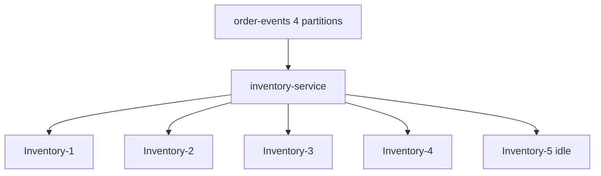

# Lab 05 – Consumer Groups, Scaling, and Rebalancing

**Lab Number:** 05  
**Day:** 2  
**Duration:** 60 minutes  
**Difficulty:** Intermediate  
**Environment:** Windows 10 / Windows 11  
**Mode:** Individual

---

## Description

This lab covers multithreaded and scaled consumption, automatic partition rebalancing, and consumer groups from the Day 2 syllabus.

You will add a consumer instance name, run two then four Inventory instances, start a fifth idle consumer, stop one instance to force a rebalance, and launch three workers as threads that each create their **own** `KafkaConsumer`.

---

## Prerequisites

- Lab 04 is complete
- `InventoryConsumer` can deserialize JSON `Order` values
- `order-events` has **4** partitions
- `group.id` is `inventory-service` or `inventory-service-json` — use **one** group for every instance in this lab
- The three-broker cluster is running

---

## Business Use Case

QuickCart inventory volume is growing. One JVM is not enough.

The team will run several Inventory workers in the same group so Kafka splits partitions. A fifth worker must not magically create more parallelism than there are partitions.

---

## Architecture

```text
                 order-events
                 P0 P1 P2 P3
                      |
           inventory-service
           ----------------
           Inventory-1
           Inventory-2
           Inventory-3
           Inventory-4
           Inventory-5  (idle when only 4 partitions)
```



---

## Detailed Steps

### Step 0 – Initial Setup

Agree the group id you will use for **every** Inventory process today. Recommended:

```text
inventory-service
```

If Lab 04 switched you to `inventory-service-json`, keep that name for all instances.

Stop every running `InventoryConsumer` so you start from a known membership.

Confirm partition count:

```powershell
cd C:\kafka-labs\kafka

.\bin\windows\kafka-topics.bat `
  --describe `
  --topic order-events `
  --bootstrap-server localhost:9092
```

`PartitionCount` must be 4.

---

### Step 1 – Add consumer identity

Update `InventoryConsumer` so the first program argument is the instance name.

At the start of `main`:

```java
String instanceName = args.length > 0
        ? args[0]
        : "consumer";

System.out.println(instanceName + " starting");
```

In the record loop:

```java
System.out.println(
        instanceName +
        " processing partition " +
        record.partition() +
        " offset " +
        record.offset() +
        " order " +
        record.value().getOrderId()
);
```

In IntelliJ, create a run configuration **Inventory-1** with program argument:

```text
Inventory-1
```

Run `Inventory-1`.

Run `OrderProducer` (use the Lab 04 JSON producer; you may send 20 orders by looping). Observe that this single consumer processes all assigned partitions.

---

### Step 2 – Start a second consumer

Create run configuration **Inventory-2** with argument:

```text
Inventory-2
```

Use the same `group.id`.

Start `Inventory-2` while `Inventory-1` is still running.

Observe partition distribution.

Conceptually:

```text
P0 ---> Inventory-1
P1 ---> Inventory-1

P2 ---> Inventory-2
P3 ---> Inventory-2
```

Actual assignments can differ.

Describe the group while both are running:

```powershell
.\bin\windows\kafka-consumer-groups.bat `
  --bootstrap-server localhost:9092 `
  --describe `
  --group inventory-service
```

Complete:

| Partition | Assigned consumer / host |
| ---: | --- |
| 0 | |
| 1 | |
| 2 | |
| 3 | |

---

### Step 3 – Scale to four instances

Start:

```text
Inventory-1
Inventory-2
Inventory-3
Inventory-4
```

Each needs its own run configuration and argument, same `group.id`.

With four partitions, Kafka can give each consumer one partition.

Produce 20 events. Watch the four consoles.

Complete:

| Instance | Partitions you saw |
| --- | --- |
| Inventory-1 | |
| Inventory-2 | |
| Inventory-3 | |
| Inventory-4 | |

---

### Step 4 – Start consumer 5

Start:

```text
Inventory-5
```

same group.

Observe its assignment.

Conceptually:

```text
4 partitions
5 consumers

C1 → P0
C2 → P1
C3 → P2
C4 → P3

C5 → idle
```

The idle consumer is not broken. A group assigns a partition to only one member at a time.

Write what Inventory-5 received:

```text
Assigned partitions: ________
Records printed: ________
```

---

### Step 5 – Trigger rebalance

Terminate:

```text
Inventory-2
```

Observe the remaining consumers. Kafka reassigns partitions.

Students should explain:

```text
Consumer leaves
       ↓
Group coordinator detects change
       ↓
Rebalance
       ↓
Partitions reassigned
```

Describe the group again and record the new assignment:

| Partition | Assigned consumer |
| ---: | --- |
| 0 | |
| 1 | |
| 2 | |
| 3 | |

---

### Step 6 – Multithreaded consumer experiment

The syllabus calls out **Multithreaded Consumer**.

Developer rule:

> `KafkaConsumer` itself is not intended to be freely shared across application threads.

For this lab:

```text
Thread 1 → KafkaConsumer 1
Thread 2 → KafkaConsumer 2
Thread 3 → KafkaConsumer 3
```

all with:

```text
group.id=inventory-service
```

Stop the five IDE instances first so membership is clean.

Create `src\main\java\com\quickcart\kafka\consumer\InventoryWorkerApp.java`:

```java
package com.quickcart.kafka.consumer;

import com.quickcart.kafka.config.KafkaConfig;
import com.quickcart.kafka.model.Order;
import com.quickcart.kafka.serializer.OrderDeserializer;
import org.apache.kafka.clients.consumer.ConsumerConfig;
import org.apache.kafka.clients.consumer.ConsumerRecord;
import org.apache.kafka.clients.consumer.ConsumerRecords;
import org.apache.kafka.clients.consumer.KafkaConsumer;
import org.apache.kafka.common.serialization.StringDeserializer;

import java.time.Duration;
import java.util.Collections;
import java.util.Properties;

public class InventoryWorkerApp {

    public static void main(String[] args) {
        for (int i = 1; i <= 3; i++) {
            int workerId = i;
            Thread worker = new Thread(
                    () -> runConsumer("worker-" + workerId)
            );
            worker.start();
        }
    }

    private static void runConsumer(String instanceName) {
        Properties properties = new Properties();
        properties.put(
                ConsumerConfig.BOOTSTRAP_SERVERS_CONFIG,
                KafkaConfig.BOOTSTRAP_SERVERS
        );
        properties.put(
                ConsumerConfig.KEY_DESERIALIZER_CLASS_CONFIG,
                StringDeserializer.class.getName()
        );
        properties.put(
                ConsumerConfig.VALUE_DESERIALIZER_CLASS_CONFIG,
                OrderDeserializer.class.getName()
        );
        properties.put(
                ConsumerConfig.GROUP_ID_CONFIG,
                "inventory-service"
        );
        properties.put(
                ConsumerConfig.AUTO_OFFSET_RESET_CONFIG,
                "earliest"
        );

        try (KafkaConsumer<String, Order> consumer =
                     new KafkaConsumer<>(properties)) {

            consumer.subscribe(
                    Collections.singletonList(KafkaConfig.ORDER_TOPIC)
            );
            System.out.println(instanceName + " subscribed");

            while (true) {
                ConsumerRecords<String, Order> records =
                        consumer.poll(Duration.ofMillis(1000));
                for (ConsumerRecord<String, Order> record : records) {
                    System.out.println(
                            instanceName
                                    + " partition=" + record.partition()
                                    + " order=" + record.value().getOrderId()
                    );
                }
            }
        }
    }
}
```

The key is that `runConsumer()` creates its own consumer instance.

Run `InventoryWorkerApp`, produce a batch, and confirm three worker names appear.

---

## Conclusion

You scaled Inventory the Java way: same `group.id`, one consumer per process or per thread, never one shared `KafkaConsumer`.

Four partitions support four active workers. A fifth member sits idle. When a member leaves, Kafka rebalances.

**You are ready for Lab 06 when:**

- Two and four instances showed split partitions
- Consumer 5 was idle
- You explained the rebalance after Inventory-2 stopped
- `InventoryWorkerApp` started three private consumers

Next lab: [06-performance-reliability.md](06-performance-reliability.md)

---

## Knowledge Check

1. Why must every Inventory instance use the same `group.id` to share work?
2. Why is the fifth consumer idle?
3. Why not call `poll()` on one `KafkaConsumer` from three threads?
4. What happens to offsets when Inventory-2 leaves?

**Expected answers**

1. Different group ids mean independent subscribers, not competing workers.
2. There are only four partitions.
3. `KafkaConsumer` is not thread-safe for that usage.
4. Its partitions are reassigned. Committed offsets stay with the group.

---

## Common Issues

| Symptom | Likely cause | What to do |
| --- | --- | --- |
| Every instance prints every record | Different `group.id` values | Use one group name |
| Fifth consumer still gets a partition | Topic has more than 4 partitions | Describe `order-events` |
| Rebalance not visible | Described too quickly | Wait 10 seconds and describe again |
| `ConcurrentModificationException` | Shared consumer across threads | One consumer per thread |
