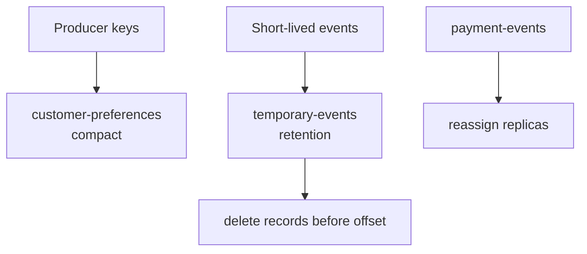

# Lab 07 – Topic and Partition Management for Developers

**Lab Number:** 07  
**Day:** 2  
**Duration:** 60 minutes  
**Difficulty:** Intermediate  
**Environment:** Windows 10 / Windows 11  
**Mode:** Individual

---

## Description

The second half of Day 2 includes compacted topics, retention, deletion, Kafka log directories, and partition reassignment.

You will create a compacted preferences topic, a short-retention topic, inspect log dirs, increase partitions, delete a disposable topic, delete records without deleting a topic, and reassign one partition on a replicated topic.

This is a developer-facing operations lab. You are not replacing the Kafka administrator role.

---

## Prerequisites

- The Day 1 three-broker cluster is running
- You can use `kafka-topics.bat` and `kafka-configs.bat`
- Day 1 `payment-events` may exist from the capstone; if not, you will create a disposable replicated topic
- You understand that compaction and retention are asynchronous

---

## Business Use Case

QuickCart needs two different storage behaviors:

- **Customer preferences** — only the latest channel per customer matters (`EMAIL`, then `SMS`, then `PUSH`)
- **Temporary events** — drop noise after a short time

Developers also need to know where logs live, how to grow partitions, and that **delete topic** is not the same as **delete records**.

---

## Architecture

```text
customer-preferences     cleanup.policy=compact
  C101 EMAIL
  C101 SMS
  C101 PUSH   --> eventually C101 PUSH

temporary-events         retention.ms=60000
  old records expire

test-delete              created then deleted

payment-events           reassign partition 0 replicas
```



---

## Detailed Steps

### Step 0 – Initial Setup

```powershell
cd C:\kafka-labs\kafka

.\bin\windows\kafka-topics.bat `
  --list `
  --bootstrap-server localhost:9092
```

Note whether `payment-events` exists. You will need a replicated topic in Step 7.

Keep Java consumers stopped if they subscribe to topics you will alter. They can stay running on `order-events`.

---

### Step 1 – Create a compacted topic

QuickCart needs the latest customer preference per customer:

```text
CUSTOMER101 → EMAIL
CUSTOMER102 → SMS
CUSTOMER101 → PUSH
```

For many state-oriented use cases, only the latest value per key is eventually important.

```powershell
.\bin\windows\kafka-topics.bat `
  --create `
  --topic customer-preferences `
  --bootstrap-server localhost:9092 `
  --partitions 3 `
  --replication-factor 3 `
  --config cleanup.policy=compact
```

Describe the config:

```powershell
.\bin\windows\kafka-configs.bat `
  --bootstrap-server localhost:9092 `
  --entity-type topics `
  --entity-name customer-preferences `
  --describe
```

You should see `cleanup.policy=compact`.

Produce keyed values:

```powershell
.\bin\windows\kafka-console-producer.bat `
  --bootstrap-server localhost:9092 `
  --topic customer-preferences `
  --property parse.key=true `
  --property key.separator=:
```

Enter:

```text
C101:EMAIL
C102:SMS
C101:PUSH
```

Explain conceptually:

```text
C101 → EMAIL
C101 → SMS
C101 → PUSH

Eventually after compaction:

C101 → PUSH
```

Log compaction is **asynchronous**. Do not expect old records to disappear immediately.

**Checkpoint**

`cleanup.policy=compact` is visible on `customer-preferences`.

---

### Step 2 – Retention topic

```powershell
.\bin\windows\kafka-topics.bat `
  --create `
  --topic temporary-events `
  --bootstrap-server localhost:9092 `
  --partitions 2 `
  --replication-factor 3 `
  --config retention.ms=60000
```

Explain:

```text
retention.ms
retention.bytes
log.segment.bytes
log.segment.ms
```

and the difference between:

```text
Retention:
"How long/how much history should Kafka retain?"

Compaction:
"What is the latest value associated with each key?"
```

A 60-second retention is for the lab only. Production order topics use much longer retention.

---

### Step 3 – Inspect Kafka log directories

```powershell
.\bin\windows\kafka-log-dirs.bat `
  --bootstrap-server localhost:9092 `
  --describe
```

Identify which brokers contain replicas for `order-events`, `customer-preferences`, and `temporary-events`.

This covers the syllabus `Kafka-Log-Dirs` requirement.

Complete:

| Topic | Brokers / dirs you recognized |
| --- | --- |
| `order-events` | |
| `customer-preferences` | |
| `temporary-events` | |

You can also look on disk:

```powershell
Get-ChildItem C:\kafka-labs\data\kafka-1 -Directory |
  Select-Object -First 15 Name
```

---

### Step 4 – Increase partitions

Inspect:

```powershell
.\bin\windows\kafka-topics.bat `
  --describe `
  --topic temporary-events `
  --bootstrap-server localhost:9092
```

Increase:

```powershell
.\bin\windows\kafka-topics.bat `
  --alter `
  --topic temporary-events `
  --partitions 4 `
  --bootstrap-server localhost:9092
```

Describe again. Partition count should be 4.

Important developer consideration:

> Increasing partition count can affect key-to-partition mapping, so partition changes should not be treated as operationally invisible for applications that depend on key-based ordering.

You cannot decrease partition count with this command.

---

### Step 5 – Delete a topic

Create a disposable topic:

```powershell
.\bin\windows\kafka-topics.bat `
  --create `
  --topic test-delete `
  --bootstrap-server localhost:9092 `
  --partitions 1 `
  --replication-factor 1
```

Delete:

```powershell
.\bin\windows\kafka-topics.bat `
  --delete `
  --topic test-delete `
  --bootstrap-server localhost:9092
```

Verify:

```powershell
.\bin\windows\kafka-topics.bat `
  --list `
  --bootstrap-server localhost:9092
```

`test-delete` should be gone or marked for deletion.

**Do not delete** `order-events`. The capstone reuses it.

---

### Step 6 – Delete records without deleting the topic

The syllabus lists deleting specific or all records **and** deleting a topic as different operations.

Produce a few records to `temporary-events`:

```powershell
.\bin\windows\kafka-console-producer.bat `
  --bootstrap-server localhost:9092 `
  --topic temporary-events
```

Enter at least six lines, then `Ctrl+C`.

Create:

```text
C:\kafka-labs\delete-records.json
```

```json
{
  "partitions": [
    {
      "topic": "temporary-events",
      "partition": 0,
      "offset": 5
    }
  ],
  "version": 1
}
```

Delete records **before** that offset on partition 0:

```powershell
cd C:\kafka-labs\kafka

.\bin\windows\kafka-delete-records.bat `
  --bootstrap-server localhost:9092 `
  --offset-json-file C:\kafka-labs\delete-records.json
```

Trainer point:

```text
Delete Topic
    !=
Delete Records
```

This exercise uses disposable data because record deletion is destructive. Do not run it against `order-events` or `payment-events` unless the trainer agrees.

---

### Step 7 – Partition reassignment

Use `payment-events` or another disposable **replicated** topic.

If `payment-events` is missing:

```powershell
.\bin\windows\kafka-topics.bat `
  --create `
  --topic payment-events `
  --bootstrap-server localhost:9092 `
  --partitions 4 `
  --replication-factor 3
```

Inspect:

```powershell
.\bin\windows\kafka-topics.bat `
  --describe `
  --topic payment-events `
  --bootstrap-server localhost:9092
```

Record the current P0 replica list:

```text
P0 replicas before: ________
P0 leader before:   ________
```

Create `C:\kafka-labs\reassign-p0.json`. Use **your** broker ids. The example only shows the shape:

```json
{
  "version": 1,
  "partitions": [
    {
      "topic": "payment-events",
      "partition": 0,
      "replicas": [2, 3, 1]
    }
  ]
}
```

Change `[2, 3, 1]` so it is a valid permutation of the brokers that actually exist (`1`, `2`, `3`) and is **different** from the current replica order if you want a visible move.

Execute:

```powershell
.\bin\windows\kafka-reassign-partitions.bat `
  --bootstrap-server localhost:9092 `
  --reassignment-json-file C:\kafka-labs\reassign-p0.json `
  --execute
```

If the tool asks for a `--throttle` or prints a verify command, follow the printed command.

Verify:

```powershell
.\bin\windows\kafka-reassign-partitions.bat `
  --bootstrap-server localhost:9092 `
  --reassignment-json-file C:\kafka-labs\reassign-p0.json `
  --verify
```

Then:

```powershell
.\bin\windows\kafka-topics.bat `
  --describe `
  --topic payment-events `
  --bootstrap-server localhost:9092
```

Complete:

| Item | Before | After |
| --- | --- | --- |
| P0 replicas | | |
| P0 leader | | |

The objective is to understand what happens when partitions move between brokers, not to turn Day 2 into an administration course.

---

## Conclusion

You used Kafka the way a developer must during incidents and releases: compact a state topic, expire noisy events, inspect log dirs, grow partitions, delete a topic, delete records, and move a replica.

Remember the two deletions are different, compaction is not instant, and adding partitions can break key-based ordering.

**You are ready for Lab 08 when:**

- `customer-preferences` is compacted
- `temporary-events` was altered to 4 partitions
- `test-delete` is gone
- You ran delete-records on disposable data
- You verified a reassignment (or captured why the trainer skipped it)

Next lab: [08-capstone-order-processing.md](08-capstone-order-processing.md)

---

## Knowledge Check

1. What does log compaction keep?
2. What does `retention.ms=60000` mean?
3. Why is increasing partitions dangerous for keyed ordering?
4. How is deleting records different from deleting a topic?

**Expected answers**

1. The latest value per key, after compaction runs.
2. Kafka may drop segments older than 60 seconds, subject to segment rolling.
3. The hash modulus changes, so the same key can move to a new partition.
4. Delete records removes data from a living topic. Delete topic removes the topic itself.

---

## Common Issues

| Symptom | Likely cause | What to do |
| --- | --- | --- |
| Compacted topic still shows old C101 values | Compaction has not run | That is expected; do not wait in class |
| `--alter --partitions` rejected | You tried to decrease partitions | Only increase |
| `delete-records` fails | Wrong JSON path or topic name | Check the file and topic |
| Reassignment rejected | Replica list has unknown broker ids | Use 1, 2, 3 from `--describe` |
| `test-delete` still listed | Delete is asynchronous | List again after 10 seconds |
