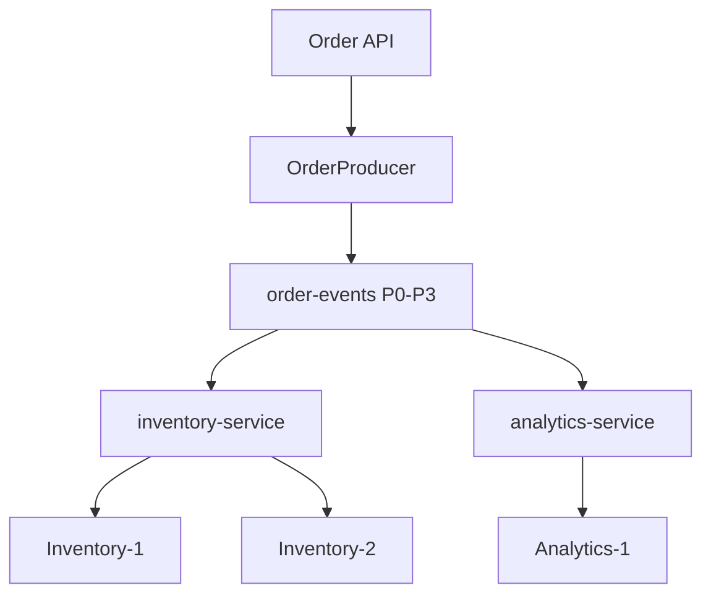

# Lab 08 – Day 2 Developer Capstone: Order Event Processing System

**Lab Number:** 08  
**Day:** 2  
**Duration:** 75–90 minutes  
**Difficulty:** Intermediate  
**Environment:** Windows 10 / Windows 11  
**Mode:** Individual or pairs

---

## Description

This is the Day 2 capstone. You build QuickCart’s **Order Event Processing System** from the skills in Labs 01–07.

You will confirm the topic, extend the `Order` model, use the JSON serializer, configure a production-shaped async producer, run two Inventory consumers, add an independent Analytics group, scale Inventory to four then five members, force lag with a slow consumer, then recover.

Work from the steps. Do not wait for the trainer to type code for you. You may reuse classes from earlier labs. You must be able to **explain** every setting you keep.

---

## Prerequisites

- Day 2 Labs 01–07 are complete
- `C:\kafka-labs\quickcart-kafka` compiles
- The three-broker cluster is running
- You can start multiple IDE run configurations
- You understand serializer, partitioner, groups, lag, and `acks`

---

## Business Use Case

QuickCart needs an Order Event Processing System.

The Order API publishes structured orders. Inventory workers share the load. Analytics reads the same stream independently. Operations must see lag when Inventory is slow and see lag fall when Inventory catches up.

---

## Architecture

```text
                    QuickCart Order API
                           |
                      OrderProducer
                           |
                           v
                 +--------------------+
                 |    order-events    |
                 | P0 | P1 | P2 | P3 |
                 +----------+---------+
                            |
               +------------+------------+
               |                         |
               v                         v

        Inventory Service          Analytics Service
        Consumer Group             Consumer Group

        inventory-service          analytics-service

          C1       C2
           \       /
            partitions
```



---

## Detailed Steps

### Step 0 – Initial Setup

1. Start ZooKeeper and brokers 1–3 if they are not running.
2. Stop leftover Inventory workers so group membership is clean.
3. Open `C:\kafka-labs\quickcart-kafka` in the IDE.
4. Confirm compile:

```powershell
cd C:\kafka-labs\quickcart-kafka
mvn -q compile
```

5. List topics:

```powershell
cd C:\kafka-labs\kafka

.\bin\windows\kafka-topics.bat `
  --list `
  --bootstrap-server localhost:9092
```

---

### Step 1 – Topic

Create or confirm:

```text
order-events
```

Requirements:

```text
Partitions = 4
Replication = 3
```

```powershell
.\bin\windows\kafka-topics.bat `
  --describe `
  --topic order-events `
  --bootstrap-server localhost:9092
```

If the topic is missing:

```powershell
.\bin\windows\kafka-topics.bat `
  --create `
  --topic order-events `
  --bootstrap-server localhost:9092 `
  --partitions 4 `
  --replication-factor 3
```

If partitions or RF are wrong, stop and fix with the trainer before producing. Do not silently use a Day 1 RF 1 topic.

| Field | Required | Your value |
| --- | --- | --- |
| Partitions | 4 | |
| RF | 3 | |

---

### Step 2 – Order model

Implement or extend `Order` so it includes:

```java
Order {
    orderId
    customerId
    productId
    quantity
    amount
    status
    createdAt
}
```

Lab 02 used `product`. The capstone uses `productId`. You may keep `product` **and** add `productId`, `status`, and `createdAt`, or rename `product` to `productId`.

Add getters and setters for every field you serialize. `createdAt` can be a `String` timestamp such as `2026-09-19T10:15:30`.

---

### Step 3 – Custom serializer

Serialize `Order` into JSON using `OrderSerializer` from Lab 04.

Confirm the producer value serializer is:

```text
OrderSerializer
```

Confirm Inventory uses:

```text
OrderDeserializer
```

If you added fields, produce one test order and consume it from the CLI to see the new JSON keys.

---

### Step 4 – Production-ready producer configuration

Configure:

```text
bootstrap.servers
key.serializer
value.serializer
acks
retries
batch.size
linger.ms
compression.type
client.id
```

Students should be able to explain why they chose each setting.

Complete this table **before** you run the 50-order load. There is no single correct row; you must defend the choice.

| Setting | Your value | Why |
| --- | --- | --- |
| `bootstrap.servers` | | |
| `key.serializer` | | |
| `value.serializer` | | |
| `acks` | | |
| `retries` | | |
| `batch.size` | | |
| `linger.ms` | | |
| `compression.type` | | |
| `client.id` | | |

Recommended starting point if you are unsure: Lab 06 values (`acks=all`, retries 3, batch 32768, linger 10, gzip or none, `client.id=quickcart-order-api`).

---

### Step 5 – Asynchronous producer

Publish:

```text
50 orders
```

Use:

```text
orderId
```

as the key.

Print from the callback:

```text
Order ID
Partition
Offset
```

Include a mix of amounts. At least five orders should have `amount >= 100000` if you still use `OrderPartitioner`, so some land on partition 0.

Run the producer. Confirm 50 callback lines (or 50 successful metadata prints).

---

### Step 6 – Inventory consumers

Create / use:

```text
group.id=inventory-service
```

Start:

```text
Inventory-1
Inventory-2
```

Verify partition distribution with logs and:

```powershell
.\bin\windows\kafka-consumer-groups.bat `
  --bootstrap-server localhost:9092 `
  --describe `
  --group inventory-service
```

| Partition | Inventory instance |
| ---: | --- |
| 0 | |
| 1 | |
| 2 | |
| 3 | |

---

### Step 7 – Analytics consumer

Create a separate consumer class or run configuration:

```text
group.id=analytics-service
```

`AnalyticsConsumer` can share the poll loop with Inventory but **must** use a different group id. Set `auto.offset.reset=earliest` so Analytics can read the stream independently.

Verify that Analytics receives the same logical stream independently from Inventory.

Produce a few more orders if Analytics starts at the tip and you need a visible live test.

| Check | Yes / No |
| --- | --- |
| Analytics uses a different group | |
| Analytics sees order events | |
| Inventory still receives new events | |

---

### Step 8 – Scale Inventory

Start:

```text
Inventory-3
Inventory-4
```

Observe rebalancing.

Then start:

```text
Inventory-5
```

Explain why adding the fifth consumer does not increase active partition-level parallelism while the topic still has only four partitions.

```text
Why Inventory-5 is idle:
________________________________________________
```

---

### Step 9 – Simulate a slow service

Add:

```java
Thread.sleep(3000);
```

to **one** Inventory consumer.

Produce another:

```text
100 events
```

Inspect:

```powershell
.\bin\windows\kafka-consumer-groups.bat `
  --bootstrap-server localhost:9092 `
  --describe `
  --group inventory-service
```

Record:

| Partition | Current Offset | Log End Offset | Lag |
| --------- | -------------: | -------------: | --: |
| P0        |                |                |     |
| P1        |                |                |     |
| P2        |                |                |     |
| P3        |                |                |     |

---

### Step 10 – Recover

Remove or reduce the artificial delay.

Observe lag decrease.

Explain:

```text
Producer rate > Consumer rate
          ↓
       Lag grows
          ↓
Consumer catches up
          ↓
       Lag falls
```

Record lag after recovery:

| Partition | Lag after recover |
| ---: | ---: |
| P0 | |
| P1 | |
| P2 | |
| P3 | |

---

### Step 11 – Architecture review

Point at your running processes and name each box:

```text
                         JAVA APPLICATION

                         OrderProducer
                              |
                    Custom Serializer
                              |
                    Custom Partitioner
                              |
                              v
                +---------------------------+
                |      order-events         |
                | P0    P1    P2    P3     |
                +-------------+-------------+
                              |
             +----------------+----------------+
             |                                 |
             v                                 v
      inventory-service                 analytics-service
       C1  C2  C3  C4                     C1
```

---

## Conclusion

You delivered a small but realistic Kafka Java system for QuickCart: structured orders, async produce, two independent consumer groups, scaling limits, and visible backpressure.

Day 2 is complete when you can run this flow without trainer prompting. Day 3 moves to Avro, administration, security, and Kafka Connect.

**Day 2 is complete when you have:**

- 4-partition / RF 3 `order-events`
- 50 async publishes with callback metadata
- Inventory-1 and Inventory-2 sharing partitions
- Analytics on a separate group
- An idle fifth Inventory member
- A lag table from the slow-consumer test and a recovery observation

---

## Knowledge Check

1. Why is `orderId` the producer key?
2. Why does Analytics need a different `group.id`?
3. Why is Inventory-5 idle?
4. What does growing lag tell operations?
5. Which producer setting is about durability more than throughput?

**Expected answers**

1. So events for the same order stay on one partition (unless the custom partitioner overrides by amount).
2. So it is an independent subscriber with its own offsets.
3. Four partitions, five group members.
4. Inventory cannot keep up with the produce rate.
5. `acks` (typically `all` for orders).

---

## Common Issues

| Symptom | Likely cause | What to do |
| --- | --- | --- |
| Deserializer errors on old CSV | Mixed history on `order-events` | New group or only consume new JSON |
| Analytics sees nothing | Started at latest with no new produce | `--offset earliest` / `auto.offset.reset=earliest` and produce again |
| Fifth consumer gets a partition | Not actually 4 partitions | Describe the topic |
| `acks=all` fails | RF 1 leftover topic | Recreate `order-events` with RF 3 |
| Lag table is empty | Wrong group name | Describe `inventory-service` while consumers run |

---

## After This Lab

Leave the three-broker cluster available if Day 3 starts on the same machine. You may stop extra Java consumers to free memory.

Instructor extensions (Docker, MirrorMaker, configuration challenge) are on [00.md](00.md).
