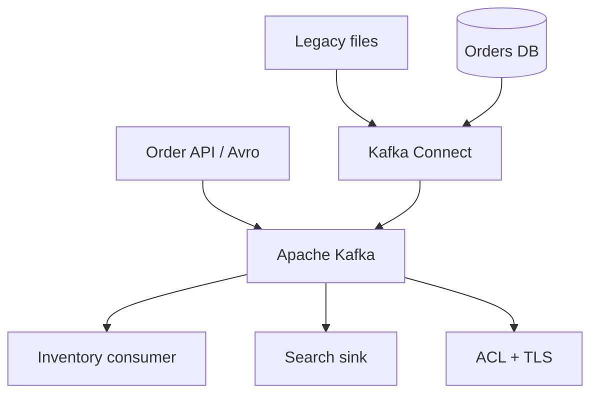

# Apache Kafka – Day 3 Hands-on Lab Guide

**Theme:** Production Kafka – Avro, Administration, Security, and Data Integration  
**Duration:** 8 hours  
**Environment:** Windows 10 / Windows 11  
**Language:** Java 17+  
**Build:** Maven  
**IDE:** IntelliJ IDEA / VS Code  
**Starting point:** Day 2 QuickCart project and Day 1 three-broker cluster  
**Business story:** QuickCart moves from development toward production

Start here. Complete the labs in order. Each exercise is a separate learner-ready file.

Day 1 built the cluster. Day 2 built Java producers and consumers. Day 3 makes that platform production-ready: structured Avro events, operations, security, and Kafka Connect pipelines.

---

## How to Use This Guide

1. Read this page once at the start of Day 3.
2. Start the Day 1 three-broker cluster before Lab 01.
3. Reuse `C:\kafka-labs\quickcart-kafka` unless a step says otherwise.
4. Do not skip **Step 0**.
5. Keep ZooKeeper and the three brokers running. Add SSL or SASL listeners without removing `PLAINTEXT://localhost:9092` so later Connect labs still work.

If a command or Java program fails, use the **Common Issues** section in that lab, then the troubleshooting cheat sheet at the end of this page.

---

## What You Will Be Able to Do

By the end of Day 3 you will be able to:

- Produce and consume Avro-encoded order events
- Use Kafka admin CLI tools to inspect topics, groups, configs, and log dirs
- Diagnose wrong bootstrap servers, wrong topics, lag, and broker loss
- Measure and tune producer batching, compression, and `acks`
- Apply ACLs so a producer can write and a consumer can read
- Encrypt client-to-broker traffic with TLS
- Run a Kafka Connect file source and file sink
- Design JDBC, Cassandra, and Elasticsearch connector pipelines
- Combine those skills in a secure integration capstone

---

## Lab Roadmap

| Lab | File | Exercise | Main topics | Time |
| ---: | --- | --- | --- | ---: |
| 01 | [01-avro-producer-consumer.md](01-avro-producer-consumer.md) | Avro producer and consumer | Avro schema, binary serialize | 45 min |
| 02 | [02-administration-toolkit.md](02-administration-toolkit.md) | Kafka administration toolkit | Topics, groups, configs, log dirs | 40 min |
| 03 | [03-troubleshooting.md](03-troubleshooting.md) | Troubleshoot production problems | Broken config, lag, broker failure | 40 min |
| 04 | [04-performance-tuning.md](04-performance-tuning.md) | Performance tuning | Batching, compression, acks | 35 min |
| 05 | [05-acl-security.md](05-acl-security.md) | Authorization and ACL | Principals, WRITE/READ, deny test | 60 min |
| 06 | [06-ssl-encryption.md](06-ssl-encryption.md) | SSL/TLS encryption | Certificates, SSL listener | 60 min |
| 07 | [07-kafka-connect-file.md](07-kafka-connect-file.md) | Kafka Connect file pipeline | Worker, FileStream source/sink | 60 min |
| 08 | [08-jdbc-pipeline.md](08-jdbc-pipeline.md) | JDBC data pipeline | Database → Kafka | 45 min |
| 09 | [09-cassandra-elasticsearch.md](09-cassandra-elasticsearch.md) | Cassandra and Elasticsearch | Connector patterns | 30 min |
| 10 | [10-capstone-secure-integration.md](10-capstone-secure-integration.md) | Day 3 capstone | Secure integration platform | 60–75 min |

Full Schema Registry is Day 4. Lab 01 teaches Avro mechanics only.

---

## Day 3 Architecture You Are Building

```text
                    QUICKCART PRODUCTION PLATFORM

                         Applications
                              |
                              v
                     +----------------+
                     | Apache Kafka   |
                     +-------+--------+
                             |
           +-----------------+----------------+
           |                 |                |
           v                 v                v
      Applications       Databases        Search

New requirements:
-------------------------------------------------
Structured messages / Avro
Kafka administration
Troubleshooting
Performance tuning
Authorization / ACL
SSL encryption
Kafka Connect
File / JDBC / Cassandra / Elasticsearch
```



---

## Standard Lab Environment

| Item | Value |
| --- | --- |
| Kafka home | `C:\kafka-labs\kafka` |
| Java project | `C:\kafka-labs\quickcart-kafka` |
| Security files | `C:\kafka-labs\security` |
| Connect files | `C:\kafka-labs\connect` |
| Data files | `C:\kafka-labs\data` |
| Bootstrap (PLAINTEXT) | `localhost:9092,localhost:9093,localhost:9094` |
| SASL listener (Lab 05) | `localhost:9095` on Broker 1 |
| SSL listeners (Lab 06) | `9192` / `9193` / `9194` |
| Avro topic | `avro-order-events` |
| Capstone topic | `production-order-events` |

Do **not** reuse port `9093` for SSL. That port is already Broker 2 PLAINTEXT.

---

## Start the Day 1 Cluster

| Terminal | Process |
| ---: | --- |
| 1 | ZooKeeper |
| 2 | Broker 1 (`server-1.properties`) |
| 3 | Broker 2 |
| 4 | Broker 3 |
| 5 | CLI |
| 6+ | Java apps, Connect, extra CLI |

```powershell
cd C:\kafka-labs\kafka
.\bin\windows\zookeeper-server-start.bat .\config\zookeeper.properties
```

```powershell
.\bin\windows\kafka-server-start.bat .\config\server-1.properties
```

Repeat for `server-2.properties` and `server-3.properties`.

---

## Lab File Template

1. Title and lab number  
2. Description  
3. Prerequisites  
4. Business use case  
5. Architecture diagram  
6. Detailed steps, starting with **Step 0**  
7. Checkpoints and observation tables  
8. Conclusion  
9. Knowledge check  
10. Common issues  

---

## Rules for Learners

- Complete labs in sequence.
- Leave `PLAINTEXT` listeners in place when you add SASL or SSL.
- Do not enable `allow.everyone.if.no.acl.found=false` on all brokers without a super user. Lab 05 tells you how to keep Connect labs working.
- Record your own lag, throughput, and ACL list output.
- Cassandra and Elasticsearch in Lab 09 may be trainer-hosted. You still write the connector configs.
- Schema Registry registry-aware Avro is Day 4.

---

## Suggested Day Plan

| Block | Labs | Focus |
| --- | --- | --- |
| Morning 1 (90 min) | 01, 02 | Avro and admin toolkit |
| Morning 2 (90 min) | 03, 04 | Troubleshooting and tuning |
| Afternoon 1 (120 min) | 05, 06 | ACL and TLS |
| Afternoon 2 (90 min) | 07, 08 | Connect file and JDBC |
| Close (90 min) | 09, 10 | Search/Cassandra patterns and capstone |

---

## Day 3 Troubleshooting Cheat Sheet

Use this all day, then again in the capstone.

| Problem | First things to investigate |
| --- | --- |
| Producer cannot connect | Bootstrap servers, broker, port, listener |
| Consumer receives nothing | Topic, group, offsets, producer |
| Consumer slow | Consumer lag, processing time |
| Broker unavailable | Broker process, leader, ISR |
| Authorization error | Principal, ACL, topic/group permissions |
| SSL failure | Truststore, certificate, hostname, listener |
| Connector not starting | Connector config, plugin availability, worker logs |
| JDBC records missing | Query/table configuration, mode/offset |
| High lag | Producer rate vs consumer throughput |
| Uneven workload | Partition/key distribution |

---

## Start Lab 01

Open [01-avro-producer-consumer.md](01-avro-producer-consumer.md) and complete **Step 0**.
