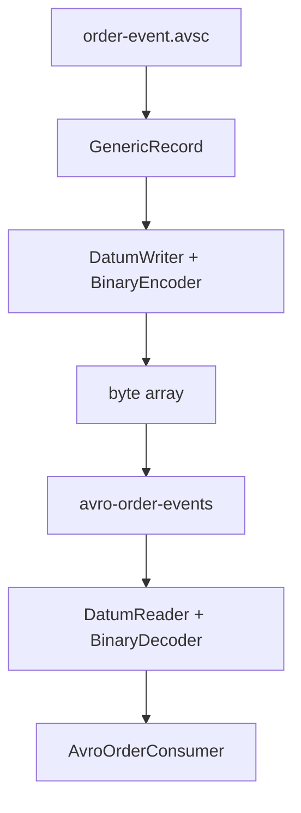

# Lab 01 – Build an Avro Producer and Consumer

**Lab Number:** 01  
**Day:** 3  
**Duration:** 45 minutes  
**Difficulty:** Intermediate  
**Environment:** Windows 10 / Windows 11  
**Mode:** Individual

---

## Description

This lab introduces Avro producer and consumer mechanics required at the start of Day 3.

You will add an Avro schema, add the Avro library to the Day 2 Maven project, build a `GenericRecord`, serialize it to bytes, publish to `avro-order-events`, and deserialize those bytes in a Java consumer.

Full Schema Registry coverage is **Day 4**. Today you learn the schema and binary encoding, not registry-aware serializers.

---

## Prerequisites

- Day 1 three-broker cluster can start
- Day 2 project `C:\kafka-labs\quickcart-kafka` exists and compiles
- JDK 17+, Maven, and the Kafka CLI work
- You understand Day 2 JSON serialization

---

## Business Use Case

Day 2 sent JSON:

```json
{
  "orderId": "ORD1001",
  "customerId": "C101",
  "amount": 75000
}
```

QuickCart now wants a **structured event contract**. Inventory and Analytics must agree on field names and types. Avro gives a schema and a compact binary encoding.

---

## Architecture

```text
Java Order
    |
    v
Avro Serialization
    |
    v
Kafka  (avro-order-events)
    |
    v
Avro Deserialization
    |
    v
Java Consumer
```



---

## Detailed Steps

### Step 0 – Initial Setup

Start ZooKeeper and brokers 1–3 if they are not running.

```powershell
cd C:\kafka-labs\kafka
.\bin\windows\kafka-topics.bat `
  --list `
  --bootstrap-server localhost:9092
```

```powershell
cd C:\kafka-labs\quickcart-kafka
mvn -q compile
```

Create the Avro folder:

```powershell
New-Item -ItemType Directory -Force -Path C:\kafka-labs\quickcart-kafka\src\main\avro
```

---

### Step 1 – Create the Avro schema

Create `src\main\avro\order-event.avsc`:

```json
{
  "type": "record",
  "name": "OrderEvent",
  "namespace": "com.quickcart.kafka.avro",
  "fields": [
    { "name": "orderId", "type": "string" },
    { "name": "customerId", "type": "string" },
    { "name": "productId", "type": "string" },
    { "name": "quantity", "type": "int" },
    { "name": "amount", "type": "double" },
    { "name": "status", "type": "string" }
  ]
}
```

Explain:

```text
Schema
   |
   +-- field name
   +-- field type
   +-- record structure
```

---

### Step 2 – Add the Avro dependency

Open `pom.xml` and add:

```xml
<dependency>
    <groupId>org.apache.avro</groupId>
    <artifactId>avro</artifactId>
    <version>1.11.4</version>
</dependency>
```

Use another Avro version only if the trainer specifies one.

Compile:

```powershell
cd C:\kafka-labs\quickcart-kafka
mvn -q compile
```

Students should understand:

```text
Kafka does NOT understand Java objects.

Application
    ↓
Serializer
    ↓
byte[]
    ↓
Kafka
```

Avro gives a defined binary representation based on a schema.

---

### Step 3 – Create a helper that loads the schema

Create `src\main\java\com\quickcart\kafka\avro\OrderAvroSupport.java`:

```java
package com.quickcart.kafka.avro;

import org.apache.avro.Schema;
import org.apache.avro.generic.GenericData;
import org.apache.avro.generic.GenericDatumReader;
import org.apache.avro.generic.GenericDatumWriter;
import org.apache.avro.generic.GenericRecord;
import org.apache.avro.io.DecoderFactory;
import org.apache.avro.io.EncoderFactory;

import java.io.ByteArrayOutputStream;
import java.io.File;
import java.io.IOException;

public final class OrderAvroSupport {

    public static final String SCHEMA_PATH =
            "src/main/avro/order-event.avsc";

    private OrderAvroSupport() {}

    public static Schema loadSchema() throws IOException {
        return new Schema.Parser().parse(new File(SCHEMA_PATH));
    }

    public static GenericRecord newOrder(Schema schema,
                                         String orderId,
                                         String customerId,
                                         String productId,
                                         int quantity,
                                         double amount,
                                         String status) {
        GenericRecord order = new GenericData.Record(schema);
        order.put("orderId", orderId);
        order.put("customerId", customerId);
        order.put("productId", productId);
        order.put("quantity", quantity);
        order.put("amount", amount);
        order.put("status", status);
        return order;
    }

    public static byte[] toBytes(Schema schema, GenericRecord record)
            throws IOException {
        ByteArrayOutputStream out = new ByteArrayOutputStream();
        var encoder = EncoderFactory.get().binaryEncoder(out, null);
        var writer = new GenericDatumWriter<GenericRecord>(schema);
        writer.write(record, encoder);
        encoder.flush();
        return out.toByteArray();
    }

    public static GenericRecord fromBytes(Schema schema, byte[] data)
            throws IOException {
        var decoder = DecoderFactory.get().binaryDecoder(data, null);
        var reader = new GenericDatumReader<GenericRecord>(schema);
        return reader.read(null, decoder);
    }
}
```

This is the `GenericRecord` plus `DatumWriter` / `BinaryEncoder` path from the original lab.

---

### Step 4 – Create the topic

```powershell
cd C:\kafka-labs\kafka

.\bin\windows\kafka-topics.bat `
  --create `
  --topic avro-order-events `
  --bootstrap-server localhost:9092 `
  --partitions 3 `
  --replication-factor 3
```

If the topic already exists, describe it instead.

| Field | Required | Your value |
| --- | --- | --- |
| Partitions | 3 | |
| RF | 3 | |

---

### Step 5 – Produce an Avro event

Create `src\main\java\com\quickcart\kafka\producer\AvroOrderProducer.java`:

```java
package com.quickcart.kafka.producer;

import com.quickcart.kafka.avro.OrderAvroSupport;
import com.quickcart.kafka.config.KafkaConfig;
import org.apache.avro.Schema;
import org.apache.avro.generic.GenericRecord;
import org.apache.kafka.clients.producer.KafkaProducer;
import org.apache.kafka.clients.producer.ProducerConfig;
import org.apache.kafka.clients.producer.ProducerRecord;
import org.apache.kafka.common.serialization.ByteArraySerializer;
import org.apache.kafka.common.serialization.StringSerializer;

import java.util.Properties;

public class AvroOrderProducer {

    public static final String TOPIC = "avro-order-events";

    public static void main(String[] args) throws Exception {
        Schema schema = OrderAvroSupport.loadSchema();
        GenericRecord order = OrderAvroSupport.newOrder(
                schema,
                "ORD5001",
                "C501",
                "LAPTOP01",
                1,
                85000.0,
                "CREATED"
        );
        byte[] avroBytes = OrderAvroSupport.toBytes(schema, order);

        Properties properties = new Properties();
        properties.put(
                ProducerConfig.BOOTSTRAP_SERVERS_CONFIG,
                KafkaConfig.BOOTSTRAP_SERVERS
        );
        properties.put(
                ProducerConfig.KEY_SERIALIZER_CLASS_CONFIG,
                StringSerializer.class.getName()
        );
        properties.put(
                ProducerConfig.VALUE_SERIALIZER_CLASS_CONFIG,
                ByteArraySerializer.class.getName()
        );

        try (KafkaProducer<String, byte[]> producer =
                     new KafkaProducer<>(properties)) {

            ProducerRecord<String, byte[]> record =
                    new ProducerRecord<>(TOPIC, "ORD5001", avroBytes);

            var metadata = producer.send(record).get();
            System.out.println("Published:");
            System.out.println("Order     = ORD5001");
            System.out.println("Partition = " + metadata.partition());
            System.out.println("Offset    = " + metadata.offset());
        }
    }
}
```

Run from the project root so `src/main/avro/order-event.avsc` resolves:

```powershell
cd C:\kafka-labs\quickcart-kafka
mvn -q compile exec:java "-Dexec.mainClass=com.quickcart.kafka.producer.AvroOrderProducer"
```

Or run `AvroOrderProducer` in the IDE with **Working directory** = `C:\kafka-labs\quickcart-kafka`.

Record:

| Field | Your value |
| --- | --- |
| Partition | |
| Offset | |

---

### Step 6 – Create the Avro consumer

Create `src\main\java\com\quickcart\kafka\consumer\AvroOrderConsumer.java`:

```java
package com.quickcart.kafka.consumer;

import com.quickcart.kafka.avro.OrderAvroSupport;
import com.quickcart.kafka.config.KafkaConfig;
import org.apache.avro.Schema;
import org.apache.avro.generic.GenericRecord;
import org.apache.kafka.clients.consumer.ConsumerConfig;
import org.apache.kafka.clients.consumer.ConsumerRecord;
import org.apache.kafka.clients.consumer.KafkaConsumer;
import org.apache.kafka.common.serialization.ByteArrayDeserializer;
import org.apache.kafka.common.serialization.StringDeserializer;

import java.time.Duration;
import java.util.Collections;
import java.util.Properties;

public class AvroOrderConsumer {

    public static void main(String[] args) throws Exception {
        Schema schema = OrderAvroSupport.loadSchema();

        Properties properties = new Properties();
        properties.put(
                ConsumerConfig.BOOTSTRAP_SERVERS_CONFIG,
                KafkaConfig.BOOTSTRAP_SERVERS
        );
        properties.put(
                ConsumerConfig.KEY_DESERIALIZER_CLASS_CONFIG,
                StringDeserializer.class.getName()
        );
        properties.put(
                ConsumerConfig.VALUE_DESERIALIZER_CLASS_CONFIG,
                ByteArrayDeserializer.class.getName()
        );
        properties.put(
                ConsumerConfig.GROUP_ID_CONFIG,
                "avro-inventory-service"
        );
        properties.put(
                ConsumerConfig.AUTO_OFFSET_RESET_CONFIG,
                "earliest"
        );

        try (KafkaConsumer<String, byte[]> consumer =
                     new KafkaConsumer<>(properties)) {

            consumer.subscribe(
                    Collections.singletonList("avro-order-events")
            );

            while (true) {
                var records = consumer.poll(Duration.ofMillis(1000));
                for (ConsumerRecord<String, byte[]> record : records) {
                    GenericRecord order =
                            OrderAvroSupport.fromBytes(schema, record.value());
                    System.out.println("Order ID    : " + order.get("orderId"));
                    System.out.println("Customer    : " + order.get("customerId"));
                    System.out.println("Product     : " + order.get("productId"));
                    System.out.println("Amount      : " + order.get("amount"));
                    System.out.println("Status      : " + order.get("status"));
                    System.out.println("-----");
                }
            }
        }
    }
}
```

Run the consumer. You should see:

```text
Order ID    : ORD5001
Customer    : C501
Product     : LAPTOP01
Amount      : 85000.0
Status      : CREATED
```

Run `AvroOrderProducer` again if the consumer starts after the first send and you used a group that already committed.

**Checkpoint**

You should be able to explain:

```text
Producer
   ↓
Avro Serialization
   ↓
Kafka byte[]
   ↓
Avro Deserialization
   ↓
Consumer
```

A CLI string consumer on `avro-order-events` will look like binary garbage. That is expected.

---

## Conclusion

QuickCart now has a schema-backed binary order event. The producer and consumer share `order-event.avsc`. Kafka still only stores bytes.

Day 4 will attach Schema Registry so the schema is not copied as a local file on every service.

**You are ready for Lab 02 when:**

- `avro-order-events` exists
- The producer printed partition and offset
- The consumer printed `ORD5001` fields

Next lab: [02-administration-toolkit.md](02-administration-toolkit.md)

---

## Knowledge Check

1. Why does Kafka not need to understand Avro?
2. What is a `GenericRecord`?
3. Why is Schema Registry postponed to Day 4?
4. Why is the CLI output unreadable?

**Expected answers**

1. Brokers store bytes. The contract lives in the application schema.
2. An Avro record built from a schema at runtime, without generated classes.
3. This lab teaches encoding. Registry is a separate operations and compatibility topic.
4. The value is binary Avro, not UTF-8 JSON.

---

## Common Issues

| Symptom | Likely cause | What to do |
| --- | --- | --- |
| `FileNotFoundException` for `.avsc` | Working directory is not the project root | Set IDE working dir to `quickcart-kafka` |
| `AvroTypeException` | Wrong field name or type | Match the schema exactly |
| Consumer prints nothing | New group already at tip | Run the producer again |
| Topic RF error | A broker is down | Start all three brokers |
