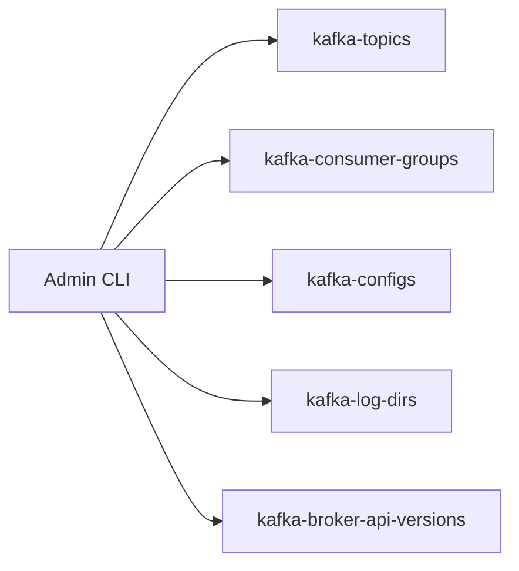

# Lab 02 – Kafka Administration Toolkit

**Lab Number:** 02  
**Day:** 3  
**Duration:** 40 minutes  
**Difficulty:** Beginner  
**Environment:** Windows 10 / Windows 11  
**Mode:** Individual

---

## Description

This lab covers Kafka administration tools and configuration inspection from the Day 3 syllabus.

You will list and describe topics, inspect consumer groups, read topic configs, inspect log directories, and check broker API versions. This is the repeatable diagnostic process QuickCart support will use.

---

## Prerequisites

- The three-broker cluster is running
- Day 2 `order-events` and/or Day 3 `avro-order-events` exist
- You can run scripts from `C:\kafka-labs\kafka`

---

## Business Use Case

QuickCart’s support team reports:

> “Orders are delayed. Is Kafka working?”

Developers need a short, repeatable checklist before they change code.

---

## Architecture

```text
Support laptop (CLI)
        |
        | bootstrap localhost:9092
        v
 +----------------------+
 | Broker 1 / 2 / 3     |
 |                      |
 | topics               |
 | consumer groups      |
 | configs              |
 | log dirs             |
 | API versions         |
 +----------------------+
```



---

## Detailed Steps

### Step 0 – Initial Setup

```powershell
cd C:\kafka-labs\kafka

.\bin\windows\kafka-topics.bat `
  --list `
  --bootstrap-server localhost:9092
```

If this fails, start ZooKeeper and the three brokers before continuing.

Write the topics you see:

```text
________________________________________________
```

---

### Step 1 – List topics

```powershell
.\bin\windows\kafka-topics.bat `
  --bootstrap-server localhost:9092 `
  --list
```

Confirm `order-events` and `avro-order-events` if you created them.

---

### Step 2 – Describe an important topic

```powershell
.\bin\windows\kafka-topics.bat `
  --bootstrap-server localhost:9092 `
  --describe `
  --topic order-events
```

If `order-events` is missing, describe `avro-order-events` instead.

Check:

```text
Partitions
Replication factor
Leader
Replicas
ISR
```

Complete:

| Partition | Leader | Replicas | ISR |
| ---: | ---: | --- | --- |
| 0 | | | |
| 1 | | | |
| 2 | | | |
| 3 | | | |

If the topic has only three partitions, leave row 3 blank.

---

### Step 3 – Inspect consumer groups

```powershell
.\bin\windows\kafka-consumer-groups.bat `
  --bootstrap-server localhost:9092 `
  --list
```

Then:

```powershell
.\bin\windows\kafka-consumer-groups.bat `
  --bootstrap-server localhost:9092 `
  --describe `
  --group inventory-service
```

If that group is empty, describe `avro-inventory-service` or another group from `--list`.

Identify:

```text
CURRENT-OFFSET
LOG-END-OFFSET
LAG
CONSUMER-ID
```

Complete for one group:

| Partition | CURRENT-OFFSET | LOG-END-OFFSET | LAG | CONSUMER-ID present? |
| ---: | ---: | ---: | ---: | --- |
| 0 | | | | |
| 1 | | | | |
| 2 | | | | |

---

### Step 4 – Inspect topic configuration

```powershell
.\bin\windows\kafka-configs.bat `
  --bootstrap-server localhost:9092 `
  --entity-type topics `
  --entity-name order-events `
  --describe
```

If there are no dynamic configs, that is still a successful command. Broker defaults still apply.

Optional: describe `customer-preferences` if Day 2 Lab 07 created it, and look for `cleanup.policy=compact`.

---

### Step 5 – Inspect log directories

```powershell
.\bin\windows\kafka-log-dirs.bat `
  --bootstrap-server localhost:9092 `
  --describe
```

Ask:

> On which brokers are the topic’s partition replicas physically stored?

Complete:

| Topic | Brokers / dirs you recognized |
| --- | --- |
| `order-events` or `avro-order-events` | |

---

### Step 6 – Inspect broker API connectivity

```powershell
.\bin\windows\kafka-broker-api-versions.bat `
  --bootstrap-server localhost:9092
```

This is useful when troubleshooting basic connectivity or client/broker compatibility.

**Checkpoint**

The command prints API version information and does not time out.

---

### Step 7 – Optional: Kafka Manager / CMAK

The syllabus includes Kafka Manager usage. If the trainer has CMAK or Control Center running, open it and find:

- broker list
- topic `order-events`
- consumer group lag

If no UI is installed, skip this step. The CLI is the required skill.

---

## Conclusion

You now have a support checklist: list, describe, groups, configs, log dirs, API versions.

Lab 03 will **break** the environment on purpose. Use this toolkit to diagnose it.

**You are ready for Lab 03 when:**

- You described a business topic
- You described at least one consumer group
- `kafka-broker-api-versions` succeeded

Next lab: [03-troubleshooting.md](03-troubleshooting.md)

---

## Knowledge Check

1. Which command shows ISR?
2. Which command shows lag?
3. Why inspect log dirs?
4. Why check API versions?

**Expected answers**

1. `kafka-topics --describe`
2. `kafka-consumer-groups --describe`
3. To see which broker disks hold which replicas.
4. To confirm the client can talk to the broker and which APIs exist.

---

## Common Issues

| Symptom | Likely cause | What to do |
| --- | --- | --- |
| Group describe is empty | Wrong name or never used | `--list` first |
| Topic not found | Day 2 topic was never created | Describe `avro-order-events` or create `order-events` |
| API versions hangs | Broker down | Start the cluster |
