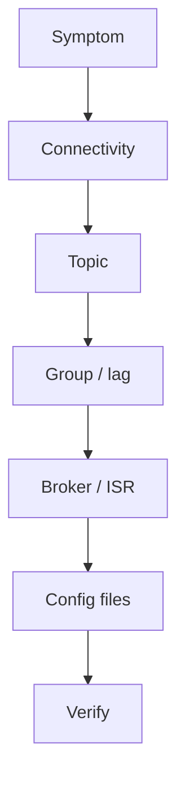

# Lab 03 – Troubleshoot Real Kafka Problems

**Lab Number:** 03  
**Day:** 3  
**Duration:** 40 minutes  
**Difficulty:** Intermediate  
**Environment:** Windows 10 / Windows 11  
**Mode:** Individual

---

## Description

This lab covers frequent problems, solutions, and configuration-file troubleshooting from the Day 3 syllabus.

You will deliberately break the environment: wrong bootstrap server, wrong topic name, a stuck consumer, a stopped broker, and a configuration-file review. After each break you follow a written procedure and restore the system.

---

## Prerequisites

- Lab 02 is complete
- `AvroOrderProducer` from Lab 01 compiles, or Day 2 `OrderProducer` is available
- `order-events` or `avro-order-events` exists with RF 3
- Three brokers are running
- You have the Lab 02 admin commands

---

## Business Use Case

Production incidents rarely start with a clear error message. QuickCart developers must practice a **procedure**, not guess.

Each scenario is a common ticket. You cause it, diagnose it, and fix it.

---

## Architecture

```text
1. Observe symptom
       ↓
2. Check connectivity
       ↓
3. Check topic
       ↓
4. Check consumer group
       ↓
5. Check lag
       ↓
6. Check broker / ISR
       ↓
7. Check configuration
       ↓
8. Correct
       ↓
9. Verify
```



---

## Detailed Steps

### Step 0 – Initial Setup

Confirm a healthy baseline:

```powershell
cd C:\kafka-labs\kafka

.\bin\windows\kafka-topics.bat `
  --list `
  --bootstrap-server localhost:9092
```

```powershell
.\bin\windows\kafka-broker-api-versions.bat `
  --bootstrap-server localhost:9092
```

Decide which producer you will break and restore:

- `AvroOrderProducer` (topic `avro-order-events`), or
- Day 2 `OrderProducer` (topic `order-events`)

Write your choice:

```text
Producer class: ________
Topic: ________
```

Keep a copy of the correct bootstrap string:

```text
localhost:9092,localhost:9093,localhost:9094
```

---

### Step 1 – Scenario 1: Wrong bootstrap server

Change the Java bootstrap configuration to:

```java
localhost:9999
```

Run the producer.

**Observe** the connection failure. Write the exception type or message:

```text
________________________________________________
```

Troubleshooting procedure:

1. Read the exception.
2. Identify the broker endpoint in the error.
3. Check the broker process (Terminal 2–4).
4. Verify the port with `netstat`.
5. Check `bootstrap.servers` in code.
6. Correct the configuration.
7. Retest.

Correct value:

```text
localhost:9092,localhost:9093,localhost:9094
```

**Checkpoint**

The producer publishes again after you restore the string.

---

### Step 2 – Scenario 2: Wrong topic

Change the topic to:

```text
order-event
```

instead of:

```text
order-events
```

(or `avro-order-event` instead of `avro-order-events`).

Run the producer.

Discuss how topic **auto-creation** settings affect what happens and why production systems often manage topics deliberately.

Verify:

```powershell
.\bin\windows\kafka-topics.bat `
  --list `
  --bootstrap-server localhost:9092
```

Complete:

| Question | Your answer |
| --- | --- |
| Did a new topic appear? | Yes / No |
| Why is that dangerous in production? | |

Restore the correct topic name. If a stray `order-event` topic was auto-created, delete it only with trainer approval:

```powershell
.\bin\windows\kafka-topics.bat `
  --delete `
  --topic order-event `
  --bootstrap-server localhost:9092
```

---

### Step 3 – Scenario 3: Consumer appears “stuck”

Add to message processing in `InventoryConsumer` or `AvroOrderConsumer`:

```java
Thread.sleep(5000);
```

Start that consumer. Produce about **100** events (loop in the producer).

Check:

```powershell
.\bin\windows\kafka-consumer-groups.bat `
  --bootstrap-server localhost:9092 `
  --describe `
  --group inventory-service
```

Use the group id that matches your consumer.

Diagnose:

```text
Producer healthy
      +
Kafka healthy
      +
Lag increasing
      =
Consumer processing bottleneck
```

Record one partition:

| CURRENT-OFFSET | LOG-END-OFFSET | LAG |
| ---: | ---: | ---: |
| | | |

Remove the sleep and restart the consumer. Confirm lag falls.

---

### Step 4 – Scenario 4: Broker failure

Look at `--describe` for your topic and pick a broker that **leads at least one partition**. Stop that broker with `Ctrl+C` in its terminal.

Then describe through a **living** broker:

```powershell
.\bin\windows\kafka-topics.bat `
  --describe `
  --topic order-events `
  --bootstrap-server localhost:9093
```

Change the topic and port if needed.

Look at:

```text
Leader
Replicas
ISR
```

Complete:

| Partition | Leader after stop | ISR after stop |
| ---: | ---: | --- |
| 0 | | |
| 1 | | |
| 2 | | |

Restart the broker with the matching `server-N.properties`. Wait, then describe again.

Observe ISR recovery. This is the Day 1 failure drill used as an operations ticket.

---

### Step 5 – Scenario 5: Configuration file investigation

Open:

```text
C:\kafka-labs\kafka\config\server-1.properties
```

(`server.properties` is the Day 1 single-broker file. Prefer the file the running broker actually uses.)

Locate and discuss the settings present for:

```text
broker identity
listeners
log directories
partition defaults
ZooKeeper connection (for this course's ZooKeeper-based environment)
```

Complete:

| Setting | Value in your file |
| --- | --- |
| `broker.id` | |
| `listeners` | |
| `log.dirs` | |
| `zookeeper.connect` | |

The goal is not memorization.

Students learn:

> When Kafka behaves unexpectedly, know which configuration layer to investigate.

Layers to name:

```text
Client code  →  topic config  →  broker properties  →  OS / ports
```

---

## Conclusion

You practiced five real tickets and a restore path for each.

Wrong endpoint, wrong name, slow processing, broker loss, and config files are different layers. Lab 04 measures performance instead of breaking things.

**You are ready for Lab 04 when:**

- Bootstrap and topic names are restored
- Sleep is removed
- All three brokers are running
- You filled the lag and ISR tables

Next lab: [04-performance-tuning.md](04-performance-tuning.md)

---

## Knowledge Check

1. What is the first thing to check when a producer cannot connect?
2. Why can a typo topic “succeed”?
3. If Kafka is healthy and lag grows, where is the bottleneck?
4. Why describe through `9093` after Broker 1 stops?

**Expected answers**

1. `bootstrap.servers`, then whether the process is listening on that port.
2. Auto-create may create a new empty topic.
3. The consumer application.
4. `9092` is the dead broker.

---

## Common Issues

| Symptom | Likely cause | What to do |
| --- | --- | --- |
| Forgot to restore bootstrap | Left `9999` in code | Fix before Lab 04 |
| Two brokers down | Closed the wrong terminal | Start the missing `server-N.properties` |
| No lag with sleep | Produced too few records | Loop 100 sends |
