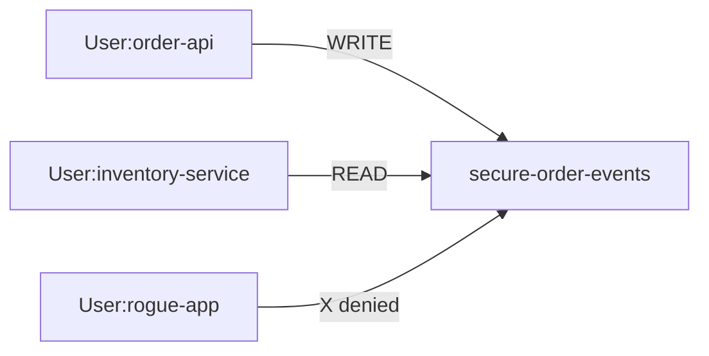

# Lab 05 – Kafka Authorization and ACL

**Lab Number:** 05  
**Day:** 3  
**Duration:** 60 minutes  
**Difficulty:** Intermediate  
**Environment:** Windows 10 / Windows 11  
**Mode:** Individual

---

## Description

This lab covers Kafka security overview, authorization, ACLs, and the ACL exercise from the Day 3 syllabus.

You will add a SASL/PLAIN listener on Broker 1 port **9095**, enable the ACL authorizer, create a dedicated topic `secure-order-events`, grant WRITE to `User:order-api` and READ to `User:inventory-service`, list ACLs, then prove that `User:rogue-app` is denied.

`order-events` stays without ACLs so Day 2 apps and later Connect labs still work on port 9092.

---

## Prerequisites

- Labs 01–04 are complete
- Three brokers are running on 9092 / 9093 / 9094
- You can edit `server-1.properties` and restart Broker 1
- You understand authentication versus authorization

---

## Business Use Case

Currently any connected application can access Kafka resources in this lab cluster.

Production requirement:

```text
Order API
    |
    +---- Produce ---> secure-order-events
    |
    X---- Consume

Inventory Service
    |
    +---- Consume ---> secure-order-events
```

Distinction:

```text
Authentication
"Who are you?"

Authorization
"What are you allowed to do?"
```

ACL is about authorization. SASL/PLAIN in this lab is how Kafka **knows the principal name**.

---

## Architecture

```text
Principal: User:order-api
ALLOW WRITE → topic secure-order-events

Principal: User:inventory-service
ALLOW READ  → topic secure-order-events
ALLOW READ  → group secure-inventory

Principal: User:rogue-app
no ACL → DENIED

PLAINTEXT :9092  (anonymous / open topics)
SASL_PLAINTEXT :9095  (named users + ACLs)
```



---

## Detailed Steps

### Step 0 – Initial Setup

Create the security folder:

```powershell
New-Item -ItemType Directory -Force -Path C:\kafka-labs\security
```

Copy Broker 1 config so you can restore it:

```powershell
Copy-Item C:\kafka-labs\kafka\config\server-1.properties `
  C:\kafka-labs\security\server-1.properties.bak
```

Stop Java clients that use only Broker 1 if you are about to restart it. Brokers 2 and 3 can stay up.

---

### Step 1 – Security model

Target:

```text
Principal: User:order-api
ALLOW: WRITE → secure-order-events

Principal: User:inventory-service
ALLOW: READ → secure-order-events
ALLOW: READ → Group secure-inventory
```

---

### Step 2 – Enable authorization on Broker 1

The exact broker properties depend on Kafka version. For this course’s Apache Kafka 3.8/3.9 package, add the following to **`server-1.properties`**. Do not remove the existing `listeners` line; replace it with the two-listener version.

```properties
listeners=PLAINTEXT://localhost:9092,SASL_PLAINTEXT://localhost:9095
advertised.listeners=PLAINTEXT://localhost:9092,SASL_PLAINTEXT://localhost:9095
listener.security.protocol.map=PLAINTEXT:PLAINTEXT,SASL_PLAINTEXT:SASL_PLAINTEXT
inter.broker.listener.name=PLAINTEXT

sasl.enabled.mechanisms=PLAIN
sasl.mechanism.inter.broker.protocol=PLAIN
listener.name.sasl_plaintext.sasl.enabled.mechanisms=PLAIN
listener.name.sasl_plaintext.plain.sasl.jaas.config=org.apache.kafka.common.security.plain.PlainLoginModule required username="admin" password="admin-secret" user_admin="admin-secret" user_order-api="order-secret" user_inventory-service="inv-secret" user_rogue-app="rogue-secret";

authorizer.class.name=kafka.security.authorizer.AclAuthorizer
allow.everyone.if.no.acl.found=true
super.users=User:admin
```

If a property already exists, keep **one** copy of each name.

Trainer note: this requires a careful rollout in a real cluster. You are changing only Broker 1’s extra listener. `allow.everyone.if.no.acl.found=true` means topics **without** ACLs stay usable on PLAINTEXT.

Restart Broker 1:

```powershell
cd C:\kafka-labs\kafka
.\bin\windows\kafka-server-start.bat .\config\server-1.properties
```

**Checkpoint**

```powershell
netstat -ano | findstr ":9095"
netstat -ano | findstr ":9092"
```

Both should listen.

---

### Step 3 – Create the secured topic

```powershell
cd C:\kafka-labs\kafka

.\bin\windows\kafka-topics.bat `
  --create `
  --topic secure-order-events `
  --bootstrap-server localhost:9092 `
  --partitions 3 `
  --replication-factor 3
```

---

### Step 4 – Create the producer ACL

Using the Kafka ACL utility, grant the producer principal permission to write.

Admin commands use the SASL listener as `User:admin` (super user). Create `C:\kafka-labs\security\admin.properties`:

```properties
security.protocol=SASL_PLAINTEXT
sasl.mechanism=PLAIN
sasl.jaas.config=org.apache.kafka.common.security.plain.PlainLoginModule required username="admin" password="admin-secret";
```

Create producer ACL:

```powershell
cd C:\kafka-labs\kafka

.\bin\windows\kafka-acls.bat `
  --bootstrap-server localhost:9095 `
  --command-config C:\kafka-labs\security\admin.properties `
  --add `
  --allow-principal User:order-api `
  --operation Write `
  --operation Describe `
  --topic secure-order-events
```

Conceptually:

```text
User:order-api
Topic: secure-order-events
Operation: WRITE
```

Also allow the producer to create transactional/idempotent metadata if your client needs it. For this lab, Write + Describe is enough.

---

### Step 5 – Consumer ACL

Grant:

```text
User:inventory-service
```

permission for:

```text
READ topic secure-order-events
READ group secure-inventory
```

```powershell
.\bin\windows\kafka-acls.bat `
  --bootstrap-server localhost:9095 `
  --command-config C:\kafka-labs\security\admin.properties `
  --add `
  --allow-principal User:inventory-service `
  --operation Read `
  --operation Describe `
  --topic secure-order-events
```

```powershell
.\bin\windows\kafka-acls.bat `
  --bootstrap-server localhost:9095 `
  --command-config C:\kafka-labs\security\admin.properties `
  --add `
  --allow-principal User:inventory-service `
  --operation Read `
  --operation Describe `
  --group secure-inventory
```

---

### Step 6 – List ACLs

```powershell
.\bin\windows\kafka-acls.bat `
  --bootstrap-server localhost:9095 `
  --command-config C:\kafka-labs\security\admin.properties `
  --list
```

Students should identify:

```text
Principal
Resource
Operation
Permission
```

Complete:

| Principal | Resource | Operation | Permission |
| --- | --- | --- | --- |
| User:order-api | | | |
| User:inventory-service | topic | | |
| User:inventory-service | group | | |

---

### Step 7 – Authorized produce test

Create `C:\kafka-labs\security\order-api.properties`:

```properties
security.protocol=SASL_PLAINTEXT
sasl.mechanism=PLAIN
sasl.jaas.config=org.apache.kafka.common.security.plain.PlainLoginModule required username="order-api" password="order-secret";
```

```powershell
cd C:\kafka-labs\kafka

.\bin\windows\kafka-console-producer.bat `
  --bootstrap-server localhost:9095 `
  --producer.config C:\kafka-labs\security\order-api.properties `
  --topic secure-order-events
```

Enter:

```text
ACL-OK-ORDER-1
```

This should succeed. Press `Ctrl+C`.

---

### Step 8 – Negative security test

Create `C:\kafka-labs\security\rogue-app.properties`:

```properties
security.protocol=SASL_PLAINTEXT
sasl.mechanism=PLAIN
sasl.jaas.config=org.apache.kafka.common.security.plain.PlainLoginModule required username="rogue-app" password="rogue-secret";
```

Try to produce:

```powershell
.\bin\windows\kafka-console-producer.bat `
  --bootstrap-server localhost:9095 `
  --producer.config C:\kafka-labs\security\rogue-app.properties `
  --topic secure-order-events
```

Type a line and press Enter.

Expected behavior:

```text
Application
    |
    v
Kafka
    |
    X
Authorization failure
```

Write the error fragment you saw:

```text
________________________________________________
```

This is an important security exercise:

> Don’t only prove that authorized access works. Prove that unauthorized access fails.

---

### Step 9 – Authorized consume test

Create `C:\kafka-labs\security\inventory.properties`:

```properties
security.protocol=SASL_PLAINTEXT
sasl.mechanism=PLAIN
sasl.jaas.config=org.apache.kafka.common.security.plain.PlainLoginModule required username="inventory-service" password="inv-secret";
```

```powershell
.\bin\windows\kafka-console-consumer.bat `
  --bootstrap-server localhost:9095 `
  --consumer.config C:\kafka-labs\security\inventory.properties `
  --topic secure-order-events `
  --group secure-inventory `
  --from-beginning
```

You should see `ACL-OK-ORDER-1`.

---

### Step 10 – Keep later labs working

Do **not** set `allow.everyone.if.no.acl.found=false` unless the trainer walks the whole cluster through super users.

Do **not** add ACLs on `order-events`, `legacy-orders`, or `__consumer_offsets` unless you also grant `User:ANONYMOUS`.

Leave the SASL listener running. Labs 07–08 still use `localhost:9092`.

---

## Conclusion

Authentication answers who the client is. ACLs answer what that principal may do.

`User:order-api` can write `secure-order-events`. `User:inventory-service` can read it. `User:rogue-app` cannot. Open topics on 9092 still work for Connect.

**You are ready for Lab 06 when:**

- Port 9095 is listening
- ACL list shows the two principals
- Rogue produce failed
- Authorized produce and consume succeeded

Next lab: [06-ssl-encryption.md](06-ssl-encryption.md)

---

## Knowledge Check

1. What is a principal?
2. Why is SASL needed in this lab if ACL is authorization?
3. Why did we use `secure-order-events` instead of `order-events`?
4. What does `allow.everyone.if.no.acl.found=true` do?

**Expected answers**

1. The identity Kafka authorizes, such as `User:order-api`.
2. Without authentication every client is anonymous, so named ACLs cannot be tested.
3. So ACLs on that topic do not lock Day 2 and Connect traffic.
4. Resources with no ACL remain open.

---

## Common Issues

| Symptom | Likely cause | What to do |
| --- | --- | --- |
| Broker 1 will not start | Duplicate `listeners` or bad JAAS line | Compare with the backup file |
| ACL command fails on 9095 | Broker not restarted or admin.properties wrong | Check `netstat :9095` and username `admin` |
| Rogue produce succeeds | No ACL actually stored, or wrong topic | `--list` and produce to `secure-order-events` |
| Day 2 producer denied | You ACLed `order-events` | Remove those ACLs or allow ANONYMOUS |
