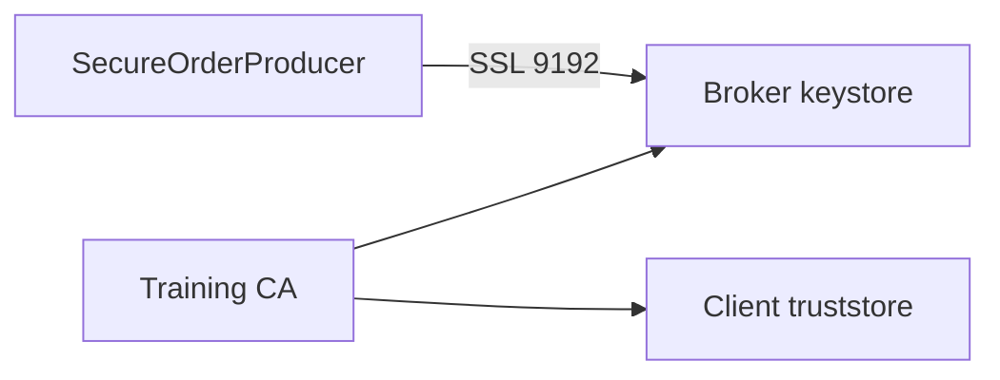

# Lab 06 – SSL/TLS Encryption

**Lab Number:** 06  
**Day:** 3  
**Duration:** 60 minutes  
**Difficulty:** Intermediate  
**Environment:** Windows 10 / Windows 11  
**Mode:** Individual

---

## Description

The syllabus requires wire encryption using SSL and an SSL exercise.

You will create a training CA, generate and sign a broker certificate, add **SSL listeners on ports 9192 / 9193 / 9194**, keep PLAINTEXT 9092–9094 running, configure a Java producer for `security.protocol=SSL`, and consume `SECURE-ORDER-1001` over TLS.

Do **not** put SSL on 9093. That port is already Broker 2 PLAINTEXT.

---

## Prerequisites

- Lab 05 is complete or Broker 1 still has a working 9092 listener
- JDK `keytool` is on the `PATH`
- You can restart all three brokers
- `C:\kafka-labs\security` exists

---

## Business Use Case

Currently:

```text
Producer ---- PLAINTEXT ----> Kafka
```

Target:

```text
Producer ===== TLS =====> Kafka
```

ACL (Lab 05) answers **who may act**. TLS answers **who can read the bytes on the wire**.

---

## Architecture

```text
                 Certificate Authority
                         |
                    Trust Chain
                         |
            +------------+------------+
            |                         |
            v                         v
      Java Producer               Kafka Broker
            \                         /
             \======= TLS ===========/

PLAINTEXT  9092 9093 9094
SSL        9192 9193 9194
```



---

## Detailed Steps

### Step 0 – Initial Setup

```powershell
New-Item -ItemType Directory -Force -Path C:\kafka-labs\security
Set-Location C:\kafka-labs\security
```

Use one lab password everywhere so commands stay copy-pasteable:

```text
kafka-secret
```

A production course would use distinct secrets and a real CA.

---

### Step 1 – Create the certificate workspace

You are already in `C:\kafka-labs\security`. Confirm:

```powershell
Get-Location
```

---

### Step 2 – Generate the broker keystore

```powershell
keytool -genkeypair `
  -alias kafka-broker `
  -keyalg RSA `
  -keysize 2048 `
  -keystore kafka.server.keystore.jks `
  -validity 365 `
  -storepass kafka-secret `
  -keypass kafka-secret `
  -dname "CN=localhost,OU=QuickCart,O=QuickCart,L=Lab,ST=Lab,C=IN" `
  -ext "SAN=DNS:localhost,IP:127.0.0.1"
```

Provide:

```text
CN=localhost
```

for the local training environment.

---

### Step 3 – Create a training CA

```powershell
keytool -genkeypair `
  -alias quickcart-ca `
  -keyalg RSA `
  -keysize 2048 `
  -keystore ca.jks `
  -validity 365 `
  -storepass kafka-secret `
  -keypass kafka-secret `
  -dname "CN=QuickCart-Training-CA,OU=QuickCart,O=QuickCart,L=Lab,ST=Lab,C=IN" `
  -ext "bc=ca:true"
```

Export the CA certificate:

```powershell
keytool -exportcert `
  -alias quickcart-ca `
  -keystore ca.jks `
  -storepass kafka-secret `
  -rfc `
  -file ca-cert.pem
```

Explain:

```text
Certificate Authority
        |
        +---- signs Broker certificate
        |
        +---- trusted by Client
```

---

### Step 4 – Generate the certificate request

```powershell
keytool -certreq `
  -alias kafka-broker `
  -keystore kafka.server.keystore.jks `
  -storepass kafka-secret `
  -file kafka-broker.csr
```

---

### Step 5 – Sign and import the certificate

Sign with the lab CA (`keytool -gencert` is available on JDK 8+):

```powershell
keytool -gencert `
  -infile kafka-broker.csr `
  -outfile kafka-broker.crt `
  -keystore ca.jks `
  -storepass kafka-secret `
  -alias quickcart-ca `
  -validity 365 `
  -ext "SAN=DNS:localhost,IP:127.0.0.1"
```

Import the CA, then the signed broker certificate, into the broker keystore:

```powershell
keytool -importcert `
  -alias quickcart-ca `
  -file ca-cert.pem `
  -keystore kafka.server.keystore.jks `
  -storepass kafka-secret `
  -noprompt

keytool -importcert `
  -alias kafka-broker `
  -file kafka-broker.crt `
  -keystore kafka.server.keystore.jks `
  -storepass kafka-secret `
  -noprompt
```

Create the client truststore that trusts the CA:

```powershell
keytool -importcert `
  -alias quickcart-ca `
  -file ca-cert.pem `
  -keystore kafka.client.truststore.jks `
  -storepass kafka-secret `
  -noprompt
```

Also create a server truststore (same CA) so brokers can be configured consistently:

```powershell
Copy-Item kafka.client.truststore.jks kafka.server.truststore.jks
```

**Checkpoint**

`C:\kafka-labs\security` contains `kafka.server.keystore.jks` and `kafka.client.truststore.jks`.

---

### Step 6 – Configure Kafka SSL listeners

Add these lines to **each** of `server-1.properties`, `server-2.properties`, and `server-3.properties`. Use the SSL port that matches the broker.

**Broker 1** — add SSL on 9192. Keep existing PLAINTEXT 9092 (and SASL 9095 if Lab 05 added it).

Example Broker 1 `listeners` / `advertised.listeners` if Lab 05 is present:

```properties
listeners=PLAINTEXT://localhost:9092,SASL_PLAINTEXT://localhost:9095,SSL://localhost:9192
advertised.listeners=PLAINTEXT://localhost:9092,SASL_PLAINTEXT://localhost:9095,SSL://localhost:9192
listener.security.protocol.map=PLAINTEXT:PLAINTEXT,SASL_PLAINTEXT:SASL_PLAINTEXT,SSL:SSL
```

If Lab 05 was skipped, omit the SASL listener.

**Broker 2:**

```properties
listeners=PLAINTEXT://localhost:9093,SSL://localhost:9193
advertised.listeners=PLAINTEXT://localhost:9093,SSL://localhost:9193
listener.security.protocol.map=PLAINTEXT:PLAINTEXT,SSL:SSL
```

**Broker 3:**

```properties
listeners=PLAINTEXT://localhost:9094,SSL://localhost:9194
advertised.listeners=PLAINTEXT://localhost:9094,SSL://localhost:9194
listener.security.protocol.map=PLAINTEXT:PLAINTEXT,SSL:SSL
```

Add the same SSL file settings to **all three** brokers:

```properties
ssl.keystore.location=C:/kafka-labs/security/kafka.server.keystore.jks
ssl.keystore.password=kafka-secret
ssl.key.password=kafka-secret
ssl.truststore.location=C:/kafka-labs/security/kafka.server.truststore.jks
ssl.truststore.password=kafka-secret
ssl.client.auth=none
```

Keep `inter.broker.listener.name=PLAINTEXT` so brokers still talk to each other without TLS in this lab.

Restart Kafka: stop brokers 1–3, then start them again with their property files. Start ZooKeeper first if it was stopped.

**Checkpoint**

```powershell
netstat -ano | findstr ":9192"
netstat -ano | findstr ":9193"
netstat -ano | findstr ":9194"
```

---

### Step 7 – Configure the Java producer

Create `C:\kafka-labs\security\ssl-client.properties` for CLI tests:

```properties
security.protocol=SSL
ssl.truststore.location=C:/kafka-labs/security/kafka.client.truststore.jks
ssl.truststore.password=kafka-secret
```

Create `src\main\java\com\quickcart\kafka\producer\SecureOrderProducer.java`:

```java
package com.quickcart.kafka.producer;

import org.apache.kafka.clients.producer.KafkaProducer;
import org.apache.kafka.clients.producer.ProducerConfig;
import org.apache.kafka.clients.producer.ProducerRecord;
import org.apache.kafka.common.serialization.StringSerializer;

import java.util.Properties;

public class SecureOrderProducer {

    public static void main(String[] args) throws Exception {
        Properties props = new Properties();
        props.put(ProducerConfig.BOOTSTRAP_SERVERS_CONFIG,
                "localhost:9192,localhost:9193,localhost:9194");
        props.put(ProducerConfig.KEY_SERIALIZER_CLASS_CONFIG,
                StringSerializer.class.getName());
        props.put(ProducerConfig.VALUE_SERIALIZER_CLASS_CONFIG,
                StringSerializer.class.getName());
        props.put("security.protocol", "SSL");
        props.put("ssl.truststore.location",
                "C:/kafka-labs/security/kafka.client.truststore.jks");
        props.put("ssl.truststore.password", "kafka-secret");

        try (KafkaProducer<String, String> producer =
                     new KafkaProducer<>(props)) {
            var metadata = producer.send(new ProducerRecord<>(
                    "order-events",
                    "SECURE-ORDER-1001",
                    "SECURE-ORDER-1001,C901,Laptop,1,99000"
            )).get();
            System.out.println("Published SECURE-ORDER-1001");
            System.out.println("Partition = " + metadata.partition());
            System.out.println("Offset = " + metadata.offset());
        }
    }
}
```

Run:

```text
SecureOrderProducer
```

---

### Step 8 – Verify over the secured connection

```powershell
cd C:\kafka-labs\kafka

.\bin\windows\kafka-console-consumer.bat `
  --bootstrap-server localhost:9192 `
  --consumer.config C:\kafka-labs\security\ssl-client.properties `
  --topic order-events `
  --from-beginning
```

Find:

```text
SECURE-ORDER-1001
```

A PLAINTEXT consumer on `localhost:9092` can also see the same record. TLS protects the **path**, not a separate copy of the data.

---

## Conclusion

Clients can now reach QuickCart Kafka on an SSL listener. The CA signs the broker cert. The client truststore trusts that CA.

ACL and TLS solve different problems. You will combine them in the capstone.

**You are ready for Lab 07 when:**

- Ports 9192–9194 listen
- `SecureOrderProducer` succeeded
- You consumed `SECURE-ORDER-1001` with the SSL consumer config

Next lab: [07-kafka-connect-file.md](07-kafka-connect-file.md)

---

## Knowledge Check

1. What does TLS encrypt?
2. Why does the client need a truststore?
3. Why keep PLAINTEXT listeners?
4. ACL vs TLS in one line each?

**Expected answers**

1. Bytes on the network between client and broker.
2. So the client accepts the broker certificate signed by the training CA.
3. Connect labs and inter-broker traffic still use 9092–9094.
4. ACL = authorization. TLS = wire encryption.

---

## Common Issues

| Symptom | Likely cause | What to do |
| --- | --- | --- |
| `PKIX path building failed` | Wrong truststore or CA not imported | Recreate client truststore from `ca-cert.pem` |
| Hostname verification failed | CN/SAN is not `localhost` | Recreate cert with `SAN=DNS:localhost` |
| Port bind error on 9093 | SSL accidentally used 9093 | Use 9193 |
| Broker loop / disconnect | `inter.broker` pointed at SSL without broker trust | Keep inter-broker PLAINTEXT |
