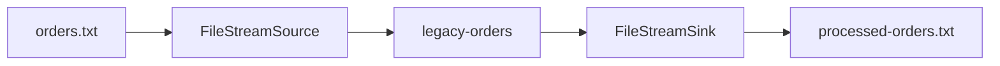

# Lab 07 – Kafka Connect Fundamentals and File Pipeline

**Lab Number:** 07  
**Day:** 3  
**Duration:** 60 minutes  
**Difficulty:** Intermediate  
**Environment:** Windows 10 / Windows 11  
**Mode:** Individual

---

## Description

The second half of Day 3 covers Kafka Connect overview, architecture, pipeline implementation, common use cases, and file connectors.

You will write an input file, create `legacy-orders`, run Connect in **standalone** mode with FileStream source and sink, verify records in Kafka, append a fourth order, and confirm `processed-orders.txt`.

Use PLAINTEXT `localhost:9092`. Do not point Connect at the SSL ports unless the trainer changed the worker security config.

---

## Prerequisites

- The three-broker cluster is running
- Port 9092 accepts PLAINTEXT
- `C:\kafka-labs\kafka\bin\windows\connect-standalone.bat` exists
- `connect-file` is on the Kafka `libs` classpath (it ships with Apache Kafka)

---

## Business Use Case

QuickCart has legacy applications that generate files.

We do **not** want developers writing custom Java producers for every file integration.

Target:

```text
orders.txt
    |
    v
File Source Connector
    |
    v
Kafka  (legacy-orders)
    |
    v
File Sink Connector
    |
    v
processed-orders.txt
```

---

## Architecture

```text
                 Kafka Connect

      +-----------------------------+
      |                             |
Source System                Sink System
      |                             ^
      v                             |
Source Connector          Sink Connector
      |                             ^
      v                             |
            Apache Kafka
```

Terminology:

```text
Connector
Task
Worker
Source Connector
Sink Connector
Standalone Mode
Distributed Mode
```



---

## Detailed Steps

### Step 0 – Initial Setup

```powershell
New-Item -ItemType Directory -Force -Path C:\kafka-labs\connect
New-Item -ItemType Directory -Force -Path C:\kafka-labs\data

cd C:\kafka-labs\kafka
.\bin\windows\kafka-topics.bat `
  --list `
  --bootstrap-server localhost:9092
```

Confirm `connect-standalone.bat`:

```powershell
Test-Path C:\kafka-labs\kafka\bin\windows\connect-standalone.bat
```

---

### Step 1 – Understand Connect architecture

A **worker** is the Connect process. A **connector** is a configured job. A **task** is the unit of parallelism inside that job.

- **Source** = external system → Kafka  
- **Sink** = Kafka → external system  
- **Standalone** = one worker, file-backed offsets (this lab)  
- **Distributed** = many workers, Kafka-backed offsets (production)

---

### Step 2 – Create the input file

Create `C:\kafka-labs\data\orders.txt`:

```text
ORD7001,C701,Laptop,85000
ORD7002,C702,Mobile,35000
ORD7003,C703,Monitor,20000
```

Use UTF-8 and a trailing newline after the last line.

---

### Step 3 – Create the topic

```powershell
cd C:\kafka-labs\kafka

.\bin\windows\kafka-topics.bat `
  --create `
  --topic legacy-orders `
  --bootstrap-server localhost:9092 `
  --partitions 3 `
  --replication-factor 3
```

---

### Step 4 – Configure the File Source connector

Create `C:\kafka-labs\connect\file-source.properties`:

```properties
name=quickcart-file-source
connector.class=org.apache.kafka.connect.file.FileStreamSourceConnector
tasks.max=1
file=C:/kafka-labs/data/orders.txt
topic=legacy-orders
```

`FileStreamSource` is the short name some docs use. The class name above is the one Apache Kafka standalone expects.

---

### Step 5 – Configure the File Sink connector

Create `C:\kafka-labs\connect\file-sink.properties`:

```properties
name=quickcart-file-sink
connector.class=org.apache.kafka.connect.file.FileStreamSinkConnector
tasks.max=1
file=C:/kafka-labs/data/processed-orders.txt
topics=legacy-orders
```

---

### Step 6 – Configure the standalone worker

Copy the sample worker file and edit it:

```powershell
Copy-Item C:\kafka-labs\kafka\config\connect-standalone.properties `
  C:\kafka-labs\connect\connect-standalone.properties
```

Set at least these keys (keep other defaults unless they conflict):

```properties
bootstrap.servers=localhost:9092
key.converter=org.apache.kafka.connect.storage.StringConverter
value.converter=org.apache.kafka.connect.storage.StringConverter
key.converter.schemas.enable=false
value.converter.schemas.enable=false
offset.storage.file.filename=C:/kafka-labs/connect/connect.offsets
plugin.path=C:/kafka-labs/kafka/libs
```

Do not use Avro/JSON Schema converters for this first file lab.

---

### Step 7 – Start Connect in standalone mode

```powershell
cd C:\kafka-labs\kafka

.\bin\windows\connect-standalone.bat `
  C:\kafka-labs\connect\connect-standalone.properties `
  C:\kafka-labs\connect\file-source.properties `
  C:\kafka-labs\connect\file-sink.properties
```

Leave this terminal running. Watch for `quickcart-file-source` and `quickcart-file-sink` started, and no stack traces.

---

### Step 8 – Verify Kafka records

```powershell
cd C:\kafka-labs\kafka

.\bin\windows\kafka-console-consumer.bat `
  --bootstrap-server localhost:9092 `
  --topic legacy-orders `
  --from-beginning
```

Expected:

```text
ORD7001,C701,Laptop,85000
ORD7002,C702,Mobile,35000
ORD7003,C703,Monitor,20000
```

Stop the consumer with `Ctrl+C`. Leave Connect running.

---

### Step 9 – Append the file

Edit `C:\kafka-labs\data\orders.txt` and add:

```text
ORD7004,C704,Keyboard,5000
```

Save. Observe the Connect source log and consume again. The new record should appear.

This demonstrates a source pipeline **without** writing a Java producer.

---

### Step 10 – Verify the sink file

```text
legacy-orders
       |
       v
File Sink Connector
       |
       v
processed-orders.txt
```

```powershell
Get-Content C:\kafka-labs\data\processed-orders.txt
```

You should see the four order lines (sink formatting can add extra blanks).

**Checkpoint**

| Check | Yes / No |
| --- | --- |
| Three original lines in Kafka | |
| `ORD7004` appeared after append | |
| Sink file exists | |

---

## Conclusion

Kafka Connect moved legacy file rows into a topic and out to another file. The worker, source connector, and sink connector are the pieces you will reuse for JDBC and search.

**You are ready for Lab 08 when:**

- `legacy-orders` contains the file lines
- `processed-orders.txt` exists
- You can name worker, connector, task, source, and sink

Next lab: [08-jdbc-pipeline.md](08-jdbc-pipeline.md)

---

## Knowledge Check

1. Source vs sink?
2. Why standalone for this lab?
3. Why not write a Java producer for every file?
4. Where does standalone store offsets?

**Expected answers**

1. Source = into Kafka. Sink = out of Kafka.
2. One Windows worker is enough to learn the pipeline.
3. Connect already provides a file connector framework.
4. `offset.storage.file.filename` on the worker.

---

## Common Issues

| Symptom | Likely cause | What to do |
| --- | --- | --- |
| `FileStreamSourceConnector` not found | Wrong class or missing `connect-file` jar | Check `C:\kafka-labs\kafka\libs\*connect-file*` |
| No records | Offset file already processed an empty run | Delete `connect.offsets` and restart, or append a new line |
| Converter errors | JsonConverter + schemas | Use `StringConverter` as in Step 6 |
| Connect cannot reach brokers | Pointed at SSL 9192 without SSL worker config | Use `localhost:9092` |
