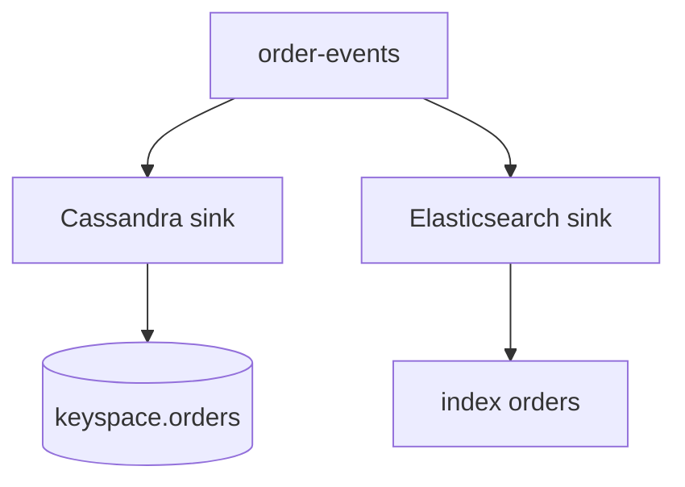

# Lab 09 – Cassandra and Elasticsearch Connector Patterns

**Lab Number:** 09  
**Day:** 3  
**Duration:** 30 minutes  
**Difficulty:** Intermediate  
**Environment:** Windows 10 / Windows 11  
**Mode:** Individual, with trainer-hosted targets

---

## Description

The syllabus lists Cassandra connectors and an Elasticsearch connector exercise.

Installing Cassandra, Elasticsearch, Kafka, and Connect plugins on every Windows laptop can consume the session. This lab is an **instructor-prepared practical** plus student-written connector configurations.

You will identify topics, connectors, and target mappings, write sink properties for both systems, produce `ORD9001`–`ORD9003` if the trainer environment is up, and verify documents when that environment is available.

---

## Prerequisites

- Labs 07–08 concepts are complete (worker, source, sink, plugin.path)
- `order-events` or `avro-order-events` exists
- Trainer may provide:
  - Cassandra contact points and a keyspace
  - Elasticsearch URL and an index
  - Preinstalled sink plugins on a shared Connect worker

If those services are not available, the **deliverable is the config files and the mapping table**.

---

## Business Use Case

QuickCart wants:

- durable activity / order history in Cassandra
- searchable orders in Elasticsearch for support dashboards

Java consumers could do this. Connect sinks keep that integration out of the Inventory service.

---

## Architecture

### Scenario A – Cassandra

```text
Kafka
  |
  v
Cassandra Sink Connector
  |
  v
Cassandra
```

Use cases:

```text
Customer activity
Order history
IoT/event data
```

### Scenario B – Elasticsearch

```text
Order Application
      |
      v
Kafka
      |
      v
Elasticsearch Sink Connector
      |
      v
Elasticsearch
      |
      v
Search / Dashboard
```



---

## Detailed Steps

### Step 0 – Initial Setup

```powershell
New-Item -ItemType Directory -Force -Path C:\kafka-labs\connect
```

Write the endpoints the trainer gives you:

| System | Endpoint / contact point | Credentials? |
| --- | --- | --- |
| Cassandra | | |
| Elasticsearch | | |
| Connect REST (optional) | | |

If both are “not provided,” continue and submit configs only.

---

### Step 1 – Cassandra mapping

Students identify:

```text
Kafka topic
Connector
Target keyspace/table
Mapping
```

Complete:

| Item | Your value |
| --- | --- |
| Kafka topic | `order-events` |
| Connector class (from trainer) | |
| Keyspace | `quickcart` |
| Table | `order_history` |
| Key fields | `orderId` / `customerId` |

Create `C:\kafka-labs\connect\cassandra-sink.properties`. Adjust class and port to the plugin the trainer installed (DataStax or community Cassandra sink names differ).

```properties
name=quickcart-cassandra-sink
connector.class=com.datastax.kafkaconnector.DseSinkConnector
tasks.max=1
topics=order-events

contactPoints=<trainer-cassandra-host>
port=9042
loadBalancing.localDc=<trainer-dc>
username=<trainer-user>
password=<trainer-password>

topic.order-events.quickcart.order_history.mapping=order_id=value.orderId, customer_id=value.customerId, amount=value.amount, status=value.status
```

If the trainer uses a different connector, copy their `connector.class` and mapping syntax into this file. The skill is **topic → table mapping**, not memorizing one vendor’s keys.

---

### Step 2 – Elasticsearch mapping

Students configure conceptually:

```text
Topic:
order-events

Sink:
Elasticsearch

Index:
orders
```

Create `C:\kafka-labs\connect\elasticsearch-sink.properties`:

```properties
name=quickcart-es-sink
connector.class=io.confluent.connect.elasticsearch.ElasticsearchSinkConnector
tasks.max=1
topics=order-events

connection.url=http://<trainer-es-host>:9200
type.name=_doc
key.ignore=false
schema.ignore=true

key.converter=org.apache.kafka.connect.storage.StringConverter
value.converter=org.apache.kafka.connect.json.JsonConverter
value.converter.schemas.enable=false
```

Index name is often the topic name (`order-events`) unless `topic.index.map` is set. The trainer may require:

```text
Index: orders
```

Add that map if they give you the exact property for their plugin version.

---

### Step 3 – Produce search/demo orders

If the shared pipeline is running, produce:

```text
ORD9001
ORD9002
ORD9003
```

```powershell
cd C:\kafka-labs\kafka

.\bin\windows\kafka-console-producer.bat `
  --bootstrap-server localhost:9092 `
  --topic order-events `
  --property parse.key=true `
  --property key.separator=:
```

Enter:

```text
ORD9001:{"orderId":"ORD9001","customerId":"C901","amount":12000,"status":"CREATED"}
ORD9002:{"orderId":"ORD9002","customerId":"C902","amount":44000,"status":"CREATED"}
ORD9003:{"orderId":"ORD9003","customerId":"C903","amount":99000,"status":"CREATED"}
```

If you still use JSON `OrderProducer` from Day 2, run that instead with those order ids.

---

### Step 4 – Verify in the trainer environment

Verify documents appear in the target search index when Elasticsearch is available.

Typical check (trainer or you, if curl works):

```text
GET /orders/_search
or
GET /order-events/_search
```

For Cassandra, `SELECT` from `quickcart.order_history` in `cqlsh`.

Complete:

| Check | Result |
| --- | --- |
| Cassandra config written | Yes / No |
| ES config written | Yes / No |
| ORD9001 visible in ES | Yes / No / N/A |
| ORD9001 visible in Cassandra | Yes / No / N/A |

---

## Conclusion

Sink connectors invert the JDBC/file source idea: Kafka is the system of record for the stream, and Cassandra or Elasticsearch is a projected store.

You now have named mappings for both. Lab 10 combines Avro, security, Connect, and troubleshooting.

**You are ready for Lab 10 when:**

- Both property files exist under `C:\kafka-labs\connect`
- You can explain source vs sink using Cassandra/ES as sinks
- You recorded whether the trainer environment was available

Next lab: [10-capstone-secure-integration.md](10-capstone-secure-integration.md)

---

## Knowledge Check

1. Why is Elasticsearch a sink, not a source, in this scenario?
2. What must you map for Cassandra?
3. Why might this lab be trainer-hosted?
4. Do sink failures stop the Kafka topic?

**Expected answers**

1. Orders are already in Kafka; search is a downstream index.
2. Topic fields to table columns (and keyspace/table names).
3. Full stacks are heavy for every Windows laptop in 30 minutes.
4. No. Kafka retains the events; the sink can be repaired and replayed.

---

## Common Issues

| Symptom | Likely cause | What to do |
| --- | --- | --- |
| Plugin class not found | Wrong vendor `connector.class` | Use the class from the installed plugin |
| ES mapping errors | JSON vs Avro value converter mismatch | Match converter to the payload on `order-events` |
| No documents | Connector not started on shared worker | Ask trainer to POST the config you wrote |
