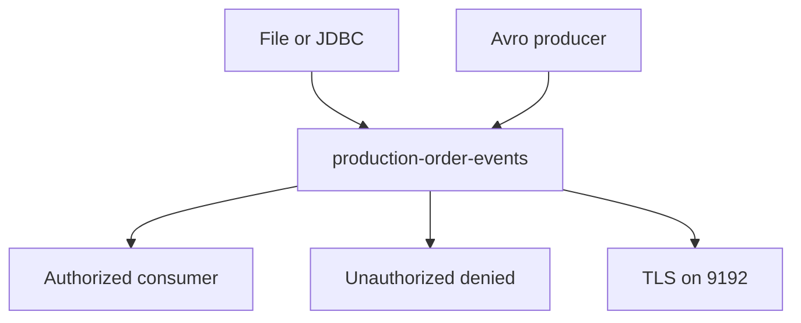

# Lab 10 – Day 3 Capstone: Secure QuickCart Data Integration Platform

**Lab Number:** 10  
**Day:** 3  
**Duration:** 60–75 minutes  
**Difficulty:** Intermediate  
**Environment:** Windows 10 / Windows 11  
**Mode:** Individual or pairs

---

## Description

This capstone combines Day 3 concepts: Avro, administration, security, TLS, Connect, and troubleshooting.

You will create `production-order-events`, publish at least 20 Avro `OrderEvents`, demonstrate authorized vs denied access, explain TLS vs ACL, ingest from a file or JDBC source, validate the pipeline with real records, then diagnose a trainer-chosen failure in 10 minutes.

---

## Prerequisites

- Day 3 Labs 01–09 are complete
- Three-broker cluster is running
- `AvroOrderProducer` / `OrderAvroSupport` work
- Lab 05 SASL/ACL and Lab 06 SSL are available, or the trainer gives a shortened security path
- Lab 07 file Connect or Lab 08 JDBC can be reused
- You have the troubleshooting cheat sheet in [00-initial.md](00-initial.md)

---

## Business Use Case

QuickCart needs this architecture:

```text
                      QUICKCART

                Legacy Order System
                         |
                      orders
                         |
                         v
                  JDBC Connector
                         |
                         v
              +--------------------+
              |                    |
              |    Apache Kafka    |
              |                    |
              |   order-events     |
              |                    |
              +---------+----------+
                        |
             +----------+----------+
             |                     |
             v                     v

        Java Consumer        Search Platform
                             Connector

        Inventory             Elasticsearch


                 SECURITY

          TLS encrypted traffic
                  +
                 ACL
```

The capstone topic name is `production-order-events`. You may still use file Connect if JDBC is not installed.

---

## Architecture

```text
AvroOrderProducer (20 events)
        |
        |  ACL + optional TLS
        v
production-order-events   (4 partitions, RF 3)
        |
        +-- Java / Avro consumer
        +-- Connect source (file or JDBC)
        +-- (optional) search sink from Lab 09

Failure drill (10 minutes)
```



---

## Detailed Steps

### Step 0 – Initial Setup

1. Start ZooKeeper and brokers 1–3 if needed.
2. Confirm PLAINTEXT 9092 and, if you completed Lab 06, SSL 9192.
3. Confirm Lab 05 admin properties still work if you will use ACLs.
4. Stop leftover Connect workers if you need the terminal.

```powershell
cd C:\kafka-labs\kafka

.\bin\windows\kafka-topics.bat `
  --list `
  --bootstrap-server localhost:9092
```

```powershell
cd C:\kafka-labs\quickcart-kafka
mvn -q compile
```

---

### Step 1 – Create the topic

Create:

```text
production-order-events
```

Requirements:

```text
Partitions = 4
Replication Factor = 3
```

```powershell
cd C:\kafka-labs\kafka

.\bin\windows\kafka-topics.bat `
  --create `
  --topic production-order-events `
  --bootstrap-server localhost:9092 `
  --partitions 4 `
  --replication-factor 3
```

Describe and record:

| Field | Required | Your value |
| --- | --- | --- |
| Partitions | 4 | |
| RF | 3 | |
| P0 leader | | |

---

### Step 2 – Produce structured events

Use the Day 3 Avro producer.

Generate at least:

```text
20 OrderEvents
```

Copy `AvroOrderProducer` to loop `ORD5101`–`ORD5120` (or add a `count` argument) and send to `production-order-events`.

Print at least one:

```text
Order
Partition
Offset
```

Consume with `AvroOrderConsumer` pointed at this topic, or dump offsets from the producer callbacks.

| Check | Your result |
| --- | --- |
| Events published | |
| Consumer decoded Avro fields | Yes / No |

---

### Step 3 – Secure access

Configure the training security setup so that the intended producer/consumer principals have the required permissions.

On `production-order-events`, using Lab 05 `admin.properties` and port **9095**:

1. Grant `User:order-api` Write + Describe.
2. Grant `User:inventory-service` Read + Describe on the topic and Read on a group such as `production-inventory`.
3. Produce as `order-api` (success).
4. Produce as `rogue-app` (denied).

Students demonstrate:

```text
Authorized application
        ↓
SUCCESS

Unauthorized application
        ↓
DENIED
```

If SASL was rolled back, the trainer may ask you to recreate the Lab 05 listener only on Broker 1.

| Test | Result |
| --- | --- |
| order-api produce | SUCCESS / FAIL |
| rogue-app produce | DENIED / FAIL (unexpected success) |

---

### Step 4 – Secure communication

Connect through the SSL/TLS-enabled listener (`localhost:9192` and `ssl-client.properties`).

Publish or consume one record on `production-order-events` over SSL.

Students should explain:

```text
ACL
    =
Authorization

TLS
    =
Wire encryption

They solve different security problems.
```

Write your explanation in one pair of sentences:

```text
ACL: ________________________________________________
TLS: ________________________________________________
```

---

### Step 5 – Create an integration pipeline

Use Kafka Connect to ingest data from either:

```text
File
```

or:

```text
JDBC database
```

into Kafka.

Reuse Lab 07 or Lab 08. Point the source at a **new** file or table if you do not want to mix `legacy-orders` with the capstone topic.

Example file source topic: `production-order-events` or a feeder topic you then consume. Either is acceptable if you can show:

```text
Source → Connector → Kafka
```

with records you can read.

---

### Step 6 – Validate

Students verify:

```text
Source
  ↓
Connector
  ↓
Kafka
  ↓
Consumer
```

using actual records.

Complete:

| Stage | Evidence (topic, file, screenshot note) |
| --- | --- |
| Source | |
| Connector running | |
| Record in Kafka | |
| Consumer output | |

---

### Step 7 – Introduce a failure

Trainer chooses one:

```text
Wrong bootstrap server
Wrong topic
Slow consumer
Stopped broker
Incorrect ACL
Incorrect connector configuration
```

Students have **10 minutes** to diagnose it.

They must follow:

```text
1. Observe symptom
       ↓
2. Check connectivity
       ↓
3. Check topic
       ↓
4. Check consumer group
       ↓
5. Check lag
       ↓
6. Check broker/ISR
       ↓
7. Check security
       ↓
8. Check connector
       ↓
9. Correct
       ↓
10. Verify
```

This is one of the most useful exercises of the day because it forces students to combine multiple skills.

Record:

| Item | Your notes |
| --- | --- |
| Assigned failure | |
| Symptom | |
| Root cause | |
| Fix | |
| Verified? | Yes / No |

Use the cheat sheet in [00-initial.md](00-initial.md).

---

## Conclusion

You built a production-shaped QuickCart path: Avro events, a replicated topic, ACL allow/deny, TLS on the wire, a Connect ingest, and a timed diagnosis.

Day 3 is complete. Day 4 adds Kafka Streams, ksqlDB, Schema Registry, and Control Center.

**Day 3 is complete when you have:**

- `production-order-events` with 4 partitions and RF 3
- At least 20 Avro publishes
- One authorized success and one unauthorized deny
- A TLS produce or consume
- A Connect source validated with real records
- A written 10-minute failure diagnosis

---

## Knowledge Check

**1. Why Avro?**  
Structured serialization using a defined schema.

**2. What is a Kafka ACL?**  
Authorization rules controlling operations on Kafka resources.

**3. ACL vs SSL?**

```text
ACL → authorization
SSL/TLS → encrypted transport (and can participate in identity/authentication depending on configuration)
```

**4. Source Connector vs Sink Connector?**

```text
External System
      |
Source Connector
      |
      v
    Kafka


    Kafka
      |
Sink Connector
      |
      v
External System
```

**5. Why Kafka Connect instead of writing Java integration code for everything?**  
Connect provides a connector/worker/task framework for moving data between Kafka and external systems.

**6. What is consumer lag?**  
How far a consumer group's progress trails the end of the partition log.

**7. How would you investigate a slow Kafka application?**  
Start with producer/consumer behavior, consumer lag, partitioning, broker health, ISR, and configuration rather than assuming Kafka itself is the bottleneck.

---

## Common Issues

| Symptom | Likely cause | What to do |
| --- | --- | --- |
| Topic RF error | Broker down | Start all three brokers |
| Avro consumer fails | Schema path / working directory | Run from `quickcart-kafka` |
| Rogue produce still works | No ACL on this topic | Add ACLs on `production-order-events` |
| SSL client fails | Truststore / port 9192 down | Repeat Lab 06 checkpoints |
| Connect empty | Offsets already at EOF | Append a new source row |

---

## After This Lab

Leave PLAINTEXT 9092 running if Day 4 starts on this machine. You may stop extra Connect workers and Java consumers.

Review the troubleshooting table in [00-initial.md](00-initial.md) before you leave.
