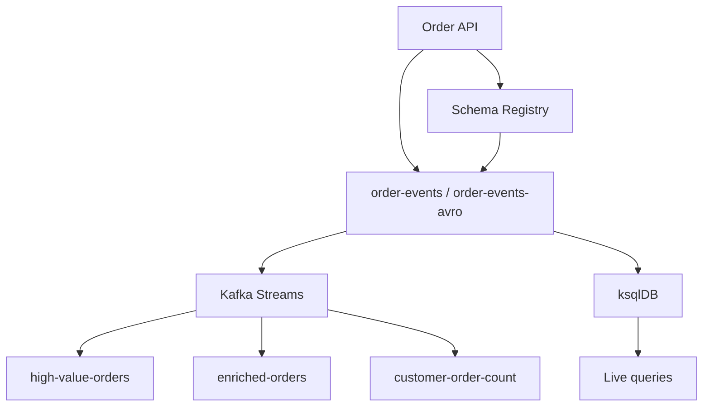

# Apache Kafka – Day 4 Hands-on Lab Guide

**Theme:** Real-Time Stream Processing, ksqlDB, and Schema Governance  
**Duration:** 8 hours  
**Environment:** Windows 10 / Windows 11 + Docker Desktop recommended for Confluent components  
**Language:** Java 17+, Maven, IntelliJ / VS Code  
**Kafka:** Reuse the Day 1 three-broker cluster  
**Business story:** QuickCart Real-Time Order Intelligence Platform

Start here. Complete the labs in order. Each exercise is a separate learner-ready file.

Day 1 built the cluster. Day 2 built Java clients. Day 3 added Avro mechanics, security, and Connect. Day 4 turns Kafka into a **real-time processing platform** and adds Schema Registry governance.

---

## How to Use This Guide

1. Read this page once at the start of Day 4.
2. Start the Day 1 three-broker cluster before Lab 01.
3. Reuse `C:\kafka-labs\quickcart-kafka`.
4. Do not skip **Step 0**.
5. Labs 05–09 need the trainer’s Confluent / Docker stack (ksqlDB, Schema Registry, Control Center). If a URL is different, write it in the table below and use **your** values.

If a Streams app, ksqlDB query, or schema registration fails, use that lab’s **Common Issues** section, then the streaming checklist at the end of this page.

---

## What You Will Be Able to Do

By the end of Day 4 you will be able to:

- Decide batch versus stream and Kafka Streams versus ksqlDB
- Build a Kafka Streams topology (filter, map, aggregate, KStream–KTable join)
- Create ksqlDB streams, tables, persistent queries, joins, and REST calls
- Register Avro schemas, list subjects, and consume with Schema Registry
- Evolve a schema compatibly and see an incompatible change rejected
- Use Control Center as a visual operations view
- Assemble the 32-hour course capstone: Avro + Streams + ksqlDB + evolution + monitoring

---

## Lab Roadmap

| Lab | File | Exercise | Main topics | Time |
| ---: | --- | --- | --- | ---: |
| 01 | [01-stream-processing-fundamentals.md](01-stream-processing-fundamentals.md) | Stream processing fundamentals | Batch vs stream, framework choice | 30 min |
| 02 | [02-first-kafka-streams-app.md](02-first-kafka-streams-app.md) | First Kafka Streams app | KStream, filter, high-value orders | 60 min |
| 03 | [03-filter-map-aggregate.md](03-filter-map-aggregate.md) | Filter, map, aggregate | Stateless/stateful, KTable count | 45 min |
| 04 | [04-kstream-ktable-join.md](04-kstream-ktable-join.md) | KStream + KTable join | Customer enrichment | 50 min |
| 05 | [05-ksqldb-streams-tables.md](05-ksqldb-streams-tables.md) | ksqlDB streams and tables | CREATE STREAM, live SELECT | 60 min |
| 06 | [06-ksqldb-joins-rest.md](06-ksqldb-joins-rest.md) | ksqlDB joins, REST, terminate | Tables, JOIN, REST API | 45 min |
| 07 | [07-schema-registry-avro.md](07-schema-registry-avro.md) | Schema Registry and Avro | Subjects, register, Avro client | 60 min |
| 08 | [08-schema-evolution.md](08-schema-evolution.md) | Schema evolution | Compatibility, reject, delete | 45 min |
| 09 | [09-control-center.md](09-control-center.md) | Confluent Control Center | Visual ops for topics and ksqlDB | 20–30 min |
| 10 | [10-capstone-order-intelligence.md](10-capstone-order-intelligence.md) | Course capstone | End-to-end intelligence platform | 75–90 min |

The original Day 4 outline listed eight labs plus a capstone. Control Center is a required syllabus UI lab, so it is Lab 09 and the capstone is Lab 10.

---

## Day 4 Architecture You Are Building

```text
                     QUICKCART

                 Order Application
                        |
                        v
                +---------------+
                | order-events  |
                +-------+-------+
                        |
             +----------+----------+
             |                     |
             v                     v
       Kafka Streams             ksqlDB
             |                     |
     +-------+-------+       +-----+------+
     |               |       |            |
     v               v       v            v
High Value       Revenue   Live Query   Aggregation
 Orders          Summary

                        +
                 Schema Registry
                        |
                   Avro Events
```



---

## Standard Lab Environment

| Item | Course default | Your trainer value |
| --- | --- | --- |
| Kafka home | `C:\kafka-labs\kafka` | |
| Java project | `C:\kafka-labs\quickcart-kafka` | |
| Bootstrap | `localhost:9092,localhost:9093,localhost:9094` | |
| Schema Registry | `http://localhost:8081` | |
| ksqlDB REST | `http://localhost:8088` | |
| Control Center | `http://localhost:9021` | |
| High-value rule | amount **>= 50000** | |

Always:

```powershell
cd C:\kafka-labs\kafka
```

```powershell
cd C:\kafka-labs\quickcart-kafka
```

---

## Start the Day 1 Cluster

| Terminal | Process |
| ---: | --- |
| 1 | ZooKeeper |
| 2–4 | Brokers 1–3 |
| 5 | Kafka CLI |
| 6+ | Streams apps, ksqlDB CLI, producers |

```powershell
cd C:\kafka-labs\kafka
.\bin\windows\zookeeper-server-start.bat .\config\zookeeper.properties
.\bin\windows\kafka-server-start.bat .\config\server-1.properties
```

Repeat for `server-2.properties` and `server-3.properties`.

Start the Confluent Docker stack only when the trainer says Labs 05–09 are ready.

---

## Lab File Template

1. Title and lab number  
2. Description  
3. Prerequisites  
4. Business use case  
5. Architecture diagram  
6. Detailed steps, starting with **Step 0**  
7. Checkpoints and observation tables  
8. Conclusion  
9. Knowledge check  
10. Common issues  

---

## Rules for Learners

- Complete labs in sequence. Labs 03–04 reuse Streams skills from Lab 02.
- `application.id` is the Streams app identity. Changing it creates a new application.
- Join keys must match. Customer id is the join key in Labs 04 and 06.
- Do not delete production Schema Registry subjects. Lab 08 uses a disposable subject.
- Control Center does not replace CLI skills from Days 1–3.
- Day 3 Avro **without** Registry is not the same as Day 4 registry-aware Avro.

---

## Suggested Day Plan

| Block | Labs | Focus |
| --- | --- | --- |
| Morning 1 (90 min) | 01, 02 | Concepts and first Streams app |
| Morning 2 (90 min) | 03, 04 | Transform, aggregate, join |
| Afternoon 1 (105 min) | 05, 06 | ksqlDB |
| Afternoon 2 (105 min) | 07, 08 | Schema Registry |
| Close (90 min) | 09, 10 | Control Center and course capstone |

---

## KStream vs KTable (keep this all day)

### KStream — “What happened?”

```text
C101 Delhi
C101 Mumbai
C101 Pune
```

All are events.

### KTable — “What is the current state?”

```text
C101 → Pune
```

---

## Kafka Streams vs ksqlDB

| Requirement | Possible approach |
| --- | --- |
| Simple filtering | Kafka Streams or ksqlDB |
| SQL-oriented real-time analytics | ksqlDB |
| Complex Java business logic | Kafka Streams |
| Developer-controlled Java service | Kafka Streams |
| SQL aggregation | ksqlDB |
| Java libraries / domain logic | Kafka Streams |

The syllabus asks you to **choose a framework**, not to declare a winner.

---

## Streaming Troubleshooting Checklist

When a pipeline stops:

```text
1. Is the producer producing?
2. Does the input topic contain data?
3. Is the schema valid?
4. Is the Streams/ksqlDB application running?
5. Are keys correct for joins?
6. Is reference-table data present?
7. Is the output topic receiving records?
8. Is the consumer running?
9. Is consumer lag increasing?
10. Check application/platform logs
```

---

## Start Lab 01

Open [01-stream-processing-fundamentals.md](01-stream-processing-fundamentals.md) and complete **Step 0**.
