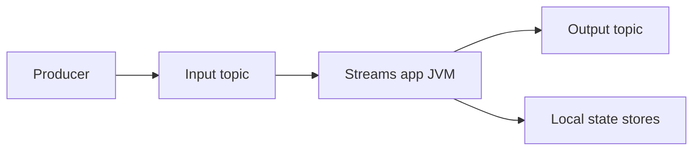

# Lab 01 – Understand Stream Processing Through a Business Problem

**Lab Number:** 01  
**Day:** 4  
**Duration:** 30 minutes  
**Difficulty:** Beginner  
**Environment:** Windows 10 / Windows 11  
**Mode:** Individual

---

## Description

The Day 4 syllabus begins with stream-processing concepts, Kafka Streams architecture, and choosing a stream-processing framework.

You will contrast nightly batch reporting with real-time requirements, classify QuickCart workloads as batch or stream, and draw the Kafka Streams processing model. You do **not** write Java in this lab.

---

## Prerequisites

- Days 1–3 concepts: topics, consumers, Avro-as-bytes, Connect
- The three-broker cluster can start (you may start it in Step 0 so Lab 02 is ready)
- You have read [00-initial.md](00-initial.md)

---

## Business Use Case

QuickCart currently calculates sales every night:

```text
Orders
   |
   v
Database
   |
   v
Nightly Batch Job
   |
   v
Daily Report
```

The business asks:

> “Show high-value orders within seconds.”

New design:

```text
Order
  |
  v
Kafka
  |
  v
Stream Processing
  |
  +----> High Value Order
  |
  +----> Revenue Calculation
  |
  +----> Fraud Alert
```

---

## Architecture

```text
Kafka Producer
      |
      v
 Input Topic
      |
      v
+----------------+
| Kafka Streams  |
| Application    |
+-------+--------+
        |
        v
 Output Topic
```

Important developer concept:

**Kafka Streams is a Java library.**

You are not deploying another processing cluster for the Java application itself. ksqlDB **is** a server you connect to. That difference drives framework choice later today.



---

## Detailed Steps

### Step 0 – Initial Setup

Start the Day 1 cluster if it is not running, so Lab 02 does not wait on brokers.

```powershell
cd C:\kafka-labs\kafka
.\bin\windows\kafka-topics.bat `
  --list `
  --bootstrap-server localhost:9092
```

Open this file and [00-initial.md](00-initial.md) side by side. You will fill tables here, not in a slide deck.

---

### Step 1 – Classify requirements

Mark each row. The expected column is the course answer; write **your** first answer, then compare.

| Requirement | Your answer (Batch / Stream) | Course answer |
| --- | --- | --- |
| Monthly sales report | | Batch |
| Fraud detection during payment | | Stream |
| Live order dashboard | | Stream |
| Historical yearly analysis | | Batch |
| Stock update after order | | Stream |
| Nightly reconciliation | | Batch |

If you disagreed with a course answer, write why:

```text
________________________________________________
```

---

### Step 2 – Understand the processing model

Copy this flow in your notes and label each box with a Day 1–3 skill:

```text
Kafka Producer          → Day 2 Java / Day 3 Avro
      |
 Input Topic            → Day 1 topic
      |
 Kafka Streams app      → new today (library in your JVM)
      |
 Output Topic           → another Kafka topic
      |
 Consumer / dashboard   → Day 2 consumer or ksqlDB
```

Complete:

| Question | Your answer |
| --- | --- |
| Where does Streams read from? | |
| Where does it write to? | |
| Is Streams a separate Kafka cluster? | Yes / No |

---

### Step 3 – Choose a framework (first pass)

Using the table in [00-initial.md](00-initial.md), pick an approach for each QuickCart need:

| Need | Kafka Streams, ksqlDB, or either | Why |
| --- | --- | --- |
| High-value filter in a Java microservice | | |
| Analyst live SQL on orders | | |
| Join order to customer tier with Java objects | | |
| COUNT per customer in SQL | | |

You will revisit this table after Labs 02–06.

---

### Step 4 – KStream vs KTable preview

Read the mental model in `00-initial.md`, then answer:

Customer C101 changes city: Delhi → Mumbai → Pune.

| View | What you see |
| --- | --- |
| KStream | |
| KTable current state | |

Expected: three events versus `C101 → Pune`.

---

## Conclusion

QuickCart’s “within seconds” requirement is a **stream** problem. Kafka Streams runs inside your Java process and reads/writes topics. ksqlDB is the SQL server option. Lab 02 implements the high-value filter in Java.

**You are ready for Lab 02 when:**

- The classification table is filled
- You can state that Streams is a library, not a second cluster
- The Day 1 brokers are running

Next lab: [02-first-kafka-streams-app.md](02-first-kafka-streams-app.md)

---

## Knowledge Check

1. Why is a monthly sales report usually batch?
2. Why is Kafka Streams not “another Kafka”?
3. When would you pick ksqlDB over Streams?
4. What question does a KTable answer?

**Expected answers**

1. It can wait for a complete period and does not need second-level freshness.
2. It is a library that uses Kafka as its input, output, and changelog.
3. SQL-oriented analytics without shipping a custom Java topology.
4. “What is the current state for this key?”

---

## Common Issues

| Symptom | Likely cause | What to do |
| --- | --- | --- |
| Cluster not up | Skipped Step 0 | Start ZooKeeper and three brokers |
| “Streams needs Flink/Spark” | Confusing product names | Stay with Kafka Streams library + ksqlDB today |
