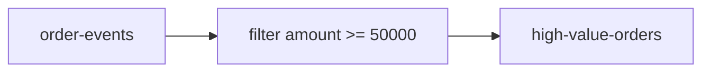

# Lab 02 – Build Your First Kafka Streams Java Application

**Lab Number:** 02  
**Day:** 4  
**Duration:** 60 minutes  
**Difficulty:** Intermediate  
**Environment:** Windows 10 / Windows 11  
**Mode:** Individual

---

## Description

You will add `kafka-streams` to the QuickCart Maven project, create `HighValueOrderStream`, filter orders of ₹50,000 or more, and write them to `high-value-orders`.

This is a KStream-only topology: read, filter, write.

---

## Prerequisites

- Lab 01 is complete
- `C:\kafka-labs\quickcart-kafka` compiles
- Three brokers are running
- Day 2 `order-events` may already exist

---

## Business Use Case

Create a service that reads:

```text
order-events
```

and identifies orders worth ₹50,000 or more.

Output:

```text
high-value-orders
```

---

## Architecture

```text
order-events
      |
      v
+----------------------+
| HighValueOrderStream |
+----------+-----------+
           |
           v
high-value-orders
```

Event format for this lab:

```text
ORD1001,C101,LAPTOP,1,75000
```



---

## Detailed Steps

### Step 0 – Initial Setup

```powershell
cd C:\kafka-labs\kafka

.\bin\windows\kafka-topics.bat `
  --list `
  --bootstrap-server localhost:9092
```

```powershell
cd C:\kafka-labs\quickcart-kafka
mvn -q compile
```

Create the Streams package folder:

```powershell
New-Item -ItemType Directory -Force `
  -Path C:\kafka-labs\quickcart-kafka\src\main\java\com\quickcart\kafka\streams
```

---

### Step 1 – Create input and output topics

```powershell
cd C:\kafka-labs\kafka

.\bin\windows\kafka-topics.bat `
  --create `
  --topic order-events `
  --bootstrap-server localhost:9092 `
  --partitions 4 `
  --replication-factor 3
```

If `order-events` already exists, describe it. Prefer 4 partitions and RF 3. Do not delete it if Day 2 data is still needed; creating `high-value-orders` is enough.

```powershell
.\bin\windows\kafka-topics.bat `
  --create `
  --topic high-value-orders `
  --bootstrap-server localhost:9092 `
  --partitions 4 `
  --replication-factor 3
```

| Topic | Created or already existed |
| --- | --- |
| `order-events` | |
| `high-value-orders` | |

---

### Step 2 – Add the Kafka Streams dependency

In `pom.xml`, add a dependency that matches your `kafka-clients` version (Day 2 used 3.8.1 unless you changed it):

```xml
<dependency>
    <groupId>org.apache.kafka</groupId>
    <artifactId>kafka-streams</artifactId>
    <version>${kafka.client.version}</version>
</dependency>
```

If you do not have `kafka.client.version`, use the same version number as `kafka-clients`.

```powershell
cd C:\kafka-labs\quickcart-kafka
mvn -q compile
```

---

### Step 3 – Create the Streams class

Create `src\main\java\com\quickcart\kafka\streams\HighValueOrderStream.java`.

---

### Step 4 – Configure Kafka Streams

```java
Properties props = new Properties();

props.put(
    StreamsConfig.APPLICATION_ID_CONFIG,
    "high-value-order-app"
);

props.put(
    StreamsConfig.BOOTSTRAP_SERVERS_CONFIG,
    "localhost:9092,localhost:9093,localhost:9094"
);

props.put(
    StreamsConfig.DEFAULT_KEY_SERDE_CLASS_CONFIG,
    Serdes.String().getClass()
);

props.put(
    StreamsConfig.DEFAULT_VALUE_SERDE_CLASS_CONFIG,
    Serdes.String().getClass()
);
```

Explain:

```text
application.id
     |
     +--> identifies Streams application
     +--> consumer-group-related identity
     +--> internal state/topic naming context
```

---

### Step 5 – Create the topology and filter

Full class (copy this file):

```java
package com.quickcart.kafka.streams;

import org.apache.kafka.common.serialization.Serdes;
import org.apache.kafka.streams.KafkaStreams;
import org.apache.kafka.streams.StreamsBuilder;
import org.apache.kafka.streams.StreamsConfig;
import org.apache.kafka.streams.kstream.KStream;

import java.util.Properties;

public class HighValueOrderStream {

    public static void main(String[] args) {
        Properties props = new Properties();
        props.put(StreamsConfig.APPLICATION_ID_CONFIG, "high-value-order-app");
        props.put(StreamsConfig.BOOTSTRAP_SERVERS_CONFIG,
                "localhost:9092,localhost:9093,localhost:9094");
        props.put(StreamsConfig.DEFAULT_KEY_SERDE_CLASS_CONFIG,
                Serdes.String().getClass());
        props.put(StreamsConfig.DEFAULT_VALUE_SERDE_CLASS_CONFIG,
                Serdes.String().getClass());

        StreamsBuilder builder = new StreamsBuilder();

        KStream<String, String> orders = builder.stream("order-events");

        KStream<String, String> highValueOrders =
                orders.filter((key, value) -> {
                    if (value == null || value.isBlank()) {
                        return false;
                    }
                    try {
                        String[] fields = value.split(",");
                        double amount = Double.parseDouble(fields[4].trim());
                        return amount >= 50000;
                    } catch (Exception e) {
                        System.err.println("Skip malformed: " + value);
                        return false;
                    }
                });

        highValueOrders.to("high-value-orders");

        KafkaStreams streams = new KafkaStreams(builder.build(), props);
        Runtime.getRuntime().addShutdownHook(new Thread(streams::close));
        streams.start();
        System.out.println("HighValueOrderStream running");
    }
}
```

You now have:

```text
order-events
      |
      v
KStream<String,String>
      |
    filter
      |
      v
high-value-orders
```

---

### Step 6 – Run the application

Run `HighValueOrderStream` from the IDE. Leave it running.

If it exits immediately, you missed `streams.start()` or the JVM ended after `main` — this `main` stays alive because the Streams threads keep running.

---

### Step 7 – Produce test data

```powershell
cd C:\kafka-labs\kafka

.\bin\windows\kafka-console-producer.bat `
  --bootstrap-server localhost:9092 `
  --topic order-events
```

Enter:

```text
ORD1001,C101,LAPTOP,1,75000
ORD1002,C102,MOUSE,1,1500
ORD1003,C103,MOBILE,2,120000
ORD1004,C104,KEYBOARD,1,5000
ORD1005,C105,TV,1,85000
```

---

### Step 8 – Consume the output

```powershell
.\bin\windows\kafka-console-consumer.bat `
  --bootstrap-server localhost:9092 `
  --topic high-value-orders `
  --from-beginning
```

Expected business result:

```text
ORD1001...
ORD1003...
ORD1005...
```

`ORD1002` and `ORD1004` must **not** appear.

| Order | Amount | In high-value-orders? |
| --- | ---: | --- |
| ORD1001 | 75000 | |
| ORD1002 | 1500 | |
| ORD1003 | 120000 | |
| ORD1004 | 5000 | |
| ORD1005 | 85000 | |

---

## Conclusion

You built the first real-time Kafka Streams application for QuickCart: a Java library process that filters a topic into another topic.

Leave `HighValueOrderStream` stopped (Ctrl+C / IDE stop) before Lab 03 if you will run a second `application.id`. You may keep it running if you only add a new class later.

**You are ready for Lab 03 when:**

- `high-value-orders` shows three high-value lines
- You can explain `application.id`
- The filter uses field index 4 as amount

Next lab: [03-filter-map-aggregate.md](03-filter-map-aggregate.md)

---

## Knowledge Check

1. What does `builder.stream` create?
2. Why is `application.id` required?
3. Where does filtered output go if you forget `.to(...)`?
4. Why skip malformed lines instead of crashing the app?

**Expected answers**

1. A `KStream` over the input topic.
2. It names the app, its consumer group, and changelog/repartition topics.
3. The filtered stream is not written to Kafka.
4. One bad record should not kill the whole topology in this lab.

---

## Common Issues

| Symptom | Likely cause | What to do |
| --- | --- | --- |
| `ArrayIndexOutOfBoundsException` | CSV has fewer than 5 fields | Use the catch block / check format |
| No output | App not started or wrong topic | Confirm `streams.start()` and topic names |
| Every order appears | Filter inverted or parse failed | Print `amount` once for debugging |
| `Missing / invalid application.id` | Property not set | Set `APPLICATION_ID_CONFIG` |
