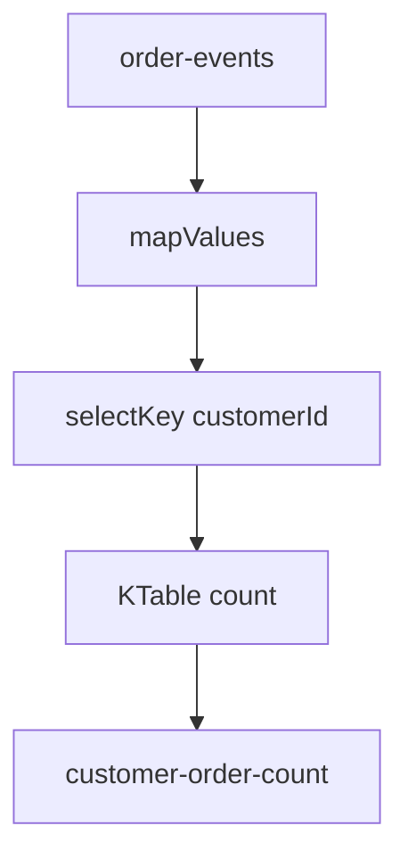

# Lab 03 – Filtering, Transformation, and Aggregation

**Lab Number:** 03  
**Day:** 4  
**Duration:** 45 minutes  
**Difficulty:** Intermediate  
**Environment:** Windows 10 / Windows 11  
**Mode:** Individual

---

## Description

You extend the Streams pipeline: normalize values, re-key by customer, count orders per customer into a **KTable**, and write `customer-order-count`.

This is the first stateful topology of the day.

---

## Prerequisites

- Lab 02 `HighValueOrderStream` compiles and you understand `KStream.filter`
- `order-events` exists
- Three brokers are running
- `kafka-streams` is on the classpath

---

## Business Use Case

QuickCart wants a live **orders-per-customer** count, not only a high-value filter.

```text
orders
  |
filter / map
  |
selectKey (customer)
  |
group
  |
aggregate (count)
  |
customer-order-count
```

---

## Architecture

```text
order-events
      |
  mapValues (trim, upper)
      |
  selectKey → customerId
      |
  groupByKey + count  →  KTable
      |
  toStream
      |
customer-order-count
```

```text
C101 → 1
C102 → 1
C101 → 2
C101 → 3

Current state:
C101 → 3
C102 → 1
```



---

## Detailed Steps

### Step 0 – Initial Setup

Stop `HighValueOrderStream` if it is still running so you can focus on one topology. You may keep it running if memory allows; use a **new** `application.id` for this lab.

```powershell
cd C:\kafka-labs\kafka

.\bin\windows\kafka-topics.bat `
  --create `
  --topic customer-order-count `
  --bootstrap-server localhost:9092 `
  --partitions 4 `
  --replication-factor 3
```

If the topic exists, continue.

---

### Step 1 – Transform events

Create `src\main\java\com\quickcart\kafka\streams\CustomerOrderCountStream.java`.

Start from a `KStream` on `order-events` and normalize:

```java
KStream<String, String> normalized =
        orders.mapValues(value ->
                value == null ? "" : value.trim().toUpperCase()
        );
```

Explain these common operations:

```text
map()
mapValues()
filter()
filterNot()
```

| Operation | Changes key? | Typical use |
| --- | --- | --- |
| `filter` | No | Drop records |
| `mapValues` | No | Change value only |
| `map` | Yes | Change key and value |
| `filterNot` | No | Inverse filter |

---

### Step 2 – Extract customer as the key

Input:

```text
ORD1001,C101,LAPTOP,1,75000
```

```java
KStream<String, String> byCustomer =
        normalized.selectKey(
                (key, value) -> {
                    String[] fields = value.split(",");
                    return fields.length > 1 ? fields[1].trim() : "UNKNOWN";
                }
        );
```

Now conceptually:

```text
Key = C101
Value = ORD1001,C101,LAPTOP,1,75000
```

---

### Step 3 – Count orders per customer

```java
KTable<String, Long> orderCount =
        byCustomer
                .groupByKey()
                .count();
```

Aggregation produces **table-like changing state**, not another independent sequence of unrelated events.

As `C101` orders arrive:

```text
C101 → 1
C101 → 2
C101 → 3
```

The table’s current value for `C101` is `3`.

---

### Step 4 – Write results

```java
orderCount
        .toStream()
        .to(
                "customer-order-count",
                Produced.with(Serdes.String(), Serdes.Long())
        );
```

Full class:

```java
package com.quickcart.kafka.streams;

import org.apache.kafka.common.serialization.Serdes;
import org.apache.kafka.streams.KafkaStreams;
import org.apache.kafka.streams.StreamsBuilder;
import org.apache.kafka.streams.StreamsConfig;
import org.apache.kafka.streams.kstream.KStream;
import org.apache.kafka.streams.kstream.KTable;
import org.apache.kafka.streams.kstream.Produced;

import java.util.Properties;

public class CustomerOrderCountStream {

    public static void main(String[] args) {
        Properties props = new Properties();
        props.put(StreamsConfig.APPLICATION_ID_CONFIG, "customer-order-count-app");
        props.put(StreamsConfig.BOOTSTRAP_SERVERS_CONFIG,
                "localhost:9092,localhost:9093,localhost:9094");
        props.put(StreamsConfig.DEFAULT_KEY_SERDE_CLASS_CONFIG,
                Serdes.String().getClass());
        props.put(StreamsConfig.DEFAULT_VALUE_SERDE_CLASS_CONFIG,
                Serdes.String().getClass());

        StreamsBuilder builder = new StreamsBuilder();
        KStream<String, String> orders = builder.stream("order-events");

        KStream<String, String> normalized =
                orders.mapValues(v -> v == null ? "" : v.trim().toUpperCase());

        KStream<String, String> byCustomer =
                normalized.selectKey((key, value) -> {
                    String[] fields = value.split(",");
                    return fields.length > 1 ? fields[1].trim() : "UNKNOWN";
                });

        KTable<String, Long> orderCount = byCustomer.groupByKey().count();

        orderCount.toStream().to(
                "customer-order-count",
                Produced.with(Serdes.String(), Serdes.Long())
        );

        KafkaStreams streams = new KafkaStreams(builder.build(), props);
        Runtime.getRuntime().addShutdownHook(new Thread(streams::close));
        streams.start();
        System.out.println("CustomerOrderCountStream running");
    }
}
```

---

### Step 5 – Inspect results

Start `CustomerOrderCountStream`.

Produce (keys optional; the app re-keys):

```text
ORD2001,C101,LAPTOP,1,75000
ORD2002,C102,MOUSE,1,1500
ORD2003,C101,MOUSE,1,2000
ORD2004,C101,TV,1,85000
```

Consume with a Long deserializer for the value:

```powershell
cd C:\kafka-labs\kafka

.\bin\windows\kafka-console-consumer.bat `
  --bootstrap-server localhost:9092 `
  --topic customer-order-count `
  --from-beginning `
  --property print.key=true `
  --property key.separator=: `
  --formatter kafka.tools.DefaultMessageFormatter `
  --property print.value=true `
  --key-deserializer org.apache.kafka.common.serialization.StringDeserializer `
  --value-deserializer org.apache.kafka.common.serialization.LongDeserializer
```

On some Windows packages the extra formatter flags differ. If you see binary values, the count is still there — use the Long deserializer.

Complete:

| Customer | Last count you saw |
| --- | ---: |
| C101 | |
| C102 | |

Expected after the four orders: C101 → 3, C102 → 1.

---

## Conclusion

`mapValues` and `selectKey` are stateless. `count()` is stateful and materializes a **KTable**. Lab 04 joins an order stream to a customer table.

**You are ready for Lab 04 when:**

- `customer-order-count` exists
- You recorded C101’s count increasing
- You can say why count is a table, not a raw stream

Next lab: [04-kstream-ktable-join.md](04-kstream-ktable-join.md)

---

## Knowledge Check

1. Difference between `map` and `mapValues`?
2. Why `selectKey` before `groupByKey`?
3. Why is `count()` a KTable?
4. What does `toStream()` do on a KTable?

**Expected answers**

1. `map` can change the key; `mapValues` does not.
2. So all events for one customer share a key and aggregate together.
3. It stores the latest count per key.
4. It emits changelog events of that table into a stream you can write to a topic.

---

## Common Issues

| Symptom | Likely cause | What to do |
| --- | --- | --- |
| Counts look random | Customer field not index 1 | Check CSV `order,customer,product,qty,amount` |
| Value looks like garbage | Consumed Long as String | Use LongDeserializer |
| Two apps fight | Same `application.id` as Lab 02 | This lab uses `customer-order-count-app` |
