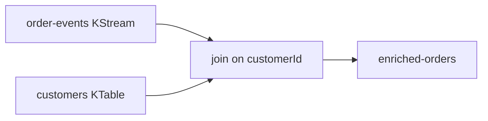

# Lab 04 – KStream and KTable Join

**Lab Number:** 04  
**Day:** 4  
**Duration:** 50 minutes  
**Difficulty:** Intermediate  
**Environment:** Windows 10 / Windows 11  
**Mode:** Individual

---

## Description

The syllabus requires KStream, KTable, and joining KStream with KTable.

You will create a compacted `customers` topic, load it as a KTable, re-key orders by customer, join stream to table, and write `enriched-orders`.

---

## Prerequisites

- Lab 03 is complete
- `order-events` uses `ORD,CUSTOMER,PRODUCT,QTY,AMOUNT`
- Three brokers are running
- You understand KTable = latest state per key

---

## Business Use Case

Orders only contain:

```text
customerId
```

Business wants:

```text
Customer Name
Customer Tier
```

Reference data:

```text
C101 → Rahul,GOLD
C102 → Neha,SILVER
C103 → Amit,PLATINUM
```

---

## Architecture

```text
Order Stream                Customer Table
     |                            |
     +-------------+--------------+
                   |
                   v
                  JOIN
                   |
                   v
            Enriched Order
```

```text
ORD1001,C101,LAPTOP,1,75000,Rahul,GOLD
```



---

## Detailed Steps

### Step 0 – Initial Setup

```powershell
cd C:\kafka-labs\kafka
```

You will create `customers` (compacted) and `enriched-orders`.

Stop extra Streams apps if the machine is short on RAM. Lab 03’s count app can stay stopped.

---

### Step 1 – Create the customer topic

```powershell
.\bin\windows\kafka-topics.bat `
  --create `
  --topic customers `
  --bootstrap-server localhost:9092 `
  --partitions 4 `
  --replication-factor 3 `
  --config cleanup.policy=compact
```

```powershell
.\bin\windows\kafka-topics.bat `
  --create `
  --topic enriched-orders `
  --bootstrap-server localhost:9092 `
  --partitions 4 `
  --replication-factor 3
```

Compaction fits reference data: only the latest tier per customer matters.

---

### Step 2 – Produce keyed customer data

```powershell
.\bin\windows\kafka-console-producer.bat `
  --bootstrap-server localhost:9092 `
  --topic customers `
  --property parse.key=true `
  --property key.separator=:
```

Enter:

```text
C101:Rahul,GOLD
C102:Neha,SILVER
C103:Amit,PLATINUM
```

Leave the producer or stop it. The table will load these keys when the Streams app starts (`auto.offset.reset` for Streams is typically earliest for changelog sources).

---

### Step 3 – Create the KTable

```java
KTable<String, String> customers =
        builder.table("customers");
```

Explain:

```text
KStream
=
events over time


KTable
=
latest state by key
```

---

### Step 4 – Key orders by customer

```java
KStream<String, String> ordersByCustomer =
        orders.selectKey(
                (key, value) ->
                        value.split(",")[1].trim()
        );
```

Both sides of the join must use the **same key**: `C101`.

---

### Step 5 – Join

```java
KStream<String, String> enrichedOrders =
        ordersByCustomer.join(
                customers,
                (order, customer) ->
                        order + "," + customer
        );
```

Output conceptually:

```text
ORD1001,C101,LAPTOP,1,75000,Rahul,GOLD
```

A join emits only when the stream record’s key exists in the table. Produce customers **before** (or ensure they are loaded before) the orders you want enriched.

---

### Step 6 – Write and consume enriched events

Create `src\main\java\com\quickcart\kafka\streams\OrderEnrichmentStream.java`:

```java
package com.quickcart.kafka.streams;

import org.apache.kafka.common.serialization.Serdes;
import org.apache.kafka.streams.KafkaStreams;
import org.apache.kafka.streams.StreamsBuilder;
import org.apache.kafka.streams.StreamsConfig;
import org.apache.kafka.streams.kstream.KStream;
import org.apache.kafka.streams.kstream.KTable;

import java.util.Properties;

public class OrderEnrichmentStream {

    public static void main(String[] args) {
        Properties props = new Properties();
        props.put(StreamsConfig.APPLICATION_ID_CONFIG, "order-enrichment-app");
        props.put(StreamsConfig.BOOTSTRAP_SERVERS_CONFIG,
                "localhost:9092,localhost:9093,localhost:9094");
        props.put(StreamsConfig.DEFAULT_KEY_SERDE_CLASS_CONFIG,
                Serdes.String().getClass());
        props.put(StreamsConfig.DEFAULT_VALUE_SERDE_CLASS_CONFIG,
                Serdes.String().getClass());

        StreamsBuilder builder = new StreamsBuilder();
        KStream<String, String> orders = builder.stream("order-events");
        KTable<String, String> customers = builder.table("customers");

        KStream<String, String> ordersByCustomer =
                orders.selectKey((key, value) -> value.split(",")[1].trim());

        KStream<String, String> enrichedOrders =
                ordersByCustomer.join(
                        customers,
                        (order, customer) -> order + "," + customer
                );

        enrichedOrders.to("enriched-orders");

        KafkaStreams streams = new KafkaStreams(builder.build(), props);
        Runtime.getRuntime().addShutdownHook(new Thread(streams::close));
        streams.start();
        System.out.println("OrderEnrichmentStream running");
    }
}
```

Start the app. Produce a new order:

```text
ORD3001,C101,LAPTOP,1,75000
```

Consume:

```powershell
.\bin\windows\kafka-console-consumer.bat `
  --bootstrap-server localhost:9092 `
  --topic enriched-orders `
  --from-beginning `
  --property print.key=true
```

**Student checkpoint**

Explain:

> Why is customer data represented as a KTable rather than another ordinary KStream in this business scenario?

Expected reasoning: customer data is changing **reference/state**. The latest name and tier per customer id is what enrichment needs.

Write your answer:

```text
________________________________________________
```

| Order | Enriched value you saw |
| --- | --- |
| ORD3001 | |

Produce `ORD3002,C199,MOUSE,1,1000` (unknown customer). It should **not** appear (inner join). That is expected.

---

## Conclusion

You joined a live order stream to a compact customer table. Keys had to match. Missing table keys drop inner-join records.

Lab 05 does the same idea in SQL on ksqlDB.

**You are ready for Lab 05 when:**

- `customers` is compacted and loaded
- At least one enriched GOLD/SILVER/PLATINUM line exists
- You answered the KTable checkpoint

Next lab: [05-ksqldb-streams-tables.md](05-ksqldb-streams-tables.md)

---

## Knowledge Check

1. Why compact `customers`?
2. What happens in an inner join if the customer is missing?
3. Why re-key the order stream?
4. KStream vs KTable in one phrase each?

**Expected answers**

1. Only the latest profile per customer id matters.
2. The order is not emitted.
3. Join is on key; orders were not keyed by customer.
4. Events over time vs current state by key.

---

## Common Issues

| Symptom | Likely cause | What to do |
| --- | --- | --- |
| No enriched output | Customers produced after orders, or wrong key | Re-produce customers, then a new order |
| `ArrayIndexOutOfBounds` | Order CSV wrong | Use 5 comma-separated fields |
| Join on wrong field | Used order id as key | `split(",")[1]` is customer |
