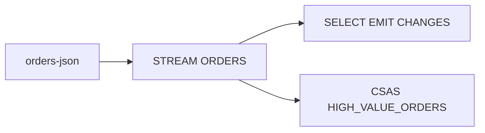

# Lab 05 – ksqlDB: Create Streams, Tables, and Queries

**Lab Number:** 05  
**Day:** 4  
**Duration:** 60 minutes  
**Difficulty:** Intermediate  
**Environment:** Windows + trainer Docker / Confluent stack  
**Mode:** Individual

---

## Description

The Day 4 curriculum includes ksqlDB servers and creating streams, tables, and queries.

You will verify the Confluent environment, open the ksqlDB CLI, create an `ORDERS` stream on JSON, run a live `SELECT`, filter high-value orders, and create a persistent `HIGH_VALUE_ORDERS` stream.

This is the SQL equivalent of Lab 02’s Java `filter`.

---

## Prerequisites

- Labs 01–04 concepts are complete
- Trainer-provided environment exposes Kafka, ksqlDB Server, ksqlDB CLI (and usually Schema Registry / Control Center)
- Docker Desktop is running if that is how the stack is started
- You know the ksqlDB URL from [00-initial.md](00-initial.md)

---

## Business Use Case

Analysts should not wait for a Java deploy to ask “show orders over ₹50,000 now.”

ksqlDB lets them declare a stream and query it continuously.

---

## Architecture

```text
orders-json topic
      |
CREATE STREAM ORDERS
      |
SELECT ... EMIT CHANGES     (transient)
      |
CREATE STREAM HIGH_VALUE_ORDERS AS
SELECT ... WHERE AMOUNT >= 50000
      |
new Kafka topic
```



---

## Detailed Steps

### Step 0 – Initial Setup

Write the URLs your trainer gave you:

| Service | URL |
| --- | --- |
| ksqlDB CLI / server | |
| Kafka bootstrap from ksqlDB’s view | |

Start the Docker / Confluent stack if that is the class procedure.

Students verify the services are running (`docker ps` or the trainer’s health check).

Confirm the Day 1 cluster is still the Kafka that ksqlDB points at, **or** that the trainer’s compose stack includes Kafka. Do not assume both clusters are the same unless the trainer says so.

---

### Step 1 – Verify the environment

Trainer-provided environment should expose:

```text
Kafka
Schema Registry
ksqlDB Server
ksqlDB CLI
Control Center
```

Tick what you can reach:

| Component | Up? |
| --- | --- |
| Kafka | |
| ksqlDB | |
| CLI or Confluent UI SQL editor | |

---

### Step 2 – Open the ksqlDB CLI

Connect to the prepared ksqlDB server (CLI container, `ksql` remote, or Control Center editor).

```sql
SHOW TOPICS;
```

Students should see Kafka topics such as:

```text
order-events
customers
high-value-orders
```

If you are on the **compose** Kafka, those Day 1–4 topics may be missing. That is fine. You will create `orders-json` via the stream `PARTITIONS` clause.

List what you actually see:

```text
________________________________________________
```

---

### Step 3 – Create the ORDERS stream

Assuming JSON records for this exercise:

```sql
CREATE STREAM ORDERS (
    ORDER_ID VARCHAR,
    CUSTOMER_ID VARCHAR,
    PRODUCT_ID VARCHAR,
    QUANTITY INT,
    AMOUNT DOUBLE
)
WITH (
    KAFKA_TOPIC='orders-json',
    VALUE_FORMAT='JSON',
    PARTITIONS=4
);
```

If the topic already exists with a different partition count, omit `PARTITIONS` or match the existing topic.

---

### Step 4 – Inspect streams

```sql
SHOW STREAMS;
```

```sql
DESCRIBE ORDERS;
```

Complete:

| Item | Your value |
| --- | --- |
| Stream name | |
| Topic | |
| Value format | |

---

### Step 5 – Query the stream

```sql
SELECT *
FROM ORDERS
EMIT CHANGES;
```

Leave this query running. In another session, produce JSON (ksqlDB CLI `INSERT` or a Kafka console producer).

ksqlDB insert example:

```sql
INSERT INTO ORDERS (ORDER_ID, CUSTOMER_ID, PRODUCT_ID, QUANTITY, AMOUNT)
VALUES ('ORD4001', 'C101', 'LAPTOP', 1, 75000);

INSERT INTO ORDERS (ORDER_ID, CUSTOMER_ID, PRODUCT_ID, QUANTITY, AMOUNT)
VALUES ('ORD4002', 'C102', 'MOUSE', 1, 1500);
```

Watch rows appear in real time.

This is the SQL equivalent of:

```text
Kafka Consumer
+
continuous processing
```

---

### Step 6 – Filter high-value orders

```sql
SELECT
    ORDER_ID,
    CUSTOMER_ID,
    AMOUNT
FROM ORDERS
WHERE AMOUNT >= 50000
EMIT CHANGES;
```

Insert another 75000 and a 1500 order. Only the high-value row should appear.

Compare with Lab 02 Java:

```text
KStream.filter(...)
```

ksqlDB:

```sql
WHERE AMOUNT >= 50000
```

---

### Step 7 – Create a persistent derived stream

```sql
CREATE STREAM HIGH_VALUE_ORDERS AS
SELECT
    ORDER_ID,
    CUSTOMER_ID,
    PRODUCT_ID,
    AMOUNT
FROM ORDERS
WHERE AMOUNT >= 50000
EMIT CHANGES;
```

```sql
SHOW TOPICS;
```

Observe the resulting Kafka topic (often `HIGH_VALUE_ORDERS` or similar).

```sql
SHOW QUERIES;
```

Record:

| Item | Your value |
| --- | --- |
| CSAS query id | |
| Output topic | |

Insert `ORD4003` with amount `120000` and consume the derived topic or `SELECT * FROM HIGH_VALUE_ORDERS EMIT CHANGES`.

---

## Conclusion

You created a ksqlDB stream, a live query, and a persistent high-value stream. Same business rule as Lab 02, expressed in SQL.

Lab 06 adds a customer table, a join, aggregation, terminate, and REST.

**You are ready for Lab 06 when:**

- `SHOW STREAMS` lists `ORDERS`
- A live `SELECT` showed inserts
- `HIGH_VALUE_ORDERS` exists as a persistent query

Next lab: [06-ksqldb-joins-rest.md](06-ksqldb-joins-rest.md)

---

## Knowledge Check

1. What does `EMIT CHANGES` mean?
2. Difference between a transient `SELECT` and `CREATE STREAM ... AS`?
3. Why JSON for this lab if Day 3 used Avro?
4. Is ksqlDB a library inside your Order API JVM?

**Expected answers**

1. The query is continuous; new records keep arriving.
2. CSAS writes a Kafka topic and keeps running; transient SELECT is a client session.
3. Faster classroom setup; Avro+Registry is Labs 07–08.
4. No. It is a server. Kafka Streams is the library.

---

## Common Issues

| Symptom | Likely cause | What to do |
| --- | --- | --- |
| `SHOW TOPICS` empty of Day 2 names | ksqlDB uses compose Kafka | Create streams with `PARTITIONS=4` |
| Cannot connect CLI | Wrong host/port | Use the trainer URL |
| INSERT not visible | Query started after insert without `EMIT` / wrong stream | Re-insert while `EMIT CHANGES` is running |
