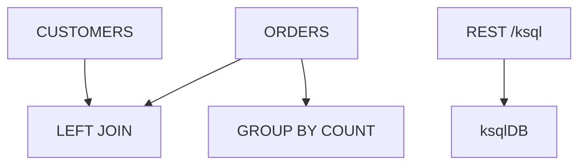

# Lab 06 – ksqlDB Tables, Joins, REST API, and Query Management

**Lab Number:** 06  
**Day:** 4  
**Duration:** 45 minutes  
**Difficulty:** Intermediate  
**Environment:** Windows + trainer ksqlDB  
**Mode:** Individual

---

## Description

This lab covers the remaining ksqlDB syllabus items: tables, joins, queries, REST API, and monitoring/terminating streams and tables.

You will create a `CUSTOMERS` table, join it to `ORDERS`, run a `GROUP BY` aggregation, inspect and terminate a query, then submit a statement through the ksqlDB REST API from PowerShell.

---

## Prerequisites

- Lab 05 `ORDERS` stream exists
- ksqlDB CLI or editor still works
- You can open PowerShell for an HTTP call
- Lab 04 taught why customer data is a table

---

## Business Use Case

SQL analysts want the same enrichment Java built in Lab 04: order + customer name + tier, plus a live count per customer.

Operations must be able to **see** and **stop** a runaway persistent query.

---

## Architecture

```text
ORDERS stream  +  CUSTOMERS table
        |
      LEFT JOIN
        |
   Enriched live query

ORDERS
   GROUP BY CUSTOMER_ID
        |
   Table-like counts

PowerShell --HTTP--> ksqlDB REST --> Kafka
```



---

## Detailed Steps

### Step 0 – Initial Setup

```sql
SHOW STREAMS;
SHOW TABLES;
SHOW QUERIES;
```

Confirm `ORDERS` is listed. If not, repeat Lab 05 Step 3.

Write the REST base URL (default `http://localhost:8088`):

```text
ksqlDB REST: ________
```

---

### Step 1 – Create the Customer table

Create a table backed by keyed customer data:

```sql
CREATE TABLE CUSTOMERS (
    CUSTOMER_ID VARCHAR PRIMARY KEY,
    CUSTOMER_NAME VARCHAR,
    TIER VARCHAR
)
WITH (
    KAFKA_TOPIC='customers-json',
    VALUE_FORMAT='JSON'
);
```

Insert reference rows (syntax can vary by ksqlDB version; `INSERT INTO` on tables is supported on current ksqlDB):

```sql
INSERT INTO CUSTOMERS (CUSTOMER_ID, CUSTOMER_NAME, TIER)
VALUES ('C101', 'Rahul', 'GOLD');

INSERT INTO CUSTOMERS (CUSTOMER_ID, CUSTOMER_NAME, TIER)
VALUES ('C102', 'Neha', 'SILVER');

INSERT INTO CUSTOMERS (CUSTOMER_ID, CUSTOMER_NAME, TIER)
VALUES ('C103', 'Amit', 'PLATINUM');
```

If `INSERT INTO TABLE` is rejected, produce keyed JSON to `customers-json` with the console producer (`CUSTOMER_ID` as key).

---

### Step 2 – Join stream and table

```sql
SELECT
    O.ORDER_ID,
    O.CUSTOMER_ID,
    C.CUSTOMER_NAME,
    C.TIER,
    O.AMOUNT
FROM ORDERS O
LEFT JOIN CUSTOMERS C
ON O.CUSTOMER_ID = C.CUSTOMER_ID
EMIT CHANGES;
```

Insert an order for `C101` while this query runs.

Business output:

```text
ORD1001
C101
Rahul
GOLD
75000
```

| Order | Name | Tier |
| --- | --- | --- |
| | | |

This is Lab 04’s join in SQL.

---

### Step 3 – Aggregation

```sql
SELECT
    CUSTOMER_ID,
    COUNT(*) AS ORDER_COUNT
FROM ORDERS
GROUP BY CUSTOMER_ID
EMIT CHANGES;
```

Discuss:

```text
Stream
    ↓
GROUP BY
    ↓
Stateful aggregation
    ↓
Table-like result
```

Insert two orders for `C101` and one for `C102`. Record the last counts you see.

Optional persistent table:

```sql
CREATE TABLE CUSTOMER_ORDER_COUNTS AS
SELECT
    CUSTOMER_ID,
    COUNT(*) AS ORDER_COUNT
FROM ORDERS
GROUP BY CUSTOMER_ID
EMIT CHANGES;
```

---

### Step 4 – Monitor queries

```sql
SHOW QUERIES;
```

Students identify persistent queries (CSAS / CTAS from Lab 05–06).

Then:

```sql
EXPLAIN <query-id>;
```

Replace `<query-id>` with an id from `SHOW QUERIES`.

Inspect query information. Write one query id:

```text
Query id: ________
Type (PUSH / PERSISTENT): ________
```

---

### Step 5 – Terminate a query

Use a **derived** query you created (for example `CUSTOMER_ORDER_COUNTS`), not `ORDERS` itself.

```sql
TERMINATE <query-id>;
```

```sql
SHOW QUERIES;
```

Verify the change. Recreate the query later if the capstone needs it.

| Query terminated | Gone from SHOW QUERIES? |
| --- | --- |
| | Yes / No |

---

### Step 6 – REST API

The syllabus specifically calls out REST API.

Architecture:

```text
Java / PowerShell / Application
            |
            | HTTP
            v
       ksqlDB REST API
            |
            v
         ksqlDB
            |
            v
          Kafka
```

From PowerShell (adjust the URL):

```powershell
$body = @{
    ksql = "SHOW STREAMS;"
    streamsProperties = @{}
} | ConvertTo-Json

Invoke-RestMethod `
  -Method Post `
  -Uri "http://localhost:8088/ksql" `
  -ContentType "application/vnd.ksql.v1+json" `
  -Body $body
```

Students submit a simple query request and inspect the response.

A push query often uses `POST /query` with `SELECT * FROM ORDERS EMIT CHANGES;`. If `/ksql` + `SHOW STREAMS` works, that satisfies the REST skill.

Discuss when applications might call REST instead of the CLI (automation, portals, other languages).

Record:

| Call | HTTP status / result |
| --- | --- |
| `SHOW STREAMS` via REST | |

---

## Conclusion

You joined a stream to a table in SQL, aggregated with `GROUP BY`, inspected and terminated a query, and reached ksqlDB over HTTP.

Labs 07–08 move schema from “local Avro file” (Day 3) to **Schema Registry**.

**You are ready for Lab 07 when:**

- Join showed a customer name
- `SHOW QUERIES` / `TERMINATE` worked
- One REST call succeeded

Next lab: [07-schema-registry-avro.md](07-schema-registry-avro.md)

---

## Knowledge Check

1. Why is `CUSTOMERS` a TABLE?
2. What does `LEFT JOIN` keep that Lab 04’s inner join dropped?
3. What does `TERMINATE` stop?
4. Why expose REST?

**Expected answers**

1. Latest attributes per `CUSTOMER_ID`.
2. Orders whose customer is missing still appear (name/tier null).
3. That running query, not necessarily the source topic.
4. So apps can manage SQL without the interactive CLI.

---

## Common Issues

| Symptom | Likely cause | What to do |
| --- | --- | --- |
| Join null names | Customer rows not keyed / not inserted | Check PRIMARY KEY and inserts |
| REST 415 / 406 | Wrong Content-Type | Use `application/vnd.ksql.v1+json` |
| TERMINATE fails | Transient push query id | Terminate a persistent CSAS/CTAS id |
