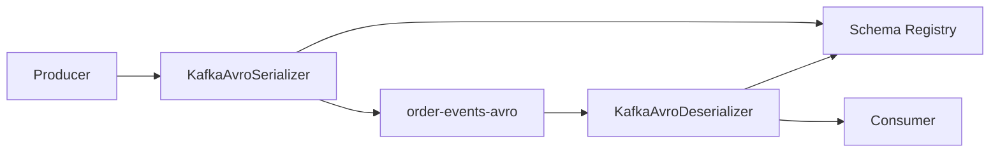

# Lab 07 – Schema Registry and Avro

**Lab Number:** 07  
**Day:** 4  
**Duration:** 60 minutes  
**Difficulty:** Intermediate  
**Environment:** Windows + Schema Registry  
**Mode:** Individual

---

## Description

The second Day 4 block covers Schema Registry, schemas as first-class citizens, Avro, subjects, and Avro producers/consumers.

You will reach Schema Registry, create `order-value.avsc`, register it, list subjects and versions, then publish and consume `ORD-SR-1001`–`1003` with registry-aware Java clients.

Day 3 Avro stored bytes you encoded yourself. Today the serializer talks to the registry and writes a schema id on the wire.

---

## Prerequisites

- Day 3 Lab 01 Avro concepts
- Schema Registry URL from the trainer (default `http://localhost:8081`)
- `C:\kafka-labs\quickcart-kafka` and Maven
- Three brokers reachable from the Java clients

---

## Business Use Case

Suppose Producer A sends:

```json
{
    "orderId":"ORD1001",
    "amount":75000
}
```

Later another developer changes it to:

```json
{
    "id":"ORD1001",
    "total":"75000"
}
```

Existing consumers may fail or interpret data incorrectly.

Target:

```text
Producer
   |
   | schema-aware event
   v
Schema Registry
   |
   | validates/manages schema
   v
Kafka
   |
   v
Consumer
```

---

## Architecture

```text
Java Order
    |
    v
Avro Serializer
    |
    +------> Schema Registry
    |          Schema ID
    |
    v
Kafka topic order-events-avro
```

Terminology:

```text
Schema
Subject
Version
Compatibility
```

Typical value subject:

```text
Topic: order-events-avro
Subject: order-events-avro-value
```



---

## Detailed Steps

### Step 0 – Initial Setup

```powershell
$sr = "http://localhost:8081"
# replace if the trainer gave another URL

Invoke-RestMethod -Uri "$sr/subjects"
```

An empty list `[]` is success. A connection error means Registry is down.

Create folders:

```powershell
New-Item -ItemType Directory -Force `
  -Path C:\kafka-labs\quickcart-kafka\src\main\avro
```

Add Confluent Avro serializer (version aligned to a 7.6.x / trainer-approved Confluent platform line):

```xml
<dependency>
    <groupId>io.confluent</groupId>
    <artifactId>kafka-avro-serializer</artifactId>
    <version>7.6.1</version>
</dependency>
```

You may need the Confluent Maven repository in `pom.xml`:

```xml
<repositories>
    <repository>
        <id>confluent</id>
        <url>https://packages.confluent.io/maven/</url>
    </repository>
</repositories>
```

```powershell
cd C:\kafka-labs\quickcart-kafka
mvn -q compile
```

---

### Step 1 – Verify Schema Registry

Use the endpoint provided by the training environment. Students verify the service is reachable (Step 0).

Record:

| Check | Value |
| --- | --- |
| Registry URL | |
| `GET /subjects` works | Yes / No |

---

### Step 2 – Create the Avro schema

Create `src\main\avro\order-value.avsc`:

```json
{
  "type": "record",
  "name": "Order",
  "namespace": "com.quickcart.events",
  "fields": [
    { "name": "orderId", "type": "string" },
    { "name": "customerId", "type": "string" },
    { "name": "productId", "type": "string" },
    { "name": "quantity", "type": "int" },
    { "name": "amount", "type": "double" }
  ]
}
```

---

### Step 3 – Understand the subject

```text
Topic:
order-events-avro

Typical value subject:
order-events-avro-value
```

The default **TopicNameStrategy** names the value subject `<topic>-value`.

---

### Step 4 – Register the schema

```powershell
$sr = "http://localhost:8081"
$schemaText = Get-Content `
  C:\kafka-labs\quickcart-kafka\src\main\avro\order-value.avsc -Raw

$bodyObj = @{ schema = $schemaText }
$body = $bodyObj | ConvertTo-Json

$result = Invoke-RestMethod `
  -Method Post `
  -Uri "$sr/subjects/order-events-avro-value/versions" `
  -ContentType "application/vnd.schemaregistry.v1+json" `
  -Body $body

$result
```

Students should capture the returned:

```text
Schema ID
```

| Schema ID | |
| --- | --- |

---

### Step 5 – List subjects

```powershell
Invoke-RestMethod -Uri "$sr/subjects"
```

Expected conceptually:

```text
order-events-avro-value
```

This covers **Subjects** and **List all Subjects**.

---

### Step 6 – Get subject versions

```powershell
Invoke-RestMethod -Uri "$sr/subjects/order-events-avro-value/versions"
```

Students should initially see:

```text
Version 1
```

---

### Step 7 – Retrieve the schema

```powershell
Invoke-RestMethod -Uri "$sr/subjects/order-events-avro-value/versions/1"
```

Inspect `Subject` + `Version` + schema text.

---

### Step 8 – Schema Registry-aware Java producer

Create the topic:

```powershell
cd C:\kafka-labs\kafka

.\bin\windows\kafka-topics.bat `
  --create `
  --topic order-events-avro `
  --bootstrap-server localhost:9092 `
  --partitions 4 `
  --replication-factor 3
```

Create `src\main\java\com\quickcart\kafka\producer\SchemaRegistryOrderProducer.java`:

```java
package com.quickcart.kafka.producer;

import com.quickcart.kafka.config.KafkaConfig;
import io.confluent.kafka.serializers.AbstractKafkaSchemaSerDeConfig;
import io.confluent.kafka.serializers.KafkaAvroSerializer;
import org.apache.avro.Schema;
import org.apache.avro.generic.GenericData;
import org.apache.avro.generic.GenericRecord;
import org.apache.kafka.clients.producer.KafkaProducer;
import org.apache.kafka.clients.producer.ProducerConfig;
import org.apache.kafka.clients.producer.ProducerRecord;
import org.apache.kafka.common.serialization.StringSerializer;

import java.io.File;
import java.util.Properties;

public class SchemaRegistryOrderProducer {

    public static void main(String[] args) throws Exception {
        Schema schema = new Schema.Parser()
                .parse(new File("src/main/avro/order-value.avsc"));

        Properties props = new Properties();
        props.put(ProducerConfig.BOOTSTRAP_SERVERS_CONFIG,
                KafkaConfig.BOOTSTRAP_SERVERS);
        props.put(ProducerConfig.KEY_SERIALIZER_CLASS_CONFIG,
                StringSerializer.class.getName());
        props.put(ProducerConfig.VALUE_SERIALIZER_CLASS_CONFIG,
                KafkaAvroSerializer.class.getName());
        props.put(AbstractKafkaSchemaSerDeConfig.SCHEMA_REGISTRY_URL_CONFIG,
                "http://localhost:8081");

        String[] ids = { "ORD-SR-1001", "ORD-SR-1002", "ORD-SR-1003" };

        try (KafkaProducer<String, GenericRecord> producer =
                     new KafkaProducer<>(props)) {
            for (String orderId : ids) {
                GenericRecord order = new GenericData.Record(schema);
                order.put("orderId", orderId);
                order.put("customerId", "C501");
                order.put("productId", "LAPTOP01");
                order.put("quantity", 1);
                order.put("amount", 85000.0);

                producer.send(new ProducerRecord<>(
                        "order-events-avro",
                        orderId,
                        order
                )).get();
                System.out.println("Published " + orderId);
            }
        }
    }
}
```

Run from the project working directory. Publish:

```text
ORD-SR-1001
ORD-SR-1002
ORD-SR-1003
```

---

### Step 9 – Avro consumer

Create `src\main\java\com\quickcart\kafka\consumer\SchemaRegistryOrderConsumer.java`:

```java
package com.quickcart.kafka.consumer;

import com.quickcart.kafka.config.KafkaConfig;
import io.confluent.kafka.serializers.AbstractKafkaSchemaSerDeConfig;
import io.confluent.kafka.serializers.KafkaAvroDeserializer;
import io.confluent.kafka.serializers.KafkaAvroDeserializerConfig;
import org.apache.avro.generic.GenericRecord;
import org.apache.kafka.clients.consumer.ConsumerConfig;
import org.apache.kafka.clients.consumer.ConsumerRecord;
import org.apache.kafka.clients.consumer.KafkaConsumer;
import org.apache.kafka.common.serialization.StringDeserializer;

import java.time.Duration;
import java.util.Collections;
import java.util.Properties;

public class SchemaRegistryOrderConsumer {

    public static void main(String[] args) {
        Properties props = new Properties();
        props.put(ConsumerConfig.BOOTSTRAP_SERVERS_CONFIG,
                KafkaConfig.BOOTSTRAP_SERVERS);
        props.put(ConsumerConfig.GROUP_ID_CONFIG, "sr-order-consumer");
        props.put(ConsumerConfig.AUTO_OFFSET_RESET_CONFIG, "earliest");
        props.put(ConsumerConfig.KEY_DESERIALIZER_CLASS_CONFIG,
                StringDeserializer.class.getName());
        props.put(ConsumerConfig.VALUE_DESERIALIZER_CLASS_CONFIG,
                KafkaAvroDeserializer.class.getName());
        props.put(AbstractKafkaSchemaSerDeConfig.SCHEMA_REGISTRY_URL_CONFIG,
                "http://localhost:8081");
        props.put(KafkaAvroDeserializerConfig.SPECIFIC_AVRO_READER_CONFIG, false);

        try (KafkaConsumer<String, GenericRecord> consumer =
                     new KafkaConsumer<>(props)) {
            consumer.subscribe(Collections.singletonList("order-events-avro"));
            while (true) {
                for (ConsumerRecord<String, GenericRecord> rec :
                        consumer.poll(Duration.ofMillis(1000))) {
                    GenericRecord order = rec.value();
                    System.out.println("Order ID    : " + order.get("orderId"));
                    System.out.println("Customer ID : " + order.get("customerId"));
                    System.out.println("Product     : " + order.get("productId"));
                    System.out.println("Quantity    : " + order.get("quantity"));
                    System.out.println("Amount      : " + order.get("amount"));
                    System.out.println("-----");
                }
            }
        }
    }
}
```

Consume and print those five fields.

The important learning: producer and consumer work against **governed** schemas, not arbitrary payloads.

---

## Conclusion

Schema Registry stores versions under a subject. The Avro serializer fetches or registers a schema id. Consumers decode using that id.

Lab 08 evolves the schema and tries a breaking change.

**You are ready for Lab 08 when:**

- Subject `order-events-avro-value` version 1 exists
- You recorded a schema id
- The consumer printed `ORD-SR-1001`

Next lab: [08-schema-evolution.md](08-schema-evolution.md)

---

## Knowledge Check

1. What is a subject?
2. What is a schema id used for on the wire?
3. Why list subjects?
4. How is this different from Day 3 `byte[]` Avro?

**Expected answers**

1. A named series of schema versions, usually `<topic>-value`.
2. The deserializer asks Registry for that version.
3. To see which contracts exist in the environment.
4. Day 3 apps shared a local file; today Registry is the contract store.

---

## Common Issues

| Symptom | Likely cause | What to do |
| --- | --- | --- |
| `UnknownHost` / connection refused | Registry not running | Start the Confluent stack |
| 409 on register | Incompatible existing subject | Use a new subject or Lab 08 rules |
| Maven cannot find serializer | Missing Confluent repo | Add `packages.confluent.io/maven` |
| Consumer `null` fields | Specific vs Generic | `SPECIFIC_AVRO_READER_CONFIG=false` |
