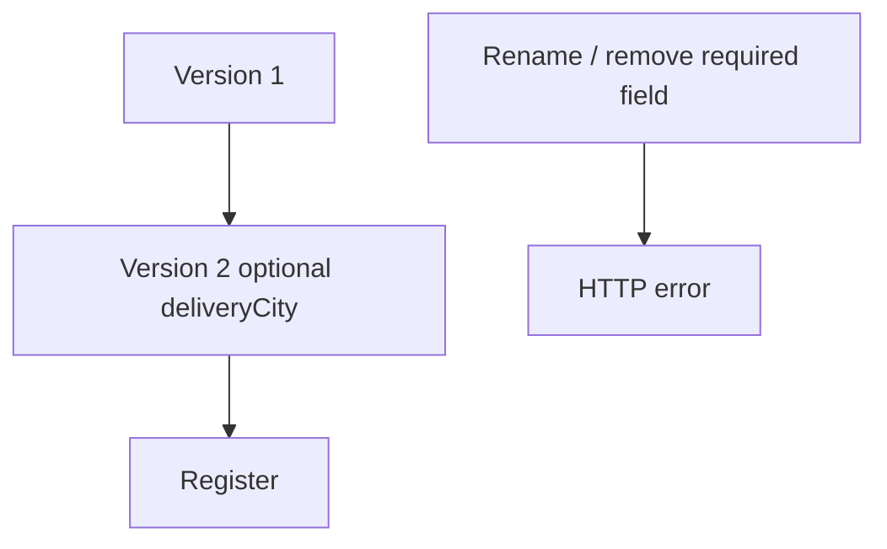

# Lab 08 – Schema Evolution and Compatibility

**Lab Number:** 08  
**Day:** 4  
**Duration:** 45 minutes  
**Difficulty:** Intermediate  
**Environment:** Windows + Schema Registry  
**Mode:** Individual

---

## Description

Compatibility is an explicit Day 4 topic. You will add `deliveryCity` as an optional field, register version 2, compare versions, discuss BACKWARD / FORWARD / FULL, attempt an incompatible change that Registry rejects, then add and delete a **disposable** subject.

Do not delete `order-events-avro-value` used by the main labs.

---

## Prerequisites

- Lab 07 registered `order-events-avro-value` version 1
- `GET /subjects` works
- You understand optional Avro unions with defaults

---

## Business Use Case

QuickCart asks:

> “Add deliveryCity without breaking existing consumers.”

Current V1:

```json
{
    "orderId": "...",
    "customerId": "...",
    "amount": 5000
}
```

Desired V2:

```json
{
    "orderId": "...",
    "customerId": "...",
    "amount": 5000,
    "deliveryCity": "Delhi"
}
```

---

## Architecture

```text
Without Governance

Developer
   |
Changes schema
   |
   v
Consumer breaks


With Schema Registry

Developer
   |
Proposes schema
   |
   v
Compatibility Check
   |
   +---- Compatible ----> Register
   |
   X---- Incompatible --> Reject
```



---

## Detailed Steps

### Step 0 – Initial Setup

```powershell
$sr = "http://localhost:8081"

Invoke-RestMethod -Uri "$sr/subjects/order-events-avro-value/versions"
```

You should see `[1]` (or more if you already experimented).

Copy `order-value.avsc` to keep V1 on disk:

```powershell
Copy-Item C:\kafka-labs\quickcart-kafka\src\main\avro\order-value.avsc `
  C:\kafka-labs\quickcart-kafka\src\main\avro\order-value-v1.avsc
```

---

### Step 1 – Create a compatible evolution

Add this field to `order-value.avsc` **after** `amount`:

```json
{
  "name": "deliveryCity",
  "type": ["null", "string"],
  "default": null
}
```

The union plus `default` is the usual **backward-compatible** add: old consumers ignore the new field; old producers omit it and consumers see `null`.

Register the updated schema the same way as Lab 07 Step 4 (`POST .../subjects/order-events-avro-value/versions`).

Students should now observe:

```text
Version 1
Version 2
```

```powershell
Invoke-RestMethod -Uri "$sr/subjects/order-events-avro-value/versions"
```

| Versions listed | |
| --- | --- |

---

### Step 2 – Inspect versions

Retrieve both versions and compare:

```powershell
Invoke-RestMethod -Uri "$sr/subjects/order-events-avro-value/versions/1"
Invoke-RestMethod -Uri "$sr/subjects/order-events-avro-value/versions/2"
```

Write one difference:

```text
________________________________________________
```

---

### Step 3 – Compatibility discussion

Cover:

```text
BACKWARD
FORWARD
FULL
```

and, where relevant to the environment:

```text
*_TRANSITIVE
```

Default for Confluent Registry is often **BACKWARD**: a new schema can read data written with the previous schema (new consumer, old data).

Business question:

> Can old/new producers and consumers continue interacting safely as the event contract changes?

Check the subject compatibility if the API is enabled:

```powershell
try {
  Invoke-RestMethod -Uri "$sr/config/order-events-avro-value"
} catch {
  Invoke-RestMethod -Uri "$sr/config"
}
```

| Mode you saw / trainer stated | |
| --- | --- |

---

### Step 4 – Attempt an incompatible change

For example, rename `orderId` to `id` with no default/alias, or change `amount` from `double` to `string`.

Save a broken schema as `order-value-bad.avsc` and POST it to `order-events-avro-value`.

Students should observe Schema Registry **rejecting** the evolution when the compatibility policy prohibits it.

Write the HTTP status or error message:

```text
________________________________________________
```

This is the key governance lesson: incompatible evolution is rejected **before** consumers break in production.

---

### Step 5 – Delete schema / subject exercise

The syllabus includes **Add/Delete Schema**. Use a disposable subject, not the main training subject.

Create subject `training-test-value`:

```powershell
$sample = '{"type":"record","name":"TrainingTest","fields":[{"name":"id","type":"string"}]}'
$body = @{ schema = $sample } | ConvertTo-Json

Invoke-RestMethod `
  -Method Post `
  -Uri "$sr/subjects/training-test-value/versions" `
  -ContentType "application/vnd.schemaregistry.v1+json" `
  -Body $body
```

List subjects. Confirm `training-test-value` appears.

Delete the disposable version or subject (hard delete if the trainer allows):

```powershell
# Soft delete subject
Invoke-RestMethod -Method Delete -Uri "$sr/subjects/training-test-value"

# Permanent delete (only on the training-test subject)
Invoke-RestMethod -Method Delete `
  -Uri "$sr/subjects/training-test-value?permanent=true"
```

List subjects again. `training-test-value` should be gone.

Emphasize: deleting production schemas is an administrative/governance action, not a routine application operation.

| Step | Done |
| --- | --- |
| Registered training-test-value | |
| Listed subjects | |
| Deleted disposable subject | |
| Did **not** delete order-events-avro-value | |

---

### Step 6 – Produce a V2 event (optional)

Update `SchemaRegistryOrderProducer` to `order.put("deliveryCity", "Delhi")` on one record and run it. The Lab 07 consumer should still print the original fields. A V2-aware consumer can print `deliveryCity`.

---

## Conclusion

Optional fields with defaults let QuickCart add `deliveryCity` as version 2. Incompatible changes are rejected. Delete is for disposable subjects only.

**You are ready for Lab 09 when:**

- Version 2 is registered
- An incompatible POST failed
- `training-test-value` was added and deleted

Next lab: [09-control-center.md](09-control-center.md)

---

## Knowledge Check

1. Why `["null","string"]` plus `default: null`?
2. What is BACKWARD compatibility in one sentence?
3. Why did the rename fail?
4. Why not delete `order-events-avro-value`?

**Expected answers**

1. Old writers can omit the field; readers get null.
2. New schema can read data written with the previous schema.
3. It breaks the existing field contract under the policy.
4. Live producers and consumers still depend on it.

---

## Common Issues

| Symptom | Likely cause | What to do |
| --- | --- | --- |
| V2 rejected | Missing default on new field | Use the union + default as written |
| Incompatible change **accepted** | Compatibility set to NONE | Note the trainer config; still explain the risk |
| Delete 404 | Already deleted / wrong name | List subjects first |
