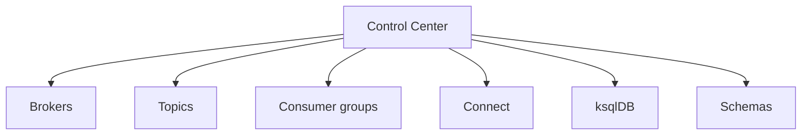

# Lab 09 – Confluent Control Center

**Lab Number:** 09  
**Day:** 4  
**Duration:** 20–30 minutes  
**Difficulty:** Beginner  
**Environment:** Trainer Docker / Confluent Control Center  
**Mode:** Individual (guided)

---

## Description

The syllabus lists Confluent Control Center, operations, and UI in the second Day 4 block.

This is a **guided visual lab**. You will open Control Center, find cluster/topics/brokers/groups/Connect/ksqlDB/schemas, relate the UI to Day 1–3 CLI commands, and inspect lag and connectors if they exist.

The goal is not to replace CLI skills with a UI.

---

## Prerequisites

- Control Center URL from the trainer (default `http://localhost:9021`)
- Day 1 cluster or compose Kafka visible to Control Center
- Optional: Day 3 Connect, Day 4 ksqlDB, Lab 07 subjects

---

## Business Use Case

Operations wants a single screen for “is the QuickCart platform healthy?” without memorizing every CLI flag. Developers still use CLI when the UI is down.

---

## Architecture

```text
Day 1–3

kafka-topics
kafka-consumer-groups
kafka-configs


Day 4

Control Center
      |
      v
Visual operational view
```



---

## Detailed Steps

### Step 0 – Initial Setup

Write the URL:

```text
Control Center: ________
```

Open it in a browser. If login is required, use the trainer credentials.

---

### Step 1 – Open Control Center and identify areas

Students identify:

```text
Cluster
Topics
Brokers
Consumer Groups
Connect
ksqlDB
Schema-related information where exposed
```

Tick what you found:

| Area | Seen? |
| --- | --- |
| Cluster | |
| Topics | |
| Brokers | |
| Consumer Groups | |
| Connect | |
| ksqlDB | |
| Schemas | |

---

### Step 2 – Find `order-events`

Inspect:

```text
Partitions
Messages
Configuration
```

Relate the UI to commands you have used since Day 1.

If `order-events` is not on this Kafka, open `order-events-avro` or `orders-json`.

| UI field | Matches which CLI? |
| --- | --- |
| Partition count | `kafka-topics --describe` |
| Messages / throughput | (UI metric; CLI consume is not the same) |
| Config | `kafka-configs --describe` |

---

### Step 3 – Inspect a consumer group

Find:

```text
inventory-service
```

or `sr-order-consumer` / a ksqlDB query group.

Observe partition assignments and lag information available in the environment.

| Group | Lag you saw | Members |
| --- | --- | --- |
| | | |

---

### Step 4 – Inspect Connect

Find Day 3 connectors if this Control Center sees that Connect cluster.

Check:

```text
Connector status
Tasks
Errors
```

If Connect is empty, write “N/A — different cluster” and move on.

---

### Step 5 – Inspect ksqlDB

Review the Day 4 stream-processing environment and persistent queries available through the prepared platform.

Find `ORDERS` or `HIGH_VALUE_ORDERS` if Lab 05 ran against this stack.

| Persistent query | State |
| --- | --- |
| | |

---

## Conclusion

Control Center is a visual operational view of the same objects you already manage with CLI, Streams, ksqlDB, and Registry.

Lab 10 is the 32-hour course capstone.

**You are ready for Lab 10 when:**

- You opened Control Center
- You mapped at least topics and brokers to Day 1 CLI
- You noted lag or “group not on this cluster”

Next lab: [10-capstone-order-intelligence.md](10-capstone-order-intelligence.md)

---

## Knowledge Check

1. Does the UI replace `kafka-topics`?
2. Where do you look for consumer lag in the UI?
3. Why might Day 3 connectors be missing?
4. What should you do if the UI is down in production?

**Expected answers**

1. No. It is another view.
2. Consumer groups (or topic throughput plus group lag).
3. Control Center may point at a different Connect cluster.
4. Use the CLI and REST APIs from Days 1–4.

---

## Common Issues

| Symptom | Likely cause | What to do |
| --- | --- | --- |
| Page will not load | Compose not started | Trainer starts Control Center |
| Empty cluster | UI pointed at compose Kafka, labs used localhost | Pick the cluster the trainer names |
| No schemas | Registry not registered with this C3 | Use Lab 07 REST instead |
