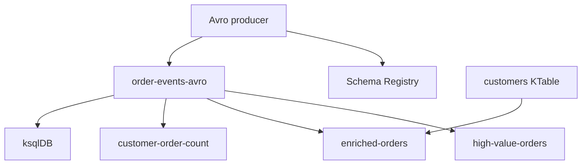

# Lab 10 – Day 4 Capstone: QuickCart Real-Time Order Intelligence Platform

**Lab Number:** 10  
**Day:** 4  
**Duration:** 75–90 minutes  
**Difficulty:** Intermediate  
**Environment:** Windows + Day 1 cluster + Confluent stack as needed  
**Mode:** Individual or pairs

---

## Description

This is the **32-hour course capstone**. It brings Days 1–4 together: Avro-governed events, Kafka Streams, ksqlDB, schema evolution, and operational monitoring.

You will prepare topics, register Order V1, produce 20 keyed Avro events, filter high-value orders, enrich from a customer KTable, aggregate counts, run ksqlDB analytics, add `deliveryCity`, reject an incompatible schema, monitor in Control Center or CLI, then diagnose a trainer-chosen failure in 10–15 minutes.

---

## Prerequisites

- Day 4 Labs 01–09 completed (or trainer-approved shortcuts)
- `quickcart-kafka` compiles with Streams and Avro serializer
- Schema Registry reachable
- ksqlDB reachable for Step 8
- Three-broker Kafka (or the compose cluster the trainer designates)

---

## Business Use Case

QuickCart wants:

1. Avro-governed order events  
2. Real-time order processing  
3. High-value order detection  
4. Customer enrichment  
5. Real-time customer order counts  
6. SQL-based analytics  
7. Schema evolution  
8. Operational monitoring  

---

## Architecture

```text
                        QUICKCART
                        Order API
                           |
                     Avro Producer
                           |
                           v
                    Schema Registry
                           |
                           v
                 +--------------------+
                 |  order-events-avro |
                 +---------+----------+
                           |
          +----------------+----------------+
          |                                 |
          v                                 v
    Kafka Streams                         ksqlDB
          |                                 |
    +-----+------+                 +--------+-------+
    |            |                 |                |
    v            v                 v                v
High Value    Enriched         Aggregation      Live Query
Orders        Orders
                  |
             KTable Join
                  |
                  v
             Customer Data


                  Operations
                      |
              Control Center / CLI
```



---

## Detailed Steps

### Step 0 – Initial Setup

Start Kafka (and Registry / ksqlDB / Control Center as required).

```powershell
cd C:\kafka-labs\kafka
.\bin\windows\kafka-topics.bat --list --bootstrap-server localhost:9092
```

```powershell
cd C:\kafka-labs\quickcart-kafka
mvn -q compile
```

Open the streaming checklist in [00-initial.md](00-initial.md).

---

### Step 1 – Prepare topics

Create or verify:

```text
order-events-avro
customers
high-value-orders
enriched-orders
customer-order-count
```

Choose partition/replication settings based on the training cluster (course default: 4 partitions, RF 3 when three brokers exist).

| Topic | Exists / created | Partitions | RF |
| --- | --- | ---: | ---: |
| order-events-avro | | | |
| customers | | | |
| high-value-orders | | | |
| enriched-orders | | | |
| customer-order-count | | | |

---

### Step 2 – Register Order schema V1

Register **Order V1** with fields:

```text
orderId
customerId
productId
quantity
amount
status
```

Lab 07’s `order-value.avsc` may lack `status`. Add `status` as a `string` (or optional union) and register under `order-events-avro-value` if needed.

Verify:

```text
Subject
Version
Schema ID
```

| Subject | Version | Schema ID |
| --- | --- | --- |
| order-events-avro-value | | |

---

### Step 3 – Java Avro producer

Produce at least **20 order events**.

Use `orderId` as the message key.

Include:

```text
Normal orders
High-value orders
Different customers
Different products
```

Adapt `SchemaRegistryOrderProducer` to loop 20 records with mixed amounts (some `< 50000`, some `>= 50000`) and customers `C101`–`C104`.

---

### Step 4 – High-value Kafka Streams pipeline

Implement:

```text
order-events-avro
        |
        | amount >= 50000
        v
high-value-orders
```

You may reuse Lab 02’s topology with Avro/GenericRecord serdes **or** keep a string bridge if the trainer allows a JSON/CSV topic. Preferred: filter on `GenericRecord.get("amount")`.

Verify output on `high-value-orders`.

| High-value order ids you saw | |
| --- | --- |

---

### Step 5 – Customer KTable

Create customer state (compacted `customers` topic):

```text
C101 → Rahul,GOLD
C102 → Neha,SILVER
C103 → Amit,PLATINUM
C104 → Priya,GOLD
```

Materialize/read it as the reference table required by the Streams application (`builder.table("customers")`).

---

### Step 6 – Enrich orders

Implement:

```text
Order KStream
      +
Customer KTable
      |
      v
    JOIN
      |
      v
enriched-orders
```

Output should contain:

```text
Order
Customer
Tier
Amount
```

Keys on both sides must be `customerId`.

| Sample enriched line | |
| --- | --- |

---

### Step 7 – Aggregate

Create:

```text
Customer
   |
GROUP BY
   |
COUNT
   |
customer-order-count
```

Verify changing counts as new orders arrive (Lab 03 pattern).

| Customer | Count after extra produce |
| --- | ---: |
| C101 | |
| C102 | |

---

### Step 8 – ksqlDB analytics

Create a ksqlDB stream over an appropriate order or enriched-order topic.

```sql
SELECT *
FROM <ORDER_STREAM>
WHERE AMOUNT >= 50000
EMIT CHANGES;
```

Then:

```sql
SELECT
    CUSTOMER_ID,
    COUNT(*) AS TOTAL_ORDERS
FROM <ORDER_STREAM>
GROUP BY CUSTOMER_ID
EMIT CHANGES;
```

If Avro + Registry is wired into this ksqlDB, use `VALUE_FORMAT='AVRO'`. Otherwise use the Lab 05 JSON `ORDERS` stream.

| Query | Works? |
| --- | --- |
| High-value SELECT | |
| GROUP BY COUNT | |

---

### Step 9 – Schema evolution

Business asks: add `deliveryCity`.

Students:

1. Update the Avro schema (optional field + default).  
2. Preserve compatibility according to the configured policy.  
3. Register the new version.  
4. Verify the version number.  
5. Produce new events.  
6. Verify consumers continue processing.  

| New version | Consumers still work? |
| --- | --- |
| | Yes / No |

---

### Step 10 – Deliberately break schema compatibility

The trainer gives an incompatible modification.

Attempt registration.

Expected:

```text
Schema Registry
       |
Compatibility validation
       |
       X
Registration rejected
```

Students must explain **why**.

```text
Why it was rejected:
________________________________________________
```

---

### Step 11 – Monitor

Using Control Center and/or CLI, verify:

```text
Kafka cluster
Topics
Partitions
Consumer groups
Consumer lag
Kafka Connect
ksqlDB queries
```

Tick what you checked:

| Item | CLI / UI / both |
| --- | --- |
| Cluster / brokers | |
| Topics / partitions | |
| Consumer lag | |
| Connect | |
| ksqlDB queries | |

---

### Step 12 – Failure challenge

The trainer selects one. Teams have **10–15 minutes**.

#### Challenge A

Stop a Kafka Streams application.  
Identify why `high-value-orders` stopped receiving new results.

#### Challenge B

Terminate a ksqlDB persistent query.  
Identify why the derived stream stopped updating.

#### Challenge C

Submit an incompatible schema.  
Identify the compatibility problem.

#### Challenge D

Start an additional Streams application instance (same `application.id`).  
Observe partition/work distribution.

#### Challenge E

Produce malformed/incorrectly serialized data into a disposable topic and investigate downstream behavior.

| Assigned challenge | Root cause | Fix / explanation |
| --- | --- | --- |
| | | |

Use the 10-step streaming checklist in [00-initial.md](00-initial.md).

---

## Conclusion

You assembled QuickCart’s real-time order intelligence platform: governed Avro, Streams filter/join/count, ksqlDB analytics, compatible evolution, rejected breaking changes, and an ops view.

This closes the 32-hour program.

**The course capstone is complete when you have:**

- Topics from Step 1  
- 20 Avro events  
- High-value + enriched + count outputs  
- A ksqlDB high-value or aggregation query  
- V2 schema + one rejected incompatible register  
- A written failure-challenge diagnosis  

Before you leave, be able to explain **KStream vs KTable** and **Streams vs ksqlDB** from [00-initial.md](00-initial.md).

---

## Knowledge Check

1. Why put `orderId` on the Kafka key?  
2. Why is the customer store a KTable?  
3. What does Schema Registry prevent in Step 10?  
4. If high-value output stops, what do you check first?  
5. When do you choose ksqlDB over Java Streams in this platform?

**Expected answers**

1. Partitioning and correlation of one order’s events.  
2. Latest name/tier per customer.  
3. Incompatible contract changes reaching consumers.  
4. Producer, input topic, then whether the Streams app is running.  
5. SQL analytics / analyst-owned persistent queries.

---

## Common Issues

| Symptom | Likely cause | What to do |
| --- | --- | --- |
| Join empty | Customers not loaded or keys differ | Produce keyed customers first |
| Avro filter NPE | Field name mismatch (`amount` vs `AMOUNT`) | Match the schema |
| ksqlDB cannot read Avro | Registry not configured in ksqlDB | Use JSON stream or trainer config |
| Two Streams apps duplicate work | **Different** `application.id` | Same id = compete; different id = two copies |
| Capstone too slow | Run string/JSON path if Avro serdes stall | Trainer may authorize Lab 02–04 reuse |

---

## Schema Registry mental model (leave with this)

```text
                       Schema Registry
                             |
              +--------------+--------------+
              |                             |
              v                             v
           Subject                       Subject
    order-events-avro-value         customer-events-value
              |
       +------+------+
       v      v      v
      V1     V2     V3

Producer → Serializer → Registry + Kafka → Deserializer → Consumer
```
